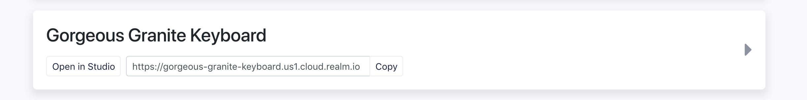
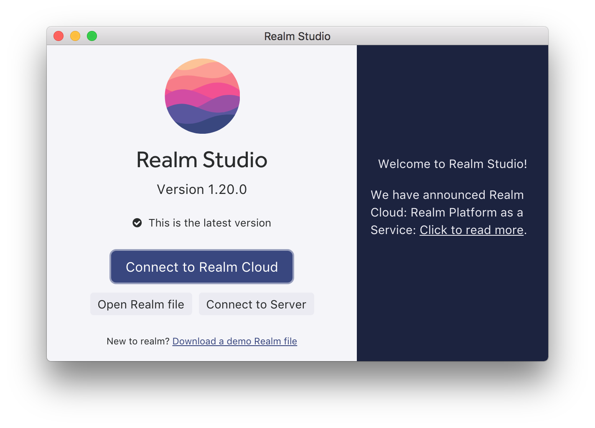

# Getting Started

## Overview

This walkthrough will take you through all of the basics of using the Realm Platform whether you are using our cloud or self-hosting. During the course, you will learn how to sign up and connect to your instance. You will learn basic terminologies and how to navigate our documentation. You will make a basic mobile app and see how web and API integrations are possible.

## What is Realm Platform? {#the-realm-platform}

The Realm Platform is made up of two major components. The Realm Database and the Realm Object Server. These two components work in conjunction to automatically synchronize data enabling a great deal of use cases ranging from offline apps to complex backend integrations.

Want to take a deeper look? Read the [Realm Overview White Paper](https://www2.realm.io/whitepaper/realm-overview-registration), a comprehensive overview that covers core concepts, key use cases, and implementation examples.

## Starting off: Getting an instance of Realm Platform



Getting a hosted instance of the Realm Object Server is as easy as [heading over to our cloud landing page and signing up](https://cloud.realm.io/login/sign-up).

Once you've signed up, you'll [create a new instance from our instances management page](https://cloud.realm.io/instances).



To get an instance of the self-hosted Realm Object Server, you'll need to [sign up for a trial here](https://realm.io/trial/self-hosted-standard-plan). You'll receive an email with your trial token and some installation instructions. [You can also find those instructions here](../self-hosted/installation/).



## Connect with Realm Studio



Connecting to your cloud instance is easy with Realm Studio. Just click the "Connect to Realm Cloud" button and select your desired instance.


If you are sharing access to your cloud instance with another user, they can connect manually by clicking "Connect to Server".

You can get your instance URL by copying it [from your cloud instances dashboard](https://cloud.realm.io/instances).





Connecting to your self-hosted instance is easy with Realm Studio. Just click the "Connect to Server" button.



In the corresponding popup, you will need to input your server information.

* URL: your URL should match the following format: `http://<ip_address>:port`
  * For example, a local installation will look like: `http://127.0.0.1:9080`
  * If using HTTPS, your format will match: `https://<ip_address>:443`
* Username / Password: You will need to login with an admin user.  After a fresh installation, a default admin user is created with the username: `realm-admin`and a blank password.  We recommend changing this password as soon as possible for security concerns.  



### Create an admin user from Studio

For some of our server examples, we'll need an admin user. Luckily, it is very easy to create one from Realm Studio.

1. Simply click the `Users` tab
2. In the lower right hand corner, select `Create a new user`
3. Provide a username and password
4. Once you're created the user, it should appear on the list.  Single click the user and a details pane will appear on the right side of studio. 
5. Change your user type from `Regular` to `Administrator`


## Learn how to pre-populate data with our server SDKs

Many of our users have existing data sets that they'd like to import into the Realm Platform. One of the most common ways to do this is via our server-side SDKs. We'll show you how to build a basic import script using our Node.JS SDK.


Looking for the quickest way to get started? [Just clone the repository here and follow the read me](https://github.com/realm/realm-server-side-samples/tree/master/17-RMP-walkthrough).


### Prerequisites

To run through our loader example, you'll need to have a few things installed

* Node v7.6.x or higher \(we typically recommended the latest LTS\) 
* A package manager like NPM
* An IDE to work in \(we typically recommend [Visual Studio Code](https://code.visualstudio.com/)\)
* A cloud or self-hosted instance of the Realm Object Server 

### Install the required packages

To start, you'll want to [download or copy our](https://github.com/realm/realm-server-side-samples/blob/master/17-RMP-walkthrough/package.json) `package.json`which lists all of the required dependencies for this entire walkthrough.

After copying this to your working directory, simply perform an `npm install`from the command line of your working directory. You'll find that a number of these dependencies are not required, but we use them to generate some mock data. In practice, you [should just need Realm](https://www.npmjs.com/package/realm).

### Create a constants file with your server information

Since we'll be using our server information a few times during this walkthrough, we can store it in a constants file to save some time. Simply create a `constants.js`, I've put mine with a `src` directory. Then make sure to fill in your instance and user info. If you aren't sure of your URL, refer to the [Realm Studio section](./#connect-with-realm-studio):



```javascript
module.exports = {
    username: "ADMIN_USERNAME",
    password: "PASSWORD",
    serverUrl: "INSTANCE_URL"
};
```



### Declare your required libraries and server information

Create a new javascript file within your working directory. Within this file, we'll start by declaring a number of variables and libraries that we'll use in our script.



```javascript
const faker = require('faker')
const Realm = require('realm')
const fs = require('fs')
const uuidv1 = require('uuid/v1');
var randomWords = require('random-words');
const constants = require('./constants')

//change this to generate more or less items 
var totalitems = 10
//provide a name to your specific Task List if desired 
const myProjectName = 'Task List'
```



### Define your Schemas

When opening a Realm, you'll need to pass in the schema configuration which you'll be working with. The application data that we're working with today is for a simple to-do app. In our app, we'll have projects that contain a list of individual items. You can find the syntax for model declarations within the database docs. Here are the [details for javascript](https://realm.io/docs/javascript/latest/#models).

```javascript
const Item = {
    name: 'Item',
    primaryKey: 'itemId',
    properties: {
      itemId: 'string',
      body: 'string',
      isDone: 'bool',
      timestamp: 'date'
    }
  }

const Project = {
    name: 'Project',
    primaryKey: 'projectId',
    properties: {
      projectId: 'string',
      owner: 'string',
      name: 'string',
      timestamp: 'date',
      items: 'Item[]'
    }
  }
```

### Login to Realm Platform and Open a Realm

Next we'll authenticate against our instance of the Realm Object Server and open up the default realm. We'll also add a basic error handler to catch errors in case of a failure. You can find [more details on authentication here](../self-hosted/customize/authentication/) \(in case you'd like to use an alternate provider\). You can find some of the [specifics of opening a realm here](../using-synced-realms/opening-a-synced-realm.md).

```javascript
const errorCallback = function errorCallback(message, isFatal, category, code) {
    console.log(`Message: ${message} - isFatal: ${isFatal} - category: ${category} - code: ${code}`)
}


Realm.Sync.User.login(`${URL}`, username, password)
.then((user) => {
      let config = user.createConfiguration();
      config.schema = [Item, Project];
      Realm.open(config)
        .then((realm) => {
            let itemResults = realm.objects('Item');
        }
}
```

### Write Sample Data to the Realm

Next we'll populate the realm with some sample data. For the sake of brevity, we're just seeing random string data, but our goal is to show you the process. It is up to you to adapt this to your own meaningful dataset.

```javascript
Realm.Sync.User.login(`${URL}`, username, password)
.then((user) => {
      let config = user.createConfiguration();
      config.schema = [Item, Project];
      Realm.open(config)
        .then((realm) => {
            let itemResults = realm.objects('Item');
            if (itemResults.length < totalitems) {
                //write to the realm
                realm.write(() => {
                    //create a project 
                    var project = realm.create('Project', {          
                    projectId: uuidv1(),
                    owner: user.identity,
                    name: myProjectName,
                    timestamp: new Date(),
                    items: []
                        }, true)
                    //create the tasks
                    for (let index = 0; index < totalitems; index++) {
                        var newItem = realm.create('Item', {
                            itemId: uuidv1(),
                            body: randomWords(),
                            isDone: false,
                            timestamp: new Date()
                        }, true)
                        project.items.push(newItem)
                    }
                })
            }
            //good practice when writing data from a server script
            realm.close()
        })
});
```

### Run your loader and view the results via Realm Studio

Now that we've completed our basic script, let's run it via the terminal:

```bash
node src/loader
```

Once it has completed, we can view the resulting data from Realm Studio. You'll find it within the `/default` realm.

## Learn how to sync this data to your Mobile App

To demonstrate Realm Platform's synchronization capabilities, we will display the data we just loaded into our instance via a mobile app. If you decided to skip the previous section, it is not a problem as you can simply create new data from the mobile side.

Currently, we have updated sample applications for both native iOS and Android which are compatible with this walkthrough.

* [iOS: Swift Example App ](ios-quick-start/)
* [Android: Java Example App](android-quick-start/)

You're welcome to follow all three steps of these tutorials. **However, feel free to skip to step two of either tutorial if you want to start viewing the data which we just pre-populated.** You should see the data which we loaded as soon as you authenticate.


The apps mentioned above utilize nickname authentication which is meant only for quick-starting development purposes


### Change data within Realm Studio to demonstrate sync

We've already learned a little about Realm Studio \(how to connect, creating users, etc\). It is also used as a simple read/write client.

1. After connecting your Realm Object Server instance, open the `/default`realm by double clicking 
2. Select the `Item` class.  Double click on an object property \(like the `body` of an `Item`\)
3. Change its value and see it instantly reflected in your mobile app


Alternatively, change and add some data from the app and see it reflected in Realm Studio!


### Developing Mobile Apps with a Cross-Platform SDK

If you are looking to use our cross-platform SDKs \(Xamarin or React Native\), we are still in the process of updating our sample applications for this walkthrough. In the meantime, feel free to take a look at some of our older examples which can be adapted to this data model.

* [Xamarin: Dotnet Example App](https://github.com/realm/realm-tasks/tree/master/RealmTasks%20Xamarin)
* [React Native: Javascript Example App](https://github.com/realm/realm-tasks/tree/master/RealmTasks%20React)

## Learn how to integrate with a Web Application


Looking for the quickest way to get started? [Just clone the repository here and follow the read me](https://github.com/realm/realm-server-side-samples/tree/master/17-RMP-walkthrough).


Since the Realm database is an embedded database, it cannot be embedded directly into a user's browser. However, we recognize that our developers have product offerings that span both mobile and web applications. To solve this, Realm Platform offers a GraphQL API which enables retrieving Realm data in a web browser or in other backend language environments unsupported with Realm SDKs currently. The API supports retrieving data or applying changes via HTTP requests and realtime [subscription](https://github.com/facebook/graphql/blob/master/rfcs/Subscriptions.md) events via a Websockets connection.

We're going to show you how to call the GraphQL API from a basic Javascript client using a few helpers and convenience APIs for the [Apollo Client](https://www.apollographql.com/client), a popular Javascript client that supports a variety of web frameworks as well as Node.js


If you are working with the self-hosted version of Realm Platform, you will need to enable the GraphQL API on your Realm Object Server. [More details here](../self-hosted/customize/web-integration-with-graphql.md).


### Prerequisites

You'll need to have everything that was required [for the previous server SDK example](./#prerequisites).

### Install the required packages

If you haven't already, [make sure to download the `package.json`which we used in our loader example](https://github.com/realm/realm-server-side-samples/blob/master/17-RMP-walkthrough/package.json). This example uses typescript, so [you'll also need to download our `tsconfig.json`](https://github.com/realm/realm-server-side-samples/blob/master/17-RMP-walkthrough/tsconfig.json)

After copying this to your working directory, simply perform an `npm install`from the command line of your working directory.

### Import your required libraries

We'll start by creating our typescript file. Mine is called `index.ts`We'll then import the various libraries which we will use.



```typescript
import * as Realm from "realm";
import { Credentials, User, GraphQLConfig } from "realm-graphql-client";
import { concat, split } from "apollo-link";
import { fetch } from "cross-fetch";
import { HttpLink } from "apollo-link-http";
import { SubscriptionClient } from 'subscriptions-transport-ws';
import { WebSocketLink } from 'apollo-link-ws';
import * as ws from "ws";
import { getMainDefinition } from 'apollo-utilities';
import { InMemoryCache } from 'apollo-cache-inmemory'
import { ApolloClient } from 'apollo-client';
import gql from 'graphql-tag';
import * as constants from './constants';
```



### Login to Realm Platform

Make sure that you've properly filled out the constants file which was created during our loader exercise.



```typescript
async function testGraphQL() {
    const credentials = Credentials.usernamePassword(constants.username, constants.password);
    const user = await User.authenticate(credentials, `https://${constants.serverUrl}`);

    const config = await GraphQLConfig.create( 
        user,
        '/default'
    );
}
```



### Setup your GraphQL Configuration

Next we'll setup our GraphQL Configuration using the Apollo Client



```typescript
function setupGraphQL(config: GraphQLConfig) {
    const httpLink = concat(
        config.authLink,
        // Note: if using node.js, you'll need to provide fetch as well.
        new HttpLink({ uri: config.httpEndpoint, fetch })
    );

    const webSocketLink = new WebSocketLink({
        uri: config.webSocketEndpoint,
        options: {
            connectionParams: config.connectionParams,
        },
        webSocketImpl: ws
    });

    const link = split(({ query }) => {
            const definition = getMainDefinition(query);
            return definition.kind === 'OperationDefinition' && definition.operation === 'subscription';
        },
        webSocketLink,
        httpLink);

    return new ApolloClient({
        link: link,
        cache: new InMemoryCache()
    });
}
```



### Make a GraphQL Query

You can learn more about the various queries and mutations that you can make with GraphQL here.

We'll perform a simple query that will print all of our tasks to the console. Our finished script should look like the following:



```typescript
import * as Realm from "realm";
import { Credentials, User, GraphQLConfig } from "realm-graphql-client";
import { concat, split } from "apollo-link";
import { fetch } from "cross-fetch";
import { HttpLink } from "apollo-link-http";
import { SubscriptionClient } from 'subscriptions-transport-ws';
import { WebSocketLink } from 'apollo-link-ws';
import * as ws from "ws";
import { getMainDefinition } from 'apollo-utilities';
import { InMemoryCache } from 'apollo-cache-inmemory'
import { ApolloClient } from 'apollo-client';
import gql from 'graphql-tag';
import * as constants from './constants';

async function testGraphQL() {
    const credentials = Credentials.usernamePassword(constants.username, constants.password);
    const user = await User.authenticate(credentials, `https://${constants.serverUrl}`);

    const config = await GraphQLConfig.create( 
        user,
        '/default'
    );

    const client = setupGraphQL(config);

   const response = await client.query({
    query: gql`
      query {
        items {
          itemId
          body
        }
      }
    `
  });
  console.log(response.data);


    while (true) {
        await new Promise(resolve => setTimeout(resolve, 500));
    }
}

function setupGraphQL(config: GraphQLConfig) {
    const httpLink = concat(
        config.authLink,
        // Note: if using node.js, you'll need to provide fetch as well.
        new HttpLink({ uri: config.httpEndpoint, fetch })
    );

    const webSocketLink = new WebSocketLink({
        uri: config.webSocketEndpoint,
        options: {
            connectionParams: config.connectionParams,
        },
        webSocketImpl: ws
    });

    const link = split(({ query }) => {
            const definition = getMainDefinition(query);
            return definition.kind === 'OperationDefinition' && definition.operation === 'subscription';
        },
        webSocketLink,
        httpLink);

    return new ApolloClient({
        link: link,
        cache: new InMemoryCache()
    });
}

testGraphQL();
```



## Navigating our Documentation

The Realm Platform is comprised of both mobile SDKs and server components. As a result, different users will have different informational needs. In this section, we'll try to highlight the areas that you'll find most helpful.

### Mobile Development

[General Documentation for our Client SDKs](https://realm.io/docs/) can be found here. From this landing page, you'll want to select your language of choice \(i.e. Swift, Java, etc\) From within each Client SDK, you'll be able to learn syntax, find code snippets, and learn about best practices.

### Working with Realm Platform

Our [platform documentation](https://docs.realm.io/platform/) contains all of the ins and outs of working with synced realms. This section of our documentation is relevant for both cloud and self-hosting users. You'll find basic code snippets and all of the details regarding working with your instance of the Realm Object Server. You will often find that this section of our documentation points back to the client SDK docs. You will need to use the two domains in conjunction.

### Self-Hosting Realm Platform

Users who have chosen to self-host the Realm Platform will need to delve into one additional section of our documentation. [Within the self-hosting section of our platform docs](https://docs.realm.io/platform/self-hosted), you'll find information on installations, customizing your deployment, moving into production with our cluster-based enterprise architecture, and more.

### Getting Help

Having an issue with Realm Platform that you don't feel you can solve from the documentation? There are a number of avenues for you:

* [Check our support FAQs ](https://support.realm.io/solution/categories/36000068636)
* [Check our Forums ](https://forums.realm.io/)
* [Check StackOverflow](https://stackoverflow.com/questions/tagged/realm)
* [Submit a support ticket ](https://support.realm.io/helpdesk)
* [File an issue on our Github](https://github.com/realm) if you believe you've found an issue



Want to learn more? 

[Read the white paper](https://www2.realm.io/whitepaper/realm-overview-registration?_ga=2.266659790.1140662478.1513013122-2031688623.1501706764) or [Watch the webinar](https://www2.realm.io/webinar/realm-platform-2-overview-registration?_ga=2.97855199.1140662478.1513013122-2031688623.1501706764)


Not what you were looking for? [Leave Feedback](https://realm3.typeform.com/to/A4guM3)

