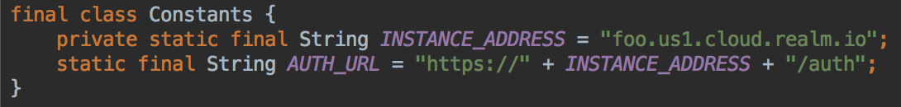
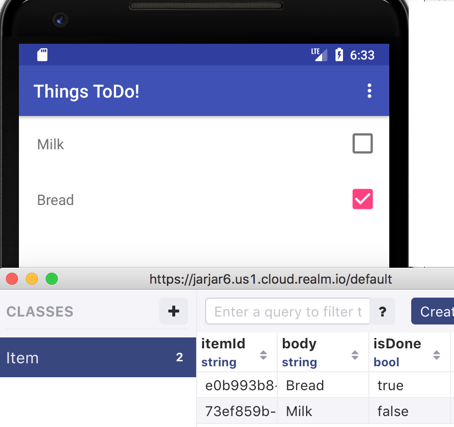
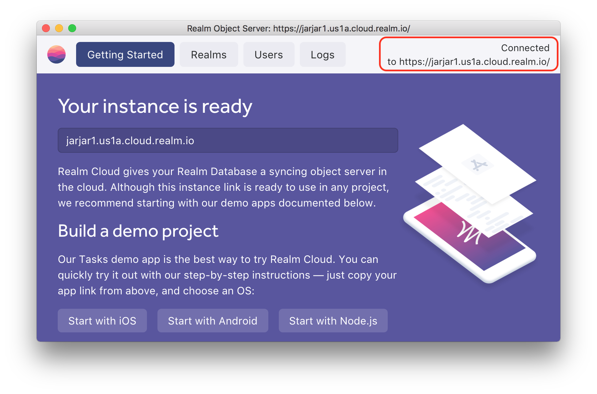
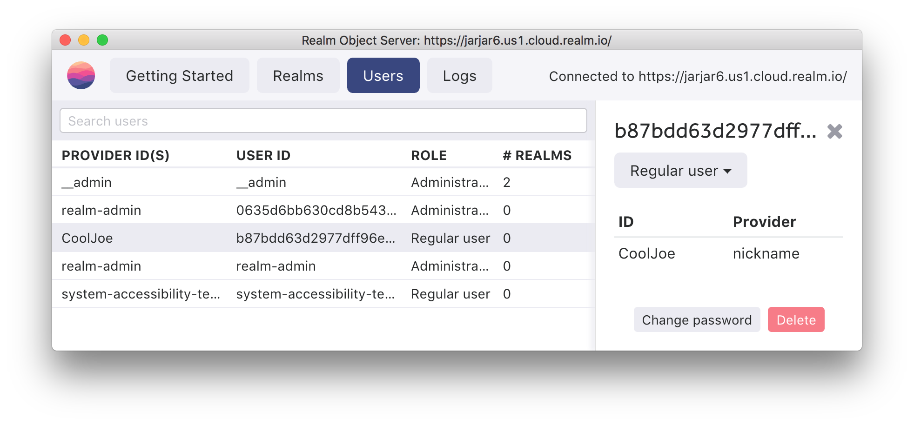
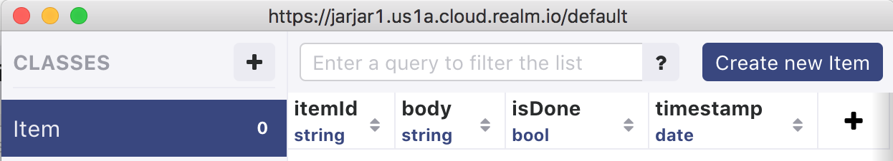
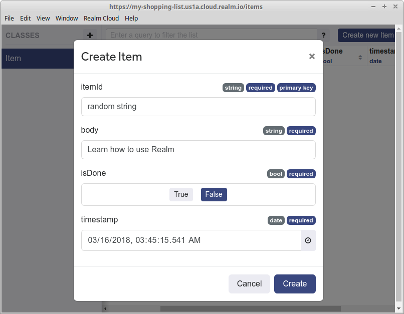

# Step 1 - My First Realm App

#### Prerequisites {#prerequisites-1}

*  [Android Studio](https://developer.android.com/studio/index.html) version 3.0 or higher
* JDK version 7.0 or higher
* A recent version of the Android SDK \(typically included as part of the Android Studio installation\)
* Android API Level 21 or higher \(Android 5.0 and above\)
* You will need your Realm Cloud instance URL that was generated when you created your instance \(it can be found by logging in to the [cloud portal](https://cloud.realm.io/), and clicking the `Copy Instance URL` link\)

## Quick Start {#step-1-create-a-new-android-project}

Want to get started right away? Follow these quick steps.

### Clone repository from GitHub

```text
git clone https://github.com/realm/my-first-realm-app
```

### Open in Android Studio

Use Android Studio version 3.0 or higher, to open the existing Android project under `<root>/my-first-realm-app/android/SyncIntro`


### Set the URL

Edit `Constants.java` and set `INSTANCE_ADDRESS` to the URL of your Cloud instance . Be sure to paste in only the host name part \("your-app-name.cloud.realm.io"\).



### Build the application

Now build and run the application. Add tasks and observe how they sync on your Realm Cloud instance using Realm Studio :



### Collaborate! {#next-step}

To see sync in practice, attach another device/emulator; start the app for each; choose a nickname for each user and observe the two simultaneously editing the same ToDo List at the same time!


### Next step {#continue-to-the-advanced-tutorial}

Now that you have seen the ToDo app in action, the rest of this tutorial will walk you through how we took a basic ToDo app and added persistence and synchronization in just a few steps.

Alternatively you can continue to our advanced tutorial that will teach you about a new feature, called Query-based sync, included with Realm Cloud. This functionality will enable you to synchronize a subset of data from the server, via a query. As an example, we will use it such that the ToDo app will only sync the data specific for the user.



## How the ToDo application was built {#step-1-create-a-new-android-project}

### Step 1 Build starting point application {#step-1-create-a-new-android-project}

We will start off with a simple ToDo application without any Realm features in it and then gradually add to it. Initially you will have to clone the project from GitHub:

```bash
git clone https://github.com/realm/my-first-realm-app
cd my-first-realm-app
git checkout -b develop android-step-1
```

Open the Android Project with the name of `SyncIntro` found under `my-first-realm-app/android`.

You should now be able to compile and run the application, the UI should look similar to:


### Step 2 Add Realm Java Plugin {#step-2-install-the-sdk}

* Locate and open the project level `build.gradle` file in the project file navigator as shown here:


* Add the class path dependency to the project level `build.gradle` file. The default file may contain additional named repositories; you should edit the file to mirror the settings shown here:

```groovy
buildscript {
    repositories {
        google() 
        jcenter()
    }
    dependencies {
        classpath 'com.android.tools.build:gradle:3.0.1'
        classpath 'io.realm:realm-gradle-plugin:5.0.1'
    }
}
```

Next we will change the app-level `build.gradle` which is shown here:


**Step 2a:** Apply the `realm-android` plugin under the Android one \(`com.android.application`\) int he `build.gradle` file.

```groovy
apply plugin: 'realm-android'
```

**Step 2b**: Add the following plugin configuration to enable the sync APIs:

```groovy
realm {
    syncEnabled = true
}
```

**Step 2c**:

We're going to use [Realm Android Adapter](https://github.com/realm/realm-android-adapters) to build the list of tasks, we need to add it's dependency.

```groovy
implementation 'io.realm:android-adapters:3.0.0'
```

**Step 2d:**

Locate the Java class `Constants` which will hold the URLs to your Realm Cloud instance, as follow

```java
package io.realm.todo;

final class Constants {
    private static final String INSTANCE_ADDRESS = "YOUR_INSTANCE.cloud.realm.io";
    static final String AUTH_URL = "https://" + INSTANCE_ADDRESS + "/auth";
}
```

Assign to `INSTANCE_ADDRESS`the actual instance address. It can be found on the 'Getting started' tab in Realm Studio.


**Self-Hosted:** The code snippet above is optimized for cloud. When using a self-hosted version of Realm Object Server, directly set the `AUTH_URL` variable. _It is likely you won't initially have SSL/TLS setup, so be careful with_ `http[s]`.





**Checkpoint**: You can compare your changes so far with the tag`android_step_2`

```bash
git diff android-step-2
```


There will of course be a difference in the instance address.


We use Java 8 in this project

```groovy
android {
    //....other properties
    compileOptions {
        sourceCompatibility JavaVersion.VERSION_1_8
        targetCompatibility JavaVersion.VERSION_1_8
    }
}
```


### Step 3: Logging in to the Cloud Server {#editing-welcomeactivity.java}

Before we can use any Realm functionality, we have to initialize the Realm library. Locate the `ToDoApplication` class and edit the `onCreate()` method like this:

```java
public void onCreate() {
    super.onCreate();
    Realm.init(this);
}
```

Update the import section to include \(_ALT+Enter on macOS_\)

```java
import io.realm.Realm;
```

Now locate the `WelcomeActivity` class. This activity is responsible of authenticating a user in order to access your Realm Cloud instance. This is done in the `attemptLogin` method by using the provided "nickname". Realm Cloud's "nickname" authentication provider is an excellent _development_ credential for you to quickly get started with Realm Sync without the need to remember any credentials.


In production you will most likely be using a password based provider like `usernamePassword` or OAuth based like `facebook` or `Google.`


Replace the `goToItemsActivity();` line in `attemptLogin()` function with this code snippet:

```java
SyncCredentials credentials = SyncCredentials.nickname(nickname, false);
SyncUser.logInAsync(credentials, AUTH_URL, new SyncUser.Callback<SyncUser>() {
    @Override
    public void onSuccess(SyncUser user) {
        showProgress(false);
        goToItemsActivity();
    }

    @Override
    public void onError(ObjectServerError error) {
        showProgress(false);
        mNicknameTextView.setError("Uh oh something went wrong! (check your logcat please)");
        mNicknameTextView.requestFocus();
        Log.e("Login error", error.toString());
    }
});
```

After a successful login, the `SyncUser` is persisted internally, there's no need to login again on the next app startup. We do check in `onCreate` if there's already a `SyncUser`. If we have one we do not attempt to login a user, instead we navigate directly to the next Activity. Add the following right before setting up the login form:

```java
// onCreate
if (SyncUser.current() != null) {
   goToItemsActivity();
}
```

Update the import section to also include:

```java
import io.realm.ObjectServerError;
import io.realm.SyncCredentials;
import io.realm.SyncUser;
import static io.realm.todo.Constants.AUTH_URL;
```

Try now to run the application and log in to the cloud using some random name, eg. "CoolJoe". You should now see the new user in the Realm Studio user list:



We can also implement the option to log out. Locate the `ItemsActivity` class. Modify the `onOptionsItemSelected` method to look like the following \(remember also to update imports\).

```java
public boolean onOptionsItemSelected(MenuItem item) {
    if (item.getItemId() == R.id.action_logout) {
        SyncUser syncUser = SyncUser.current();
        if (syncUser != null) {
            syncUser.logOut();
            Intent intent = new Intent(this, WelcomeActivity.class);
            intent.setFlags(Intent.FLAG_ACTIVITY_NEW_TASK | Intent.FLAG_ACTIVITY_CLEAR_TASK);
            startActivity(intent);
        }

        return true;
    }
    return super.onOptionsItemSelected(item);
}
```

As you can see we will logout the user before jumping back to the login screen. You may now try to log out and log in using another name.


**Checkpoint**: You can compare your changes with the tag `android_step_3`

```bash
git diff android-step-3
```


### Step 4 Adding the Item Realm Object {#step-6-adding-the-item-realm-object}

Locate the Java class `Item` \(under the `model` package\). This is a class that will hold each task of the ToDo list. We will now turn this into a Realm Object. This is basically done by inheriting from `RealmObject`:

`public class Item extends RealmObject {`

All properties are required \(meaning they will all be filled in when we create a new to do item\) and have default values. We will use the `itemId` property as primary key and the `timestamp` property to sort the collection of Items. We are indicating this by annotations:

```java
import io.realm.annotations.PrimaryKey;
import io.realm.annotations.Required;
public class Item extends RealmObject {
    @PrimaryKey
    @Required
    private String itemId;
    @Required
    private String body;
    @Required
    private Boolean isDone;
    @Required
    private Date timestamp;
```

We are now ready to create a Realm on the device and sync it to the cloud. This will only require a few modifications of `ItemsActivity` class.

Add the following method:

```java
private Realm realm;

private void setUpRealm() {
    Realm.setDefaultConfiguration(SyncUser.current().getDefaultConfiguration());
    realm = Realm.getDefaultInstance();
}
```

This will create a `SyncConfiguration` which use the current logged in user, as well as the URI of the remote Realm, to connect us with a Realm named '_default_' in the cloud.

Now we just need to add a call to this new method \(add it just before we create the`itemsRecyclerAdapter`inside the `onCreate` callback\).

```java
setUpRealm();
```

We must also remember to close the Realm. Modify `onDestroy` callback to add the close:

```java
@Override
protected void onDestroy() {
    super.onDestroy();
    realm.close();
}
```

If you run the program now, you will see that a realm called '_default_' is created in the cloud. If you double-click the Realm, it will open and you can see that the appropriate number of properties are added:




**Checkpoint**: You can compare your changes against the commit `android_step_4`

```bash
git diff android_step_4
```


### Step 5 Using the Realm data {#step-8-adding-the-itemsrecycleradapter-class}

We will now query the Realm asynchronously \(from a background thread\) to fetch all `Item` sorted by date. Add the following line after `setUpRealm()`

```java
RealmResults<Item> items = realm.where(Item.class).sort("timestamp", Sort.DESCENDING).findAllAsync();
```

To display the data inside a `RecyclerView` we use an adapter based on the [realm-android-adapters](https://github.com/realm/realm-android-adapters) library \(included previously as a dependency\). Our `ItemsRecyclerAdapter` must be modified to inherit from `RealmRecyclerViewAdapter` as follows :

```java
public class ItemsRecyclerAdapter extends RealmRecyclerViewAdapter<Item, ItemsRecyclerAdapter.MyViewHolder> {

    public ItemsRecyclerAdapter(OrderedRealmCollection<Item> data) {
        super(data, true);
    }
...
```

You can delete the `getItem` and `getItemCount` functions and we don't need the `mData` instance variable any more. The last thing we have to modify is the `onClick` function. This is called every time we click the checkbox and should invert the 'done' property. As this is a modification to the database, this has to be done in a write transaction. Replace the for loop with this:

```java
this.mItem.getRealm().executeTransactionAsync(realm -> {
    Item item = realm.where(Item.class).equalTo("itemId", itemId).findFirst();
    if (item != null) {
        item.setIsDone(!isDone);
    }
});
```

Remember to update the import section along the way.

If you run you application now and create new items through the Realm Studio interface, you should see the changes reflected on the device. Also, if you click a checkbox, the 'done' property should be changed in the cloud.



If you create multiple items, be sure to use unique strings for the `itemId`.


**Checkpoint**: You can compare your changes against the commit `android_step_5`

```bash
git diff android-step-5
```


### Step 6 Adding and removing objects {#step-9-editing-the-itemsactivity.java}

The only thing missing at this point is the ability to add and delete items on the device. This is done in two write transactions in the `ItemsActivity` class. The `List<Item>` instance variable is not needed any more. Adding a new item is done by the `AlertDialog` component. We use an asynchronous write transaction inside the `setPositiveButton` callback to add the new `Item`

```java
realm.executeTransactionAsync(realm -> {
    realm.insert(item);
});
```

Similarly swiping right will delete the item, this should also be performed inside a transaction: replace the for loop in `onSwiped` with this piece of code

```java
realm.executeTransactionAsync(realm -> {
    Item item = realm.where(Item.class)
            .equalTo("itemId", id)
            .findFirst();
    if (item != null) {
         item.deleteFromRealm();
    }
});
```

Run the application and see that the changes you make are reflected in the cloud.


This was the final step. You can compare your code with `android_step_6`.

```bash
git diff android-step-6
```


_Congrats on creating your first synchronized app with Realm Cloud!_

### Next step {#continue-to-the-advanced-tutorial}

Now that you have seen the ToDo app in action, you can continue to our advanced tutorial that will teach you about a new feature, called Query-based sync, included with Realm Cloud. This functionality will enable you to synchronize a subset of data from the server, via a query. As an example, we will use it such that the ToDo app will only sync the data specific for the user.



Not what you were looking for? [Leave Feedback](https://realm3.typeform.com/to/A4guM3)

