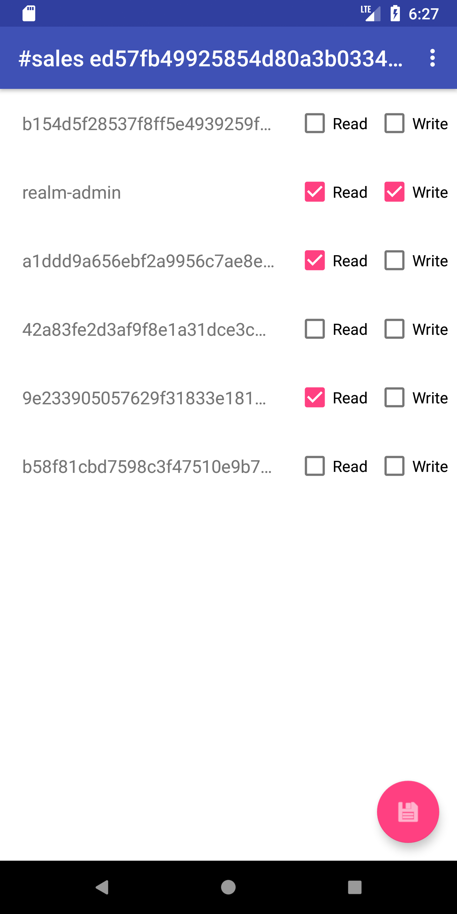
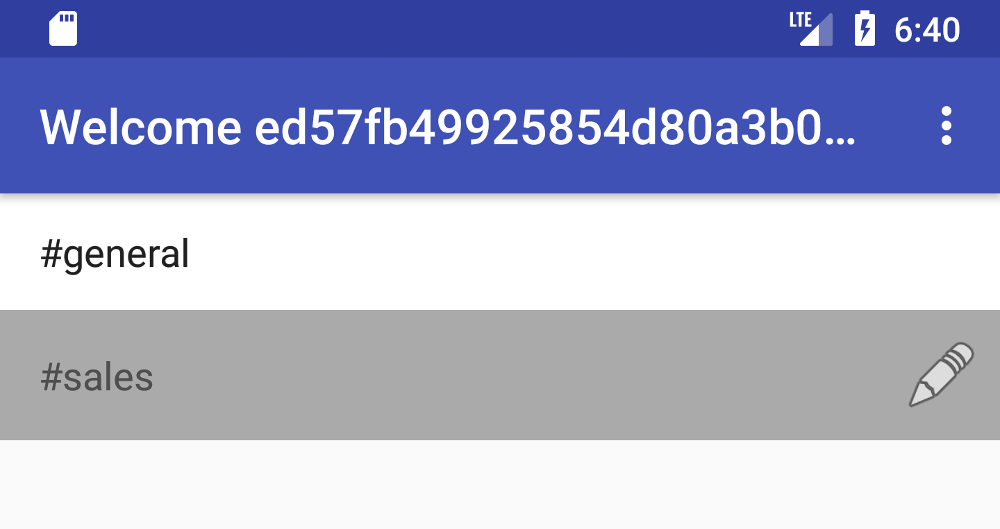

# Step 4 - Chat Room \(Permission API\)


**This tutorial uses new APIs still in beta.**  
The API may change, and we encourage you to give [feedback](https://forums.realm.io/t/partial-synchronization-and-object-level-permissions-feedback/1109)!



Want to get started right away with the complete source code? [Check it out here](https://github.com/realm/my-first-realm-app/tree/master/android/ObjectPermissionAdvanced)  


## Goal

To highlight more advanced use cases with the permission API and partial sync, we want to design a chat app that enables the user to create public and private chat rooms.

Here's a [video](https://www.youtube.com/watch?v=0nildZkOKkw) demonstrating the app in action 


Before starting this tutorial, it is recommended that you familiarise yourself with the new [permission API](https://docs.realm.io/platform/using-synced-realms/access-control#fine-grained-permissions-1) introduced in 3.x.


## The Model

Our model is simple, we use one class to represent a public chat room, and another for private rooms. Both contain a name and a list of messages represented with a `RealmList` as follow

```java
public interface ChatRoom extends RealmModel {
    String getName();
    RealmList<Message> getMessages();
}
```

#### PublicChatRoom

```java
@RealmClass
public class PublicChatRoom implements ChatRoom {
    @Required
    @PrimaryKey
    private String name;
    private RealmList<Message> messages;

    @Override
    public String getName() {
        return name;
    }

    @Override
    public RealmList<Message> getMessages() {
        return messages;
    }

    public void setName(String name) {
        this.name = name;
    }
}
```


Note that we use `@RealmClass` to define our Realm model instead on inheriting from `RealmObject` which is an alternative, \(`ChatRoom` interface extends `RealmModel` interface\) more details [here](https://realm.io/docs/java/latest#realmmodel-interface).


#### PrivateChatRoom

```java
@RealmClass
public class PrivateChatRoom implements ChatRoom {
    @PrimaryKey
    @Required
    private String name;
    private RealmList<Message> messages;
    private RealmList<Permission> permissions;

    @Override
    public String getName() {
        return name;
    }

    @Override
    public RealmList<Message> getMessages() {
        return messages;
    }

    /**
     * @return The list of {@link Permission} restricting access to this private chat room.
     */
    public RealmList<Permission> getACL() {
        return permissions;
    }

    public void setName(String name) {
        this.name = name;
    }
}
```

The `PrivateChatRoom` is similar to `PublicChatRoom` \(they share the same interface `ChatRoom`\).  The interesting difference lies in the `permissions` attribute which defines an [**A**ccess**C**ontrol**L**ist](https://docs.realm.io/platform/using-synced-realms/access-control#fine-grained-permissions-1) that controls who has access to which privileges \(`read`/`write` etc.\).

#### Message

```java
public class Message extends RealmObject {
    @Required
    private String body;
    @Required
    private String author;

    public String getBody() {
        return body;
    }

    public void setBody(String body) {
        this.body = body;
    }

    public String getAuthor() {
        return author;
    }

    public void setAuthor(String author) {
        this.author = author;
    }
}
```

`Message` is just a container of a single message with the name of the author for UI purpose.

## Querying for Chat Rooms

`ChatRoomsActivity` is responsible for presenting the list of both public & private chat rooms.  To do this, the activity uses the result of these two queries

```java
RealmResults<PublicChatRoom> publicChatRooms = realm
                .where(PublicChatRoom.class)
                .findAllAsync();
RealmResults<PrivateChatRoom> privateChatRooms = realm
                .where(PrivateChatRoom.class)
                .findAllAsync();                
```

The second query for private chat rooms will only returns the `PrivateChatRoom` we're allowed to see \(i.e we have `read`/`query` privileges on them\).

## Creating a public chat room

Creating a `PublicChatRoom` is straightforward since we just need to specify the name of it

```java
realm.executeTransactionAsync(realm -> realm.createObject(PublicChatRoom.class, name));
```

Since the `PublicChatRoom` model doesn't define any [ACL](https://docs.realm.io/platform/using-synced-realms/access-control#fine-grained-permissions-1) property, this makes it world readable/writable by any user.

## Creating a private chat room

The idea of a private chat room is to allow the user to select particular users, then grant them `read` and/or `write` privileges. 

* Only users who were granted `read` privileges can see this private chat room appearing to them \(as a result of the `realm.where(PrivateChatRoom.class)` query\). 
* Similarly, only users who were granted `canUpdate` can post messages to this private room.

The creation and modification of private chat room privileges is implemented inside `GrantPermissionsActivity`

```java
PrivateChatRoom privateChatRoom = realm.createObject(PrivateChatRoom.class, chatRoom);
```

### Granting read/write permission

We present the current user with a list of other users that he/she might wish to grant privileges to. 

```java
RealmResults<PermissionUser> users = realm.where(PermissionUser.class)
                    .notEqualTo("id", SyncUser.current().getIdentity())
                    .findAllAsync();
```

The selection of granted privileges with the associated user-id is captured inside this helper class \(populated by the UI code\)

```java
public class GrantedPermission {
    public String userId;
    public boolean canRead;
    public boolean canWrite;
}
```



We then iterate through the list of `GrantedPermission` \(when the user clicks on the save button\) to create the `Permission` for each selected user.

* First we need to get the selected user private role.  This will avoid creating a new role to assign the permission to:

```java
// create a permission using the built-in role of the user
Role userRole = realm.where(PermissionUser.class)
        .equalTo("id", grantedPermission.userId).findFirst().getPrivateRole();
```

* Create a `Permission` using the builder pattern.  We start by denying all privileges:

```java
Permission userPermission = new Permission.Builder(userRole).noPrivileges().build();
```

* We then grant the `read` / `write` privileges:

```java
userPermission.setCanRead(grantedPermission.canRead);
userPermission.setCanQuery(grantedPermission.canRead);
userPermission.setCanCreate(grantedPermission.canWrite);
userPermission.setCanUpdate(grantedPermission.canWrite);
```

* We add the permission to our ACL:

```java
privateChatRoom.getACL().add(userPermission);
```


   Find the complete implementation in `PermissionHelper#grantPermissions`


### Granting admin privileges 

It is necessary for the user who created the private chat room to grant himself the privilege to modify the previously granted permission\(s\) in the future.  This is why a special permission with all privileges is added to the ACL of this `PrivateChatRoom` :

```java
Role privateRole = realm.where(PermissionUser.class)
    .equalTo("id", SyncUser.current().getIdentity()).findFirst().getPrivateRole();
Permission adminPermission = new Permission.Builder(privateRole).allPrivileges().build();
privateChatRoom.getACL().add(adminPermission);
```

### Editting a permission

If we want to edit the granted privileges of a particular user, we need only to find his `Permission` in the `RealmList<Permission>`ACL, and then proceed to modify it. 

* Find the user role:

```java
Role userRole = realm.where(PermissionUser.class)
    .equalTo("id", grantedPermission.userId).findFirst().getPrivateRole();
```

* Find the permission that has this particular role:

```java
Permission userPermission = privateChatRoom.getACL()
    .where().equalTo("role.name", userRole.getName()).findFirst();
```

* Now we can edit the permission: 

```java
// update/set permission
userPermission.setCanRead(grantedPermission.canRead);
userPermission.setCanQuery(grantedPermission.canRead);
userPermission.setCanCreate(grantedPermission.canWrite);
userPermission.setCanUpdate(grantedPermission.canWrite);
userPermission.setCanDelete(grantedPermission.canWrite);
userPermission.setCanSetPermissions(false);
userPermission.setCanModifySchema(false);
```


This modification will succeed only if the current user performing it has the privilege to `setPermissions` which is the case since we granted all privileges to the user who created the private chat room previously.



Find the complete implementation inside `PermissionHelper#updateGrantedPermissions`


#### Permission correction

With the permission system in place, Realm Cloud can enforce these ACL policies.  For example, a user that was granted only `read` to a private chat room can only read the messages posted, but not write \(add `Message`\).  If the user tries to write without permissions, Realm Cloud will perform a permission correction \(to remove this operation\) to prevent this illegal change from propagating into the Realm.

#### Permission cache

If the user doesn't know his privileges he/she can query the permission cache to find out if he/she has the privilege to perform the desired operation.

As an example, in the chat app we display a modification button along the private chat room only if the current user has the privilege to `setPermission` 

```java
ObjectPrivileges privileges = realm.getPrivileges(chatRoom);
if (privileges.canSetPermissions()) {
    // display modify button 
}
```



Querying the permission cache will help design a better UX by reflecting a UI compatible with the set of privileges we can perform \(and avoid permission correction\). 


Find out more about permission cache [here](https://docs.realm.io/platform/using-synced-realms/access-control#user-privileges).


## Locking permission schema

Finally, as we did in the previous permission [tutorial](https://docs.realm.io/platform/getting-started/android-quick-start/step-3-adding-permissions#lower-the-default-permissions), we need to lower the default permissions since every user by default is part also of the "everyone" role which can perform all operations.


In this demo, we lower the privileges programmatically the first time a user logs in to our application. In practice, you'll want to configure these privileges using Realm Studio or a script prior to your users running the application.


There are two levels of permissions that we will lower: class-level permissions, and Realm-level permissions.

#### Class-level permissions

* `Message`

Message should not be queryable.  This means that only `Message` objects that can be synchronized as part of their respective `PublicChatRoom` or `PrivateChatRoom` are visible,  thus avoid adding an ACL for each message which is suboptimal. 

We also remove the ability for `everyone` to change the permissions of our model

```java
Permission messagePermission = realm.where(ClassPermissions.class)
    .equalTo("name", "Message").findFirst().getPermissions().first();
messagePermission.setCanQuery(false); // Message are not queryable since they're accessed via RealmList (from PublicChatRoom or PrivateChatRoom)
messagePermission.setCanSetPermissions(false);
```

* `PublicChatRoom` and `PrivateChatRoom`

We remove the ability for `everyone` to change the permissions of these model 

```java
Permission publicChatPermission = realm.where(ClassPermissions.class)
    .equalTo("name", "PrivateChatRoom").findFirst().getPermissions().first();
Permission privateChatPermission = realm.where(ClassPermissions.class)
    .equalTo("name", "PublicChatRoom").findFirst().getPermissions().first();
publicChatPermission.setCanSetPermissions(false);
privateChatPermission.setCanSetPermissions(false);    
```

#### Realm-level permissions

* We prevent the creation of `Role` since we rely on prebuilt/private user role for the entire application: 

```java
Permission rolePermission = realm.where(ClassPermissions.class)
    .equalTo("name", "__Role").findFirst().getPermissions().first();
rolePermission.setCanCreate(false);    
```

* We also prevent the modification of `Role` to prevent a malicious user from adding themselves to another user's private role:

```java
rolePermission.setCanUpdate(false);
```

* Finally, we prevent schema modification then "lock" the permission schema by removing the possibility to change permission at the Realm level \(in case another user connecting with the `everyone` role wants to revert our changes\)


Note that the order in which we perform these operations is significant, as removing the ability to modify permissions would cause subsequent permission changes to be rejected.


```java
// Lock the permission and schema
RealmPermissions permission = realm.where(RealmPermissions.class)
    .equalTo("id", 0).findFirst();
Permission everyonePermission = permission.getPermissions().first();
everyonePermission.setCanModifySchema(false);
everyonePermission.setCanSetPermissions(false);
```


Find complete implementation inside `PermissionHelper#initializePermissions` 



