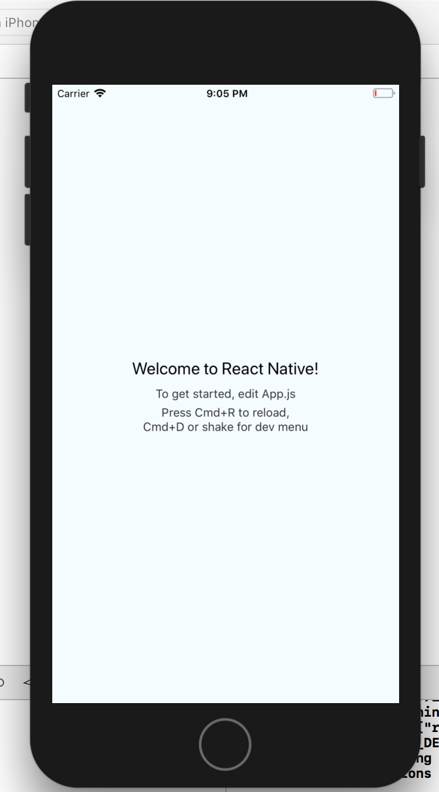

# Step 1 - Query-based sync

## Prerequisites:

Before we get started we need a few things setup; the prerequisites for this project are:

* [Xcode 9.0](https://itunes.apple.com/us/app/xcode/id497799835?mt=12) or later.
* Make sure your environment is set up to run React Native applications. Follow the [React Native instructions](https://facebook.github.io/react-native/docs/getting-started.html) for getting started.
* Install the [React Native CLI](https://facebook.github.io/react-native/docs/getting-started.html#the-react-native-cli)
* You will need your Realm Cloud instance URL that was generated when you created your instance \(it can be found by logging in to the [cloud portal](https://cloud.realm.io/), and clicking the `Copy Instance URL` link\).

## Overview:

We will make a simple work management application called "ToDo", which will allow for users to create "projects". Within those projects we will enable them to create any number of "tasks" associated with each project.

Realm works by defining a data model that configures the schema of a "realm". A [realm ](https://realm.io/docs/data-model/#what-is-a-realm)is an instance of a Realm Mobile Database container. In this project, our client realm will connect and sync data with the centralized Realm Object Server through a process called [query-based synchronization](https://docs.realm.io/platform/using-synced-realms/syncing-data#using-query-based-synchronization).

## Step 1: Create a React Native Project

Navigate to your desktop or a directory your would like to save our project to. On the command line create a new React Native project. Let's name it "**ToDo".**

```text
react-native init ToDo
```

This will create the basic application structure and a `package.json` file for our dependencies.

Before we dive into adding code, it's a good idea to make sure that the environment is configured correctly and that we can successfully compile the app template we just created.

Navigate to the project directory &gt; `ios` and `open ToDo.xcodeproj`. Start the new application by selecting a simulator and clicking Build/Run icon. Your new app should look like the screen below.



## Step 2: Installing the Realm Framework

To use Realm Cloud in your React Native app, you'll need to add the `Realm`  framework to the project. This can most easily be accomplished using [NPM](https://www.npmjs.com/).

Inside of your project directory add the `realm` package with the command:

```text
npm install --save realm
```

Next, link your project to the `realm` native module:

```text
react-native link realm
```


If you receive a `node-pre-gyp install --fallback-to-build` error when running your app, it is possible your version of Node is incompatible with Realm. Either upgrade or downgrade your installation to the latest [LTS](https://nodejs.org/en/download/).


## Step 3: Realm Model and Application overview

From this point you can use a text editor of your choice to edit the JS files directly \(we recommend [VS code](https://code.visualstudio.com/)\). In your project directory create a new folder called `src`. Inside of that folder we will create our first file, `schemas.js`. Just like any other database system we will need to give types to every property and establish a primary key to reference specific objects. Go ahead and copy the following models into our newly created `schema.js` file:


It is important to use the 'copy to clipboard' link in the top right of each snippet instead of highlighting then copying. This prevents formatting errors.




```javascript
export const Project = {
  name: "Project",
  primaryKey: "projectId",
  properties: {
    projectId: "string",
    owner: "string",
    name: "string",
    timestamp: "date",
    items: "Item[]"
  }
};

export const Item = {
  name: "Item",
  primaryKey: "itemId",
  properties: {
    itemId: "string",
    body: "string",
    isDone: "bool",
    timestamp: "date"
  }
};
```



## Step 4: Create a Constants File and Set the Realm Instance Address

Inside of the `src` directory create a new javascript file named `constants.js` and paste the code snippet below. Replace `MY_INSTANCE_ADDRESS` with your own instance address. This file is where you will need to input your specific Realm Object Server address so we can access the path later when we configure our first realm.



```javascript
// **** Realm Cloud Users:
// **** Replace MY_INSTANCE_ADDRESS with the hostname of your cloud instance
// **** e.g., "mycoolapp.us1.cloud.realm.io"
// ****
// ****
// **** ROS On-Premises Users
// **** Replace the SERVER_URL string with the fully qualified versions of
// **** address of your ROS server, e.g.: "http://127.0.0.1:9080".
const MY_INSTANCE_ADDRESS = "YOUR-INSTANCE-ID.cloud.realm.io"; // <- update this
export const SERVER_URL = `https://${MY_INSTANCE_ADDRESS}`;
```




**NOTE**: The Realm Cloud Portal presents fully specified URLs \(e.g., _https:_//_appname.cloud.realm.io_\); be sure to paste in only the host name part \(e.g., _appname.cloud.realm.io_\) into your copy of the `constants.js` file.


## Step 5: Adding a Login Form Dialogue

Next we are going to create a welcome page where we will authenticate the user. This will be the page you see when the app starts up and will be used to log in to the app and connect your application to the Realm Cloud. Inside our `src` directory create a new folder called  `components`. This will contain all of our components and pages. 

Before we set out to complete our `LoginForm` component, which will house our authentication logic, we need to create two other components which the `LoginForm` will depend on--a custom `ModalView` and a `Button`.

### Creating the ModalView:

Create a new javascript file called `ModalView.js` inside of our new `components` folder. We will greet the user with a modal asking for a login nickname that we will use to connect to the Realm Object Server. To do this we will need to import modals from the React Native Community:

```text
npm install --save react-native-modal
```

You can read more about the dependency [here](https://github.com/react-native-community/react-native-modal).

Import `React` and `Component` from the 'react' library for the basic building blocks of our class and import the `Modal` component from 'react-native-modal' for our `render()` method. We will also import `PropTypes` for our [state](https://facebook.github.io/react-native/docs/state), then`Stylesheets` , `View` , `Text` , and `TextInput` from the 'react-native' library.



```javascript
import PropTypes from "prop-types";
import React, { Component } from "react";
import { View, Text, TextInput } from "react-native";
import Modal from "react-native-modal";
import { StyleSheet } from "react-native";

const white = "white";

const styles = StyleSheet.create({
  content: {
    flexDirection: "column",
    backgroundColor: white,
    padding: 16,
    justifyContent: "center",
    alignItems: "center",
    borderRadius: 4
  },
  input: {
    width: "100%",
    textAlign: "center"
  },
  buttons: {
    flexDirection: "row",
    marginTop: 10
  }
});

//component will be added later
import { Button } from "./Button";

export class ModalView extends Component {
  render() {
  }
}
```



When we create a `ModalView` component in our LoginForm we will pass several [props](https://facebook.github.io/react-native/docs/props) to it. The `placeholder` and `confirmLabel` will be text passed in to customize the prompt of the Modal. The `error` prop will display the state error and `isModalVisible` is a boolean that determines if the modal is active. Finally, `handleSubmit` passes in the method to be called for submission.

We will add three methods to this class. First, `componentDidUpdate` will reset the `text` state when the modal becomes visible. The `onChangeText` will update the `text` state when the input is changed by the user. And `onConfirm` will fire the `handleSubmit` prop.



```javascript
//...
//import statements and stylesheet
//...

export class ModalView extends Component {
  static propTypes = {
    confirmLabel: PropTypes.string,
    error: PropTypes.object,
    handleSubmit: PropTypes.func,
    isModalVisible: PropTypes.bool,
    placeholder: PropTypes.string,
    toggleModal: PropTypes.func
  };
  
  state = {
    text: ""
  };
  
  componentDidUpdate(prevProps) {
    // Reset the text state when the modal becomes visible
    if (!prevProps.isModalVisible && this.props.isModalVisible) {
      this.setState({ text: "" });
    }
  }
  
  render() {
    const {
      confirmLabel,
      error,
      isModalVisible,
      placeholder,
      toggleModal
    } = this.props;
    
    return (
      <Modal isVisible={isModalVisible}>
        <View style={styles.content}>
          {error && <Text>{error.message}</Text>}
          <TextInput
            style={styles.input}
            autoFocus={true}
            placeholder={placeholder}
            onChangeText={this.onChangeText}
            value={this.state.text}
            onSubmitEditing={this.onConfirm}
          />
          <View style={styles.buttons}>
            <Button onPress={this.onConfirm}>
              {confirmLabel || "Confirm"}
            </Button>
            {toggleModal ? <Button onPress={toggleModal}>Cancel</Button> : null}
          </View>
        </View>
      </Modal>
    );
  }
  
  onChangeText = text => {
    this.setState({ text });
  };
  
  onConfirm = () => {
    this.props.handleSubmit(this.state.text);
  };
}
```



### Creating the Button:

The `Button` component that we imported earlier allows the parent to pass in variable confirm prompts. It builds off the [React Native Elements](https://react-native-training.github.io/react-native-elements/) toolkit, so you will need to install it with:

```text
npm install --save react-native-elements
npm install --save react-native-vector-icons
react-native link react-native-vector-icons
```



```javascript
import PropTypes from "prop-types";
import React from "react";
import { StyleSheet } from "react-native";
import * as ReactNativeElements from "react-native-elements";

const styles = StyleSheet.create({
  container: {
    marginLeft: 6,
    marginRight: 6,
    marginTop: 4,
    marginBottom: 4
  }
});

export const Button = ({ onPress, children, style }) => (
  <ReactNativeElements.Button
    backgroundColor="lightblue"
    buttonStyle={style}
    containerViewStyle={styles.container}
    color="black"
    borderRadius={4}
    onPress={onPress}
    title={children}
  />
);

Button.propTypes = {
  onPress: PropTypes.func,
  children: PropTypes.string,
  style: PropTypes.object
};
```



### Creating the LoginForm:

Now that we have the `Button` and `ModalView` components set up, we can create the `LoginForm`. The `LoginForm` is where we will receive the input from the user and make our first authenticated connection to the Realm Object Server. The skeleton for this component looks like this:



```javascript
import React, { Component } from "react";
import { View, StyleSheet } from "react-native";
//We will add "react-native-router-flux in the next step
import { Actions } from "react-native-router-flux";
import Realm from "realm";

import { SERVER_URL } from "../constants";
import { Project, Item } from "../schemas";

import { Button } from "./Button";
import { ModalView } from "./ModalView";

const styles = StyleSheet.create({
  container: {
    flex: 1,
    justifyContent: "center",
    alignItems: "center"
  },
  buttons: {
    flex: 1,
    justifyContent: "center",
    alignItems: "center"
  }
});

export class LoginForm extends Component {
  state = {};
  
  render() {
  }
}
```



The [first method](https://reactjs.org/docs/state-and-lifecycle.html) that will fire within the class is `componentWillMount`. Here we will check to see if there is a user logged in, and if not we will start the process.



```javascript
componentDidMount() {
  // Check if we're already authenticated
  if (Realm.Sync.User.current) {
    this.onAuthenticated(Realm.Sync.User.current);
  } else {
    this.setState({ isModalVisible: true });
  }
}
```



Our render method draws upon the two components we created earlier:



```javascript
render() {
  // Show the modal if the user is not authenticated
  const isAuthenticated = !!Realm.Sync.User.current;
  
  return (
    <View style={styles.container}>
      <ModalView
        placeholder="Please Enter a Username"
        confirmLabel="Login"
        isModalVisible={!isAuthenticated}
        handleSubmit={this.handleSubmit}
        error={this.state.error}
      />
      {isAuthenticated && (
        <View style={styles.buttons}>
          <Button onPress={this.onLogout}>Logout</Button>
          <Button onPress={this.onOpenProjects}>Go to projects</Button>
        </View>
      )}
    </View>
  );
}
```



When the modal is visible the user, the user has input a username, and has clicked confirm, the `handleSubmit` method in our class will now run. It should look like this:



```javascript
handleSubmit = async nickname => {
  try {
    // Reset any previous errors that might have happened
    this.setState({ error: undefined });
    // Attempt to authenticate towards the server
    const user = await Realm.Sync.User.registerWithProvider(SERVER_URL, {
      provider: "nickname",
      providerToken: nickname
    });
    // Hide the modal
    this.setState({ isModalVisible: false });
    this.onAuthenticated(user);
  } catch (error) {
    this.setState({ isModalVisible: true, error });
  }
}
```



Realm supports a number of authentication methods: For prototyping \(or low-security applications\) the `Nickname` provider - which allows you to log in without needing a password -- is very convenient, and it's what we've chosen for this short introduction. Nickname credentials are easily constructed with:

```text
Realm.Sync.User.registerWithProvider()
```

Where `provider` is set to `nickname`. You can be read about the different authentication types [here](https://docs.realm.io/platform/using-synced-realms/user-authentication). This method registers and signs in a user to the Realm Object Server associated with the address that you added earlier. The last portion of the method then calls `onAuthenticated()`.



```javascript
onAuthenticated(user) {
  // Create a configuration to open the default Realm
  const config = user.createConfiguration({
    schema: [Project, Item]
  });
  // Open the Realm
  const realm = new Realm(config);
  // Navigate to the main scene
  Actions.authenticated({ user, realm });
}
```



Here we do three things. First we create a default configuration object with the schema we created. Second we open the realm. This will create a connection to the Realm Object Server and allow us to read and write data. Third we navigate to the next page while passing in the reference to the logged in `user` and the `realm` we just opened.

The last two methods of the class serve to provide options to logout or proceed to the `projects` screen.



```javascript
onLogout = () => {
    if (Realm.Sync.User.current) {
      Realm.Sync.User.current.logout();
      this.forceUpdate();
    }
};
  
onOpenProjects = () => {
    if (Realm.Sync.User.current) {
      this.onAuthenticated(Realm.Sync.User.current);
    }
};
```



### Connecting the classes to our root file:

If we were to run the application now, you would still see the React-native default screen because we have not connected any of our components to the main AppRegistry. In the main project directory we will want to move the `App.js` file to our component folder. In doing so we will need to edit the `index.js` file to import `App.js` from `./src/components/App` instead of `./App`. The new line should look like:



```javascript
//...
import { App } from "./src/components/App"
//...
```



Now we will add the `react-native-router-flux` [dependency](https://github.com/aksonov/react-native-router-flux) to our project:

```text
npm install --save react-native-router-flux@4.0.0-beta.31
```

The dependency works by creating a hierarchy of scenes, where each scene is designated a key and a component. To navigate to any scene, you simply invoke the key and the desired component will be mounted with any attached props.

Replace the current contents of the `App.js` file with:



```javascript
import React from "react";
import { Scene, Stack, Router } from "react-native-router-flux";

import { LoginForm } from "./LoginForm";
import { ProjectList } from "./ProjectList";
//import { ItemList } from "./ItemList";

export const App = () => (
  <Router>
    <Scene hideNavBar={true}>
      <Scene key="login" component={LoginForm} title="Please Login" />
      <Stack key="authenticated">
        <Scene key="projects" component={ProjectList} title="Projects" />
        {/* <Scene key="items" component={ItemList} title="Items" /> */}
      </Stack>
    </Scene>
  </Router>
);
```



To test the code that we currently have we will need to create a `ProjectList`. For now let's create a placeholder.



```javascript
import PropTypes from "prop-types";
import React, { Component } from "react";
import { View, FlatList, Text, StyleSheet } from "react-native";
import { Actions } from "react-native-router-flux";
import { List, ListItem } from "react-native-elements";
import { v4 as uuid } from "uuid";

const projectKeyExtractor = project => project.projectId;

const styles = StyleSheet.create({
  placeholder: {
    textAlign: "center",
    padding: 10
  }
});

import { ModalView } from "./ModalView";
//import { SwipeDeleteable } from "./SwipeDeleteable";

export class ProjectList extends Component {
    static propTypes = {
        user: PropTypes.object,
        realm: PropTypes.object
    };
    state = {
    dataVersion: 0,
    isModalVisible: false
    };
    render() {
        return(
            <View>
                <Text>User identity is: {this.props.user.identity}</Text>
            </View>
        )
        
    }
}
```



Let's make sure everything is working correctly. After clicking the build/run button in Xcode the result should look similar to this:


## Step 6: Querying the Realm and displaying Projects

Now we will fill out the ProjectList, implement a process so the user can create projects, and query the realm for data.

Most of our logic for fetching the `project` data will be in the componentDidMount below. On line 5 we are adding a navigation button to create a new project object. If it is toggled `true` we use the same `ModalView` as we did in the `LoginForm`. On line 13 we are creating a query that will return a [results](https://realm.io/docs/javascript/2.15.0/api/Realm.Results.html) object filtered by who the author of the project is. On line 19 we add a listener so React will be notified of changes. On line 26 we subscribe to the query we made on 13, which will tell the Realm Object Server to sync that data to our device's realm.



```javascript
componentDidMount() {
    const { realm } = this.props;
    
    // Register an action to create a project
    Actions.refresh({
      rightTitle: " Create",
      onRight: () => {
        this.toggleModal();
      }
    });
    
    // Get a result containing all projects
    const projects = realm
      .objects("Project")
      .filtered("owner == $0", this.props.user.identity)
      .sorted("timestamp", true);
      
    // When the list of projects change, React won't know about it because the Result object itself did not change.
    projects.addListener(() => {
      // Bump a data version counter that we'll pass to components that should update when the projects change.
      this.setState({ dataVersion: this.state.dataVersion + 1 });
    });
    
    // Create a subscription and add a listener
    // Remember to remove the listener when component unmounts
    this.subscription = projects.subscribe();
    this.subscription.addListener(this.onSubscriptionChange);
    
    // Update the state with the projects
    this.setState({ projects });
  }
```



In our `render()` method we utilize the `FlatList` [component](https://facebook.github.io/react-native/docs/flatlist) which receives our data in the `project` state variable and uses the `renderProject` method to create each `ListItem`.



```javascript
render() {
    const { dataVersion, isModalVisible, projects } = this.state;
    return (
      <View>
        {!projects || projects.length === 0 ? (
          <Text style={styles.placeholder}>Create your first project</Text>
        ) : (
          <List>
            <FlatList
              data={projects}
              extraData={dataVersion}
              renderItem={this.renderProject}
              keyExtractor={projectKeyExtractor}
            />
          </List>
        )}
        <ModalView
          placeholder="Please Enter a Project Name"
          confirmLabel="Create Project"
          isModalVisible={isModalVisible}
          toggleModal={this.toggleModal}
          handleSubmit={this.onProjectCreation}
        />
      </View>
    );
  }
```



Below is the code for `renderProject`.



```javascript
renderProject = ({ item }) => (
    <SwipeDeleteable
      key={item.projectId}
      onPress={() => {
        this.onProjectPress(item);
      }}
      onDeletion={() => {
        this.onProjectDeletion(item);
      }}
    >
      <ListItem
        title={item.name}
        badge={{
          value: item.items.length
        }}
        hideChevron={true}
      />
    </SwipeDeleteable>
  );
```



`SwipeDeleteable` is another custom component we will add after the `ProjectList`.

Next we will add the following five methods:



```javascript
onProjectCreation = projectName => {
    const { user, realm } = this.props;
    // Open a write transaction
    realm.write(() => {
      // Create a project
      realm.create("Project", {
        projectId: uuid(),
        owner: user.identity,
        name: projectName,
        timestamp: new Date()
      });
    });
    // Reset the state
    this.setState({ isModalVisible: false });
  };
  
  onProjectPress = project => {
    const { user, realm } = this.props;
    Actions.items({ project, realm, user, title: project.name });
  };
  
  onProjectDeletion = project => {
    const { realm } = this.props;
    // Open a write transaction
    realm.write(() => {
      // Delete the project
      realm.delete(project);
    });
  };
  
  onSubscriptionChange = () => {
    // Realm.Sync.SubscriptionState.Complete
    // Realm.Sync.SubscriptionState.Error
  };
  
  toggleModal = () => {
    this.setState({ isModalVisible: !this.state.isModalVisible });
  };
```



The first, `onProjectCreation`, is the process of [adding data](https://realm.io/docs/javascript/latest#writes) to the realm. After having the realm object passed as a prop from the LoginForm, we can open a write transaction and begin creating objects. 

When the user selects a project from the list, we navigate to the items associated with that project with `onProjectPress`. In `onProjectDeletion`, we open another write transaction to delete data from the realm. 

Finally when the component is unmounted you will want to remove all listeners.



```javascript
componentWillUnmount() {
    const { projects } = this.state;
    if (this.subscription) {
      // Remove all listeners from the subscription
      this.subscription.removeAllListeners();
    }
    if (projects) {
      projects.removeAllListeners();
    }
  }
```



The last custom component we will add is the `SwipeDeletable`. In a new file paste the following code. More can be read about the `panResponder` [here](https://facebook.github.io/react-native/docs/panresponder).



```javascript
import PropTypes from "prop-types";
import React, { Component } from "react";
import { Animated, PanResponder } from "react-native";

export class SwipeDeleteable extends Component {
  static propTypes = {
    onDeletion: PropTypes.func.isRequired,
    onPress: PropTypes.func
  };
  
  _panResponder = PanResponder.create({
    onStartShouldSetPanResponder: () => true,
    onPanResponderMove: (e, gestureState) => {
      this._offset.setValue(gestureState.dx);
    },
    onPanResponderRelease: (e, gestureState) => {
      if (gestureState.dx === 0 && this.props.onPress) {
        // We consider it a press if the user didn't pan
        this.props.onPress();
      } else {
        // Delete the item if the gesture is released 30% to either side
        const isDeletion = Math.abs(gestureState.dx) > this._width / 3;
        // If the item is deleted, complete the swipe in the correct direction
        const toValue = isDeletion
          ? gestureState.dx > 0
            ? this._width
            : -this._width
          : 0;
        // Apply a sprint to the offset
        Animated.spring(this._offset, {
          toValue,
          speed: 48
        }).start();
        // Delete the item right away
        if (isDeletion) {
          this.props.onDeletion();
        }
      }
    }
  });
  
  _offset = new Animated.Value(0);
  
  render() {
    const { children } = this.props;
    return (
      <Animated.View
        style={{
          transform: [
            {
              translateX: this._offset
            }
          ]
        }}
        onLayout={this.onLayout}
        {...this._panResponder.panHandlers}
      >
        {children}
      </Animated.View>
    );
  }
  
  onLayout = event => {
    this._width = event.nativeEvent.layout.width;
  };
}
```



## Step 7: Adding the ItemList

Now we will add the `ItemList`. It shares several similarities with the `ProjectList` with a few key differences. 

In our project model, each Project object contains a [list property](https://realm.io/docs/javascript/latest#list-properties) called items. Here we are able to push item objects which will then be related to their parent Project. This is done in the write transaction at the creation of each Item object.

The code for the ItemList is as follows:



```javascript
import PropTypes from "prop-types";
import React, { Component } from "react";
import { View, FlatList, Text, StyleSheet } from "react-native";
import { Actions } from "react-native-router-flux";
import { List, ListItem } from "react-native-elements";
import { v4 as uuid } from "uuid";

const styles = StyleSheet.create({
  placeholder: {
    textAlign: "center",
    padding: 10
  }
});

const itemKeyExtractor = item => item.itemId;

import { ModalView } from "./ModalView";
import { SwipeDeleteable } from "./SwipeDeleteable";

const checkedIcon = {
  name: "check-box",
  color: "#555"
};

const uncheckedIcon = {
  name: "check-box-outline-blank",
  color: "#555"
};

export class ItemList extends Component {
  static propTypes = {
    user: PropTypes.object,
    realm: PropTypes.object,
    project: PropTypes.object
  };
  
  state = {
    dataVersion: 0,
    isModalVisible: false
  };
  
  componentDidMount() {
    const { project } = this.props;
    
    // Register an action to create an item
    Actions.refresh({
      title: project.name,
      rightTitle: " Create",
      onRight: () => {
        this.toggleModal();
      }
    });
    
    // Get a result containing all items
    const items = project.items.sorted("timestamp");
    
    // When the list of items change, React won't know about it because the Result object itself did not change.
    items.addListener(() => {
      // Bump a data version counter that we'll pass to components that should update when the items change.
      this.setState({ dataVersion: this.state.dataVersion + 1 });
    });
    
    // No need to create a subscription here:
    // We assume another subscription is created for all the users projects already.
    
    // Update the state with the items
    this.setState({ items });
  }
  
  componentWillUnmount() {
    const { items } = this.state;
    // Remove all listeners from the subscription
    if (this.subscription) {
      this.subscription.removeAllListeners();
    }
    // Remove all listeners from the items
    if (items) {
      items.removeAllListeners();
    }
  }
  
  render() {
    const { dataVersion, isModalVisible, items } = this.state;
    return (
      <View>
        {!items || items.length === 0 ? (
          <Text style={styles.placeholder}>Create your first item</Text>
        ) : (
          <List>
            <FlatList
              data={items}
              extraData={dataVersion}
              renderItem={this.renderItem}
              keyExtractor={itemKeyExtractor}
            />
          </List>
        )}
        <ModalView
          placeholder="Please enter a description"
          confirmLabel="Create Item"
          isModalVisible={isModalVisible}
          toggleModal={this.toggleModal}
          handleSubmit={this.onItemCreation}
        />
      </View>
    );
  }
  
  renderItem = ({ item }) => (
    <SwipeDeleteable
      key={item.itemId}
      onDeletion={() => {
        this.onDeletion(item);
      }}
    >
      <ListItem
        title={item.body}
        rightIcon={item.isDone ? checkedIcon : uncheckedIcon}
        onPressRightIcon={() => {
          this.onToggleDone(item);
        }}
      />
    </SwipeDeleteable>
  );
  
  onSubscriptionChange = () => {
    // Realm.Sync.SubscriptionState.Complete
    // Realm.Sync.SubscriptionState.Error
  };
  
  toggleModal = () => {
    this.setState({ isModalVisible: !this.state.isModalVisible });
  };
  
  onItemCreation = body => {
    const { realm, project } = this.props;
    // Open a write transaction
    realm.write(() => {
      // Create a project
      const item = realm.create("Item", {
        itemId: uuid(),
        body,
        isDone: false,
        timestamp: new Date()
      });
      // Add the item to the project
      project.items.push(item);
    });
    // Reset the state
    this.setState({ isModalVisible: false });
  };
  
  onToggleDone = item => {
    const { realm } = this.props;
    // Open a write transaction
    realm.write(() => {
      // Toggle the item isDone
      item.isDone = !item.isDone;
    });
  };
  
  onDeletion = item => {
    const { realm } = this.props;
    // Open a write transaction
    realm.write(() => {
      // Delete the item
      realm.delete(item);
    });
  };
}
```



To see the entire app cycle, uncomment the `Scene` components in the `App.js` file and the `SwipeDeletable` import in `ProjectList` file.


## Step 8: Review

The source of this project can be found at: [https://github.com/realm/my-first-realm-app](https://github.com/realm/my-first-realm-app)

In step 2 we will implement Realm's [fine-grained permissions](https://docs.realm.io/platform/using-synced-realms/access-control/fine-grained-permissions#granting-permissions).

