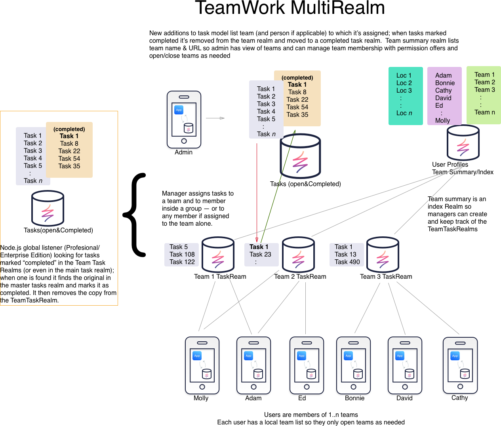
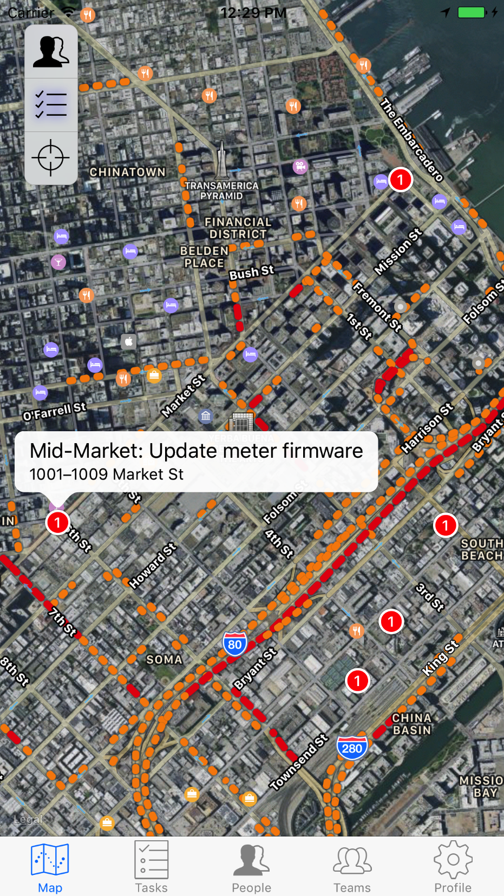
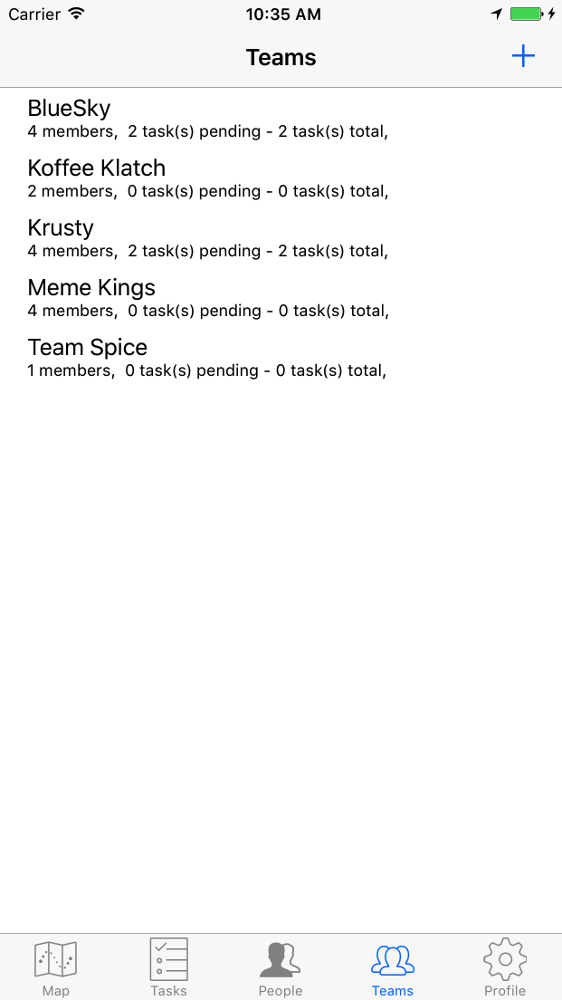

# Building a Field Worker Application in Swift


This tutorial was designed for Realm Object Server 2.x  
If you are running a newer version of the server or Realm Cloud, it may take a few small configuration changes to build and function 


## Overview

Teamwork is a Realm demo-app that represents an idealized, distributed customer services application. This is the kind that might be used by a power company, a cable company, or even a distributed mobile sales force. Its world-view is that of one or more central "manager" users who create and assign tasks to field workers/agents who are either members of teams or are individual agents carrying out their various assigned tasks.Interested in learning more about reactive, offline-first apps for the mobile workforce?

### [Watch the webinar ](https://www2.realm.io/webinar/reactive-offline-first-for-mobile-workforce-registration)

### Teamworks models {#teamworks-models}

One of the goals in Teamwork was to show the principles behind the design of a multi-user, multi-Realm application, not necessarily to create a complete field service application. Nonetheless, Teamwork contains all the elements need to show how a basic version of such a system might be constructed and could even be used as the basis for building a full-blown field services application.

Teamwork is built upon 4 basic models:


#### Person {#person}

This is in effect a user profile object. It allows the application to store/show a little more about it’s users than just a user identity string. It manages the basics - first name, last name, and avatar/profile image and stores what role the use plays in the system \(typically a manager or a worker\).

#### Task {#task}

Tasks are the central objects in the system. They represent some unit of work that needs to be done and assigned to someone if the field who can actually accomplish the work. The properties of a task are pretty straightforward and include such things as:

* Task name
* Task Description
* Creation and Due Dates
* Team name \(which is optional\)
* An assignee \(a Teamwork user\)
* References to a location where the task must be performed

Tasks exist inside TeamWork in two forms: A Master Task list that is owned and managed by admin users; admin users create tasks, fill in their details and assign them to either individuals or to Teams \(where they can be free-floating - not assigned to a specific person\) or assigned to a specific team-member

The second use of the Team model is in the creation of Team Task lists that represent copies of the tasks that are assigned to specific teams. This second form is realized in the form of specific Realms of tasks for each team. These as called “TaskTeamRealms” in the parlance of the Teamwork application.

#### Team {#team}

Teams represent collections of users. User can be members of 1 or more teams, and Tasks can be assigned to teams generically, or to individuals on a specific team.

Teams have some pretty generic and obvious properties:

* Team name
* Team Description
* Creation/Modification Dates
* List of Members
* A URL that can be used to access the Team Task Realm that contains all of the tasks that have been assigned to this team

### Team Task Realms {#team-task-realms}

These are stand alone Realms that contain copies of tasks assigned by admin users to a specific team. Each team has its own team Task Realm which is opened by team members and kept in sync by the Realm Object Server to the team members device.

Team members open these Realms when accessing their own task assignments inside the Teamwork app and can view tasks assigned to them individually or to the team as a whole. As tasks are marked “completed” the back-end Realm event listeners notice the update to the items in the Team Task Realm and mark the master copy of the task as “completed” and update any other relevant metadata.

### Locations {#locations}

The location model serves double duty: it holds info on a person’s location \(so they can be seen on a map inside the application\), and it represents the location where some task needs to be performed.

Locations have several properties including:

* Latitude/Longitude and various street address components
* Creation and last updated dates
* A person ID - used if this location object represents the last known location of a Teamwork user
* A Task ID - used if this location represents a place where a task is to be performed
* A Team ID - used if this location represents a task assigned to a specific team

The location object, if it represents a task, will also contain which team that task is assigned to \(if any\); this allows the map and team components to display locations of tasks and filter the map display based on which team is being viewed.

## Designing the Realms {#designing-the-realms}

Realms are databases, but they also represent groupings of information that can be used to manage access to and distribution of information in a mobile context.

In Teamwork there are 3 main pools of information:

* Common info accessed by all users that need to be synchronized to all users
* Info created and managed by only admin users
* Info consumed by Teams of individual workers

Looking at the available models described above we can see that these pretty clearly break down into pretty well defined groupings:

1. Common info everyone needs includes: People, Teams and Locations
2. Manager-only info: the Master Task List
3. Team-Member-only info includes groups of tasks for each team they are members of \(which are represented by separate Realms per team which contain copies of the tasks assigned to that team\)

These groupings help us meet some design challenges in multi-user mobile apps, specifically:

* Only give users data they need
* Maintaining access separation is good data hygiene and good security
* Data Model Clustering - grouping commonly accessed models into Realms keep the number of Realms that the programmer must interact with to perform any given operation down to a reasonable number.



### Management and Access to Multiple Realms {#management-and-access-to-multiple-realms}

Many apps can get along quite well with a single Realm, and accessing a single sync’d Realm is a one line call:

```text
let defaultRealm = try! realm()
```

Accessing Realms in a multi-Realm application is slightly more involved, but can be reduced to 2 simple patterns:

1. Decide how your data models form common data usage clusters
2. Create accessors that describe the Realm configuration that encompass those clusters

#### Clustering Your Models {#clustering-your-models}

This is actually the most challenging part - it requires understanding the potential linkages between models and seeing which linkages are truly required versus those that can be inferred.

Required linked are those where you application needs to be able to reference one set of model objects from another model by following a Realm List reference or a backlink.

In Teamwork’s case Teams, Persons and Locations are all strongly bound together; this allows all users to see teams, teams to reference people, and the map to show both people and tasks from one shared Realm without requiring that all users be able to open every TeamTask Realm or the master tasks list. The referential elements -- tasks IDs are used as literal foreign keys to find objects in either the master Task list or user-appropriate TeamTask Realm as needed.

#### Creating Accessors {#creating-accessors}

Accessing multiple Realms is a reflection in code of your the layout and linkage of your models into Realms. Dealing with multiple tables or DBs in any framework can be daunting--Teamwork tries to make this easier by reducing the access mechanisms to static properties that can be passed to Realm instances.

This example is in Apple’s Swift, but the same principles apply in any of the language bringings that Realm supports; here we’re treating the construction of various elements much like macros.

```text
static let syncHost               	= "127.0.0.1"
static let ApplicationName         	= "TeamworkMR"
static let syncRealmPath          	= "teamwork"
 
 
// this is purely for talking to the RMP auth system
static let syncAuthURL = NSURL(string: "http://\(syncHost):9080")!
    
// The following URLs and URI fragments are about talking to the
// synchronization service and the Realms it manages on behalf of your
// application:
static let syncServerURL = NSURL(string: "realm://\(syncHost):9080/\(ApplicationName)-\(syncRealmPath)")
    
// Note: When we say Realm file we mean literally the entire collection of
// models/schemas inside that Realm... So we need to be very clear what Models
// that are represented by a given Realm.  For example:
    
// This is the master list of People, Teams and Locations - Opened by everyone
static let commonRealmURL = URL(string: "realm://\(syncHost):9080/\(ApplicationName)-CommonRealm")!
func commonRealmConfig(user: SyncUser) -> Realm.Configuration  {
    let config = Realm.Configuration(syncConfiguration: SyncConfiguration(user: SyncUser.current!, realmURL: TeamWorkConstants.commonRealmURL), objectTypes: [CommonModel_1.self, CommonModel_2.self, ..., CommonModel_N.self])
    return config
}
 
func managerRealmConfig(user: SyncUser) -> Realm.Configuration  {
    let config = Realm.Configuration(syncConfiguration: SyncConfiguration(user: SyncUser.current!, realmURL: TeamWorkConstants.managerRealmURL), objectTypes: [Task.self])
    return config
}
// Lastly, this is a partial path to directories that hold individual
// TeamTaskRealms that are opened on demand, usually when the user opens a
// particular view into a team they're a member of: i.e., "Red Team", "Team
// Bonzai!" etc
static let TeamTasksPartialPath = "realm://\(syncHost):9080/\(ApplicationName)-TeamTaskRealms/"
```

This accessor mechanism allow you to open Realms as needed rather than trying to open all possible Realms.

Only one Realm--the common Realm--is opened when non-admin users log in. This is used to display any tasks the user may have outstanding on the map view \(note that the locations--which track both users and tasks\) are stored in this common Realm:



If the user has selected a default team it is opened, or the user can go to the Teams tab to see a list of available teams and switch to any of of these teams:




Not what you were looking for? [Leave Feedback](https://realm3.typeform.com/to/A4guM3) 

