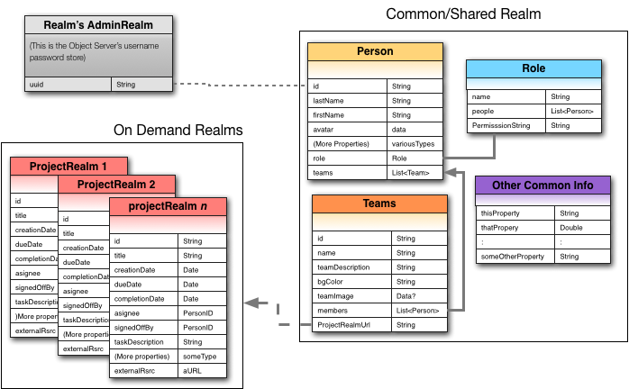
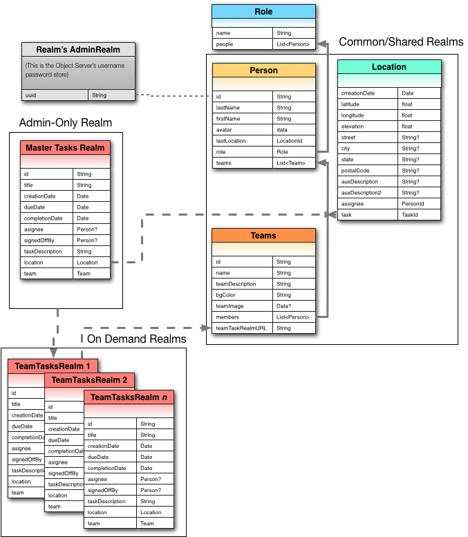

# Designing an Architecture with Multiple Realms


Multiple Realm architectures will become less common after the GA release of Query-based sync which will allow finer grain \(object-level\) permissions.


## Intro {#intro}

The design of databases can be challenging in the best of circumstances, designing for mobile even more so since there's a constant tug of war between the desire to have as much info available on the end-user's device as possible and being respectful of both the disk space on the end-user's device and the amount of over-the-air bandwidth being consumed

## Realm Design {#realm-design}

The simplest design principle when dealing with multiple Realms is to decide what everyone needs access to versus what only specific groups need access to. Which sounds trivially simple but really requires a rather good understanding of the interaction between the models in your application. And which models truly need to be connected via hard links \(in Realm these would be &lt;List&gt; types or backlinks\) versus which can be accessed by using record identifiers that are used as foreign keys \(foreign in that their definition is in a model in another, separate Realm\).

The Realm Platform's primary goal is the fast, efficient synchronization of shared data between large numbers of mobile clients. Part of any DB design should take into account the fact that data will be moving around the device ecosystem and to be respectful of both the user's storage and data plans only relevant data should be in motion into or out of the end-user's device.

Realm recommends breaking up data into at least two basic kinds of Realms:

* **A Common Realm** for things that are required upon log in by every user - these might be
  * Minimal profile data for all users \(if your users need to be able to find each other inside your app\)
  * Roles/Permissions that the app needs to make decisions about access checking/setting
  * Team models or other mechanisms for grouping users/processes/etc
  * Common data models that all users will need access to
* **On-Demand Realms** for things that are restricted on a user/team/project or other discrete unit-of-work level basis and that should not be synchronized to every user's device.

## Accessing Realms {#accessing-realms}

A very clean way to keep your various Realms straight is to code them with explicit accessors for the Realm configurations that includes the models of interest for any given Realm. This way when a connection a realm is instantiated, it is merely a matter of providing the right configuration.

The examples here make reference to models in a Realm example app called "[Realm Bingo](http://github.com/realm-demos/realm-bingo)," available from the Realm Demos GitHub account.

Here we break the construction of our Realm accessors into their principal components to make it easier to compose them depending on our needs.

This first set of constants describes the primary host we are going to talk to and the root path names for both public \(common\) and individual \(private\) Realms. As you will see, we reuse the defaultSyncHost for both talking to our authorization service and our sync server \(the Realm Object Server\). In a large production environment your auth service may be a different host---you may even have multiple sync-servers, all of which will work perfectly well. This example uses one host for both authorization and synchronization.

```text
static let defaultSyncHost = "1.2.3.4"
static let syncRealmPath   = "RealmBingo"
static let personalCards   = "myCards"
static let ApplicationName = "RealmBingo"


// this is purely for talking to the RMP auth system
static let syncAuthURL    = URL(string: "http://\(defaultSyncHost):9080")!

// The following URLs and URI fragments are about talking to the 
// synchronization service and the Realms it manages on behalf of your application:
static let syncServerURL    = URL(string: "realm://\(defaultSyncHost):9080/\(ApplicationName)-\(syncRealmPath)")

// Note: When we say Realm file we mean literally the entire collection 
// of models/schemas inside that Realm...
// So we need to be very clear what models that are represented by a given Realm.  
// For example:

static let commonRealmURL = URL(string: "realm://\(defaultSyncHost):9080/\(ApplicationName)-CommonRealm")!

func commonRealmConfig(user: SyncUser) -> Realm.Configuration  {
    let config = Realm.Configuration(syncConfiguration: SyncConfiguration(user: SyncUser.current!, realmURL: TeamWorkConstants.commonRealmURL), objectTypes: [CommonModel_1.self, CommonModel_2.self, ..., CommonModel_N.self])
    return config
}


// This is the private realm in every user's home path - it's where we keep user profile info and responses
static let privateRealmURL   = URL(string: "realm://\(defaultSyncHost):9080/~/RealmBingo")!


func privateRealmConfig(user: SyncUser) -> Realm.Configuration  {
    let config = Realm.Configuration(syncConfiguration: SyncConfiguration(user: SyncUser.current!, realmURL: TeamWorkConstants.privateRealmURL), objectTypes: [PrivateModel_1.self, PrivateModel_2.self, ..., PrivateModel_N.self])
    return config
}
```

For example, if we look at a model collection of Realms that might represent a simplified team-oriented application:



This diagram represents both a multi-Realm system and one that would likely be governed by a specialized role-based permission system. In the common Realm we see information that would be useful to all participants in the system: profile info, roles that can be used at run-time by the application logic to make decisions about permissions, and descriptions of teams and team membership used by the app to allow people to open projects they are assigned to

If we start with the basic definitions we described above for the RealmBingo app, we can adapt this into the following 2 classes of Realms:

1. The common, shared Realm
2. Project Realms

The common Realm can be defined the same way as in the example above---define the component parts of the Realm descriptors \(the hostname or IP address, the path to the common Realm, as well as the collection of models that define the Realm configuration\), e.g:

```text
static let commonRealmURL = URL(string: "realm://\(defaultSyncHost):9080/\(ApplicationName)-CommonRealm")!
```

Once the common URLs and other constants are defined we can create a function that returns an appropriate Realm configuration:

```text
func commonRealmConfig(user: SyncUser) -> Realm.Configuration  {
    let config = Realm.Configuration(syncConfiguration: SyncConfiguration(user: SyncUser.current!, realmURL: TeamWorkConstants.commonRealmURL), objectTypes: [CommonModel_1.self, CommonModel_2.self, ..., CommonModel_N.self])
    return config
}
```

For on-demand Realms things can be a lot more variable---and it is really up to the programmer to define either well-known static end-point names for each Realm, or composed common Realms.

### Accessing Records Across Multiple Realms {#accessing-records-across-multiple-realms}

Having multiple Realms does beg the next logical question: How do you access info across Realms since Realm does not support cross realm queries? The easiest solution is we need a stand-in for identifying values in the common realm \(such as SyncUser ID's\) that we'd normally use as part of a Realm for querying across models. For example if we wanted to get a list of user's ID based on what team they are on, we could execute a Realm query like this:

```text
let teamMemberIDs = try! someRealm.objects(Person.self).filter(NSPredicate(form:"teams.name = %@",teamName).map({\$0.id})
```

This would return a collection of IDs of users that met the filter criteria \(using the Links in our Person model scribed above to match against the linked-to Teams model in the common Realm\). In a single-Realm example we could then use these IDs to query other models in the same Realm to gather up other objects of interest and them operate on them.

So, the only functional difference in a multi-Realm application is that we would use these user IDs as foreign keys to access values in another Realm.

One can envision a larger scenario, perhaps in the form of a centralized client services application where there are multiple teams into which managers can assign tasks and team members are able to open only the Team specific realms in which they are assigned as members:



Here we have 3 distinct kinds of Realms:

1. The "common Realm" that all users have access to---data that includes information about roles \(worker, admin, etc\); user profile info, locations \(to visualize task/work locations and people on a map\) and, lastly, a listing of all of the available teams. The Teams model tracks team assignment as well as which stand-alone Realm of Team Task holds the work list for
2. An Admins-only "task" Realm where admins/managers create tasks that will be assigned to teams; as part of the creation of tasks, the business logic also copies task records to the individual Team Task Realms as needed.
3. Individual Team Task Realms. This is where copies of work for each team reside. Here the record IDs \(primary keys\) for each task as the same as in the source/master task list as created by the Admin/Manager when creating the task.

Here the "foreign keys" we make use of are the ID field from the the Admin-Only Tasks Realm---they map the the ID values for Tasks in the Task Team Realms.

Similarly, if one wanted to determine who a task was assigned to based only on the data in a task record inside a Team Task Realm, using the assignee field value and performing a query against the common Realm the assignee ID is the same value as the primary key ID for the Person model objects.

### Managing Permissions {#managing-permissions}

Realm has a very simple permission structure: Permissions of **Read**, **Write**, or **Manage** may be applied to any Realm, and each higher permission level includes the the other less permissive permissions as part of its permission grant. For example, a read-only Realm can be created by granting a READ permission, but if WRITE is granted then it is also possible for the writer to also READ anything in the target Realm \(this does preclude the creation of an anonymous write only system\). Having MANAGE permission gives all-access to the Realm. These permissions may be applied as a wildcard to all users, or individually on a user by user bases. However, it should be noted that if a high level permission is granted as a wildcard to the Realm the highest level permission grant wins.

Managing permissions on Realms is usually done either on a user by user basis \(i.e., a privileged user explicitly grants a privilege to another user\) or by programmatically assigning privileges based on some kind of triggering event \(for example a user being added to or removed from some kind of team or group\) that causes an event handler to be triggered on the Realm Platform back-end event service. Either way works equally well, it depends on the needs of the application and if the overall app architecture deals with a large enough user-base or permission complexity to need an automated system.

### Setting permissions manually {#setting-permissions-manually}

We could change permissions from inside an app using:

```text
let permission = SyncPermissionValue(realmPath: team1Path,
              userID: theId, // The SyncUser.identity value for the grantee
              accessLevel: .write)   // .read, .write, or .manage
user.applyPermission(permission) { error in
  if let error = error {
    // handle error
    return
  }
  // permission was successfully applied
}
```

### Reading permissions {#reading-permissions}

Finding out who has what permissions is slightly different. Here we are asking Realm on a user-by-user bases what they have access to. For example, to found what your own permissions are to all of the Realms on a given server, you would use:

```text
SyncUser.current?.retrievePermissions { permissions, error in
  if let error = error {
    // handle error
    return
  }
  // success! access permissions
}
```

The permission objects returned would each represent a Realm to which you has some kind of access rights. However, this does not include Realms for which you have permissions by virtue of a wildcard permission available to all users.

Not what you were looking for? [Leave Feedback](https://realm3.typeform.com/to/A4guM3)

