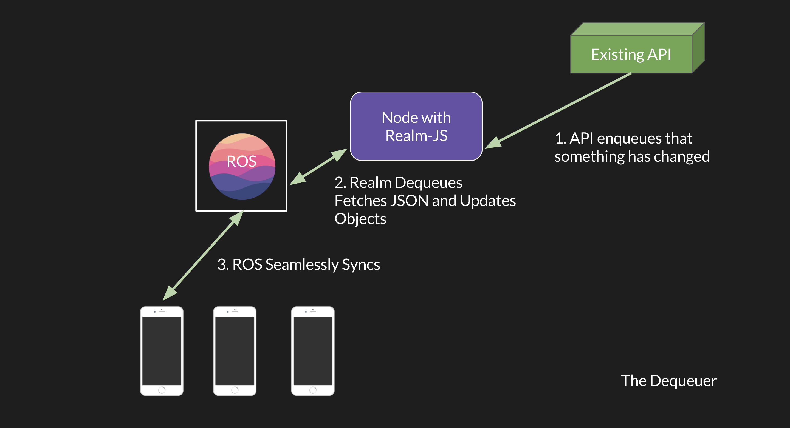

# Integrate with a Message Queue

##  The Dequeuer: Push data into the Realm Object Server using a Message Queue 



**Objective:**

The aim of this exercise is to create a basic test application that follows the dequeuer architecture pattern for the Realm Platform. Upon completion, you will be able to write a message to Apache Kafka, consume the message via node.js, and respond to this consumed message by creating a new object in the Realm Object Server.

### **Prerequisites:** {#prerequisites}

The exercises below require a running instance of the Professional or Enterprise edition of the Realm Object Server. Detailed installation instructions can be found[ here](https://realm.io/docs/realm-object-server/latest/index.html#install-realm-object-server).

_\(Note: if you run into any issues during installation, make sure you have all of the required prerequisites\)._

You also need to create an **admin** user on your Realm Object Server. This username and password will be used in step 4.

### **Step 1: Download Kafka** {#step-1-download-kafka}

[Download](https://www.apache.org/dyn/closer.cgi?path=/kafka/0.11.0.1/kafka_2.11-0.11.0.1.tgz) the 0.11.0.1 release and un-tar it

```text

ubuntu@kafka-server:~$ wget http://apache.mirrors.pair.com/kafka/0.11.0.1/kafka_2.11-0.11.0.1.tgz

ubuntu@kafka-server:~$  tar -xzf kafka_2.11-0.11.0.1.tgz

ubuntu@kafka-server:~$ cd kafka_2.11-0.11.0.1
```

### **Step 2: Start the Server** {#step-2-start-the-server}

The following section requires java to be installed. This can be done via the terminal with:

```text
ubuntu@kafka-server:~/kafka_2.11-0.11.0.1$ sudo apt-get update

ubuntu@kafka-server:~/kafka_2.11-0.11.0.1$ sudo apt install default-jre -y
```

Kafka uses[ ZooKeeper](https://zookeeper.apache.org/), so you first need to start a ZooKeeper server. Kafka includes a script to get a quick single-node ZooKeeper instance running.

`ubuntu@kafka-server:~/kafka_2.11-0.11.0.1$ bin/zookeeper-server-start.sh config/zookeeper.properties &`

Now, start the Kafka server:

`ubuntu@kafka-server:~/kafka_2.11-0.11.0.1$ bin/kafka-server-start.sh config/server.properties &`

### **Step 3: Create a topic** {#step-3-create-a-topic}

In a new terminal window, create a Kafka topic

_\(Note: you can change the topic name to whatever you desire. I have chosen "kafkaTest"\)_

`ubuntu@kafka-server:~/kafka_2.11-0.11.0.1$ bin/kafka-topics.sh --create --zookeeper localhost:2181 --replication-factor 1 --partitions 1 --topic kafkaTest`

You can print out all of your existing topics via the following command:

`ubuntu@kafka-server:~/kafka_2.11-0.11.0.1$ bin/kafka-topics.sh --list --zookeeper localhost:2181`

### **Step 4: Create a consumer that ingests Kafka and writes to ROS** {#step-4-create-a-consumer-that-ingests-kafka-and-writes-to-ros}

_\(Note: the consumer and producer that we create in the following steps will need to be saved and ran locally from the Kafka server\)_

Next, we need to create a Kafka consumer to take messages from the Kafka queue and write them to the ROS. We are going to do this via node.js

This relies on realm-js and no-kafka npm packages being installed in the working directory. You will need to install npm:

`ubuntu@kafka-server:~/kafka_2.11-0.11.0.1$ sudo apt install npm -y`

Now we can install the dependencies for the consumer via npm. 

```text

ubuntu@kafka-server:~/kafka_2.11-0.11.0.1$ npm install realm

ubuntu@kafka-server:~/kafka_2.11-0.11.0.1$ npm install no-kafka
```

You can find the code for our consumer [here](https://gist.github.com/mgeerling/69d7c661fdfb6ae2c2ab0c639a12dcd8).

Within this code, you will need to edit a few things such as the ROS Address, your login credentials for Realm, and the name of your Kafka topic:

```text
//Params to edit

var ROS_Address = 'INSERT_ROS_ADDRESS_HERE' //i.e.[ ‘](http://localhost:9080/)[http://localhost:9080](http://localhost:9080)’

var username = 'INSERT_USERNAME_HERE'; //i.e. ‘realm-admin’

var password = 'INSERT_PASSWORD_HERE'; //i.e. ‘’

var kafkaTopic = 'INSERT_TOPIC_HERE'; //i.e. kafkaTest

const token = "INSERT_FEATURE_TOKEN_HERE";
```

Once you’ve done this, save the code as `consumer.js` to a convenient location on your Kafka server.

`ubuntu@kafka-server:~/kafka_2.11-0.11.0.1$ node consumer.js`

### **Step 5: Create a producer to send messages to Kafka** {#step-5-create-a-producer-to-send-messages-to-kafka}

We first need to create a producer where we can generate messages for Kafka

You can do this via the terminal window with the following command:

`ubuntu@kafka-server:~/kafka_2.11-0.11.0.1$ bin/kafka-console-producer.sh --broker-list localhost:9092 --topic kafkaTest`

You can find the code for our producer [here](https://gist.github.com/mgeerling/86f76e2288147c5d31a92044331c21f8).

_Note: This relies on no-kafka being installed in the working directory. If you are using the same directory as your consumer, this dependency was already installed._

The script will produce messages to kafka. You can change the content of these messages by changing the messageBuffer variable.

Once you are happy with the script, save it as producer.js on your Kafka server. It can then be run via the terminal with:

`ubuntu@kafka-server:~/kafka_2.11-0.11.0.1$ node producer.js`

**Step 6: View the results via Realm Studio**

Download and installation instructions for Realm Studio can be found [here](../../getting-started/view-data-with-realm-studio.md).


Not what you were looking for? [Leave Feedback](https://www.getfeedback.com/r/uO1Zl0vE)

