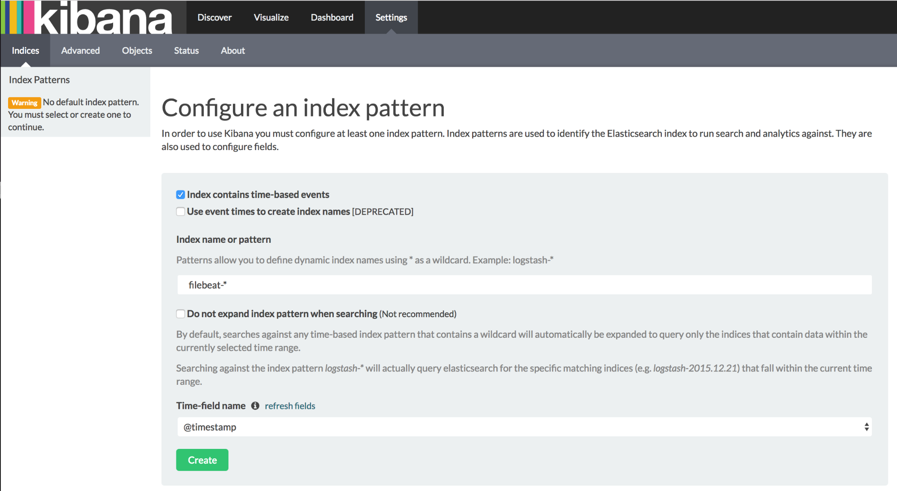
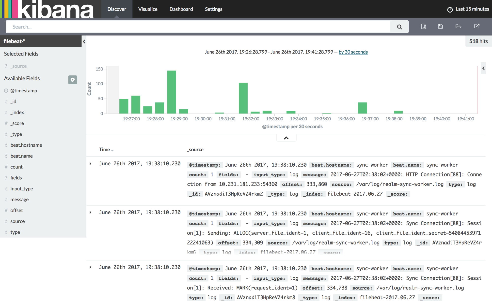

# Logging

## Overview

All components of the Realm Object Server output logs to a standard interface which can then be piped to the console or more commonly to a file on disk.  We like to recommend pm2 for more granular logging capabilities during development or testing.  

However, in a production system, it is a best practice to offload the logs to a central logging repository which has more refined tools for detecting anomalies and performing root cause analysis. There are a variety of tools on the market today, Realm provides a [walkthrough](https://realm.io/docs/tech-notes/rmp-walkthrough#adding-a-logging-system) on how to set-up one such free system with Elasticsearch, Filebeat, and Kibana. See here for details:

## Using PM2 for Logging for a single server

You can use pm2 to monitor the usage of ROS instances by:

`pm2 monit`

This will print a GUI that will display both logs, CPU usage, and Memory usage.

pm2 also includes robust log management. You can use it to display logs in realtime in your console, log to a file, and rotate logs. Please see the [pm2 Log Management documentation](http://pm2.keymetrics.io/docs/usage/log-management/) to set this up.

In addition, Realm Object Server includes built-in logging capabilities as well. You can supply a custom logger to the server via a start parameter. The server includes three logging classes for this:

`ConsoleLogger`

This class will just log directly to console. It is included in the default configuration of the server, so no changes are needed to use it.

`FileLogger`

This class will log directly to a file, but not the console. This cannot be used with pm2 logging. To use add it to your server start function:

```typescript
server.start({
  logger: new FileLogger('myfile.log', 'info')
})
```

`FileConsoleLogger`

Finally, this class will log to the console and a file. To use add it to your server start function:

```typescript
server.start({
  logger: new FileConsoleLogger('myfile.log', 'info')
})
```

## Example: Adding a dedicated logging system

In this example, we will show you how to setup a more sophisticated logging system to pull logs from the various components of the Realm Platform at regular intervals.  We will be using Elasticsearch and Kibana.  We will use the Filebeat utility to complete the integration with Realm.  

### Install Elasticsearch and Filebeat

First, set up a new server or EC2 instance to use as the logging server. Once that’s done, SSH into it:

```bash
# Clear any pre-existing Java installs
sudo apt-get remove --purge openjdk*

# Add the Oracle repo
sudo add-apt-repository -y ppa:webupd8team/java

# Update the repo and install Java and wget
sudo apt-get update
sudo apt-get -y install oracle-java8-installer
sudo apt-get install wget
```

Then install Elasticsearch:

```bash
# Add Elasticsearch's key and repository
wget -qO - https://artifacts.elastic.co/GPG-KEY-elasticsearch | sudo apt-key add -
echo "deb https://artifacts.elastic.co/packages/5.x/apt stable main" | sudo tee -a /etc/apt/sources.list.d/elastic-5.x.list
sudo apt-get update

# Install Elasticsearch
sudo apt-get install elasticsearch
# Enable and start Elasticsearch
sudo systemctl daemon-reload
sudo systemctl enable elasticsearch.service
sudo systemctl start elasticsearch.service
```

Elasticsearch is now installed and listening on port 9200 by default. Next, let’s set-up Filebeat on the Realm Object Server and Realm Sync Worker. SSH back to the sync worker machine, not the logging machine:

```bash
# Set up the Filebeat repo and install
echo "deb https://artifacts.elastic.co/packages/5.x/apt stable main" | sudo tee -a /etc/apt/sources.list.d/elastic-5.x.list
sudo apt-get update
sudo apt-get install filebeat
```

If you use an initial template to build the Realm Object Server via `ros init` a default file log file called `log.txt` will be created in the realm object server folder. Otherwise you can add the following to your server `startConfig` in your `index.ts`:



```typescript
       logger: new FileConsoleLogger(path.join(__dirname, '../log.txt'), 'all', {
           file: {
               timestamp: true,
               level: 'debug'
           },
           console: {
               level: 'info'
           }
       }),
```



Add the following to your `filebeat.prospectors`



```text
# Each - is a prospector. Most options can be set at the prospector level, so
# you can use different prospectors for various configurations.
# Below are the prospector specific configurations.

- input_type: log

  # Paths that should be crawled and fetched. Glob based paths.
  paths:
    - /home/ubuntu/testROS/log.txt
  tail_files: true

output.elasticsearch:
  # Array of hosts to connect to.
  hosts: ["<logging_server_hostname>:9200"]
```



Now let’s edit Filebeat’s configuration file at `/etc/filebeat/filebeat.yml`. This is a YAML file, so watch the indentation!

```bash
input:
      paths:
        - /var/log/realm-sync-worker.log
      tail_files: true
output:
  elasticsearch:
    hosts: ["<logging_server_hostname>:9200"]
```

Then, start Filebeat, so it picks up the config change:

```bash
sudo systemctl start filebeat
```

We also want to get the logs from our Realm Object Server, so let’s SSH to that host as well and set up Filebeat there, too:

```bash
# Set up the Filebeat repo and install
echo "deb https://artifacts.elastic.co/packages/5.x/apt stable main" | sudo tee -a /etc/apt/sources.list.d/elastic-5.x.list
sudo apt-get update
sudo apt-get install filebeat
```

The changes to Filebeat’s configuration file at `/etc/filebeat/filebeat.yml` are similar, but just with a different log file path:

```bash
input:
      paths:
        - /var/log/realm-object-server.log
      tail_files: true
output:
  elasticsearch:
    hosts: ["<logging_server_hostname>:9200"]
```

Then, start Filebeat over here, too:

```bash
sudo systemctl start filebeat
```

Now, let’s SSH back to the logging server. We need to set up Elasticsearch for the incoming Filebeat connections. Edit its configuration file at `/etc/elasticsearch/elasticsearch.yml` and edit its `network.host` block:

```bash
network.host: '0.0.0.0'
```

Finally, restart Elasticsearch:

```bash
sudo systemctl restart elasticsearch
```

### Install Kibana

Kibana is another product from Elasticsearch that lets us visualize the logs and provides a UI.

SSH back to the logging server. \(We’re almost done with the SSH hopping, we promise.\)

The Elasticsearch package repository is already set up, so installing it over here is pretty easy:

```bash
sudo apt-get update
sudo apt-get install kibana

# enable and start the service
sudo systemctl enable kibana
sudo systemctl start kibana
```

Update the kibana config to allow remote hosts to view by going to `/etc/kibana/kibana.yml`and change the `server.host`to this: 

```text
server.host: "0.0.0.0"
```

Now, let’s login to our Kibana server! Go to `http://<logging_server_hostname>:5601` in a web browser. The Kibana configuration page will open. Create an index pattern with the name `filebeat-*`, and enter `@timestamp` as the Time-field name:



Now, you can go to the **Discover** tab, and select a recent time interval, such as the last 15 minutes. Start generating some connections to the Realm Object Server, and you should start to see Kibana populating with logs:  




Not what you were looking for? [Leave Feedback](https://realm3.typeform.com/to/A4guM3) 

