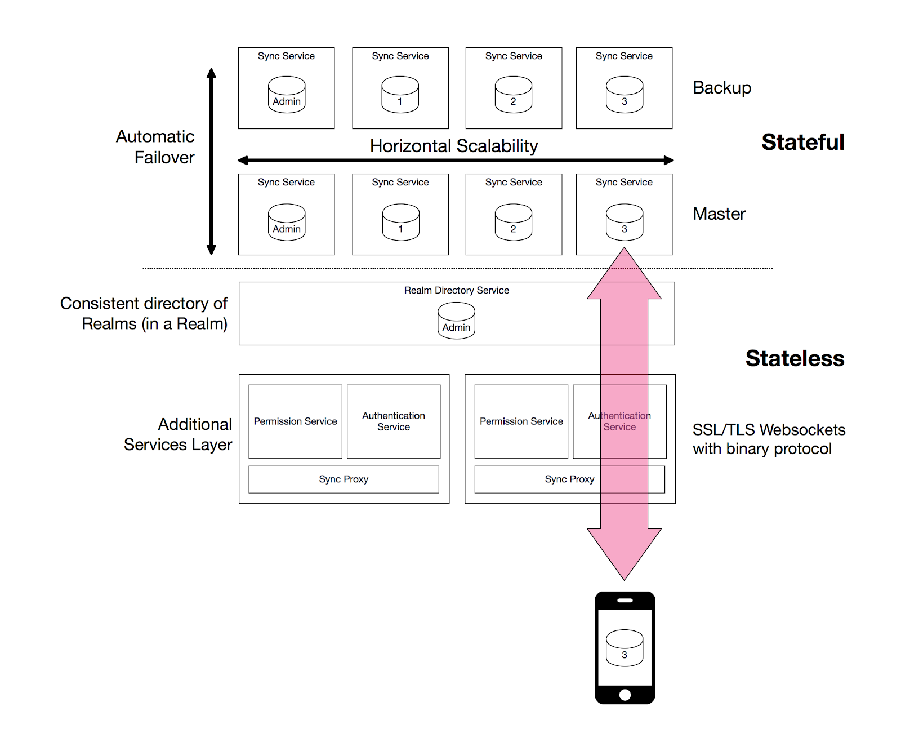
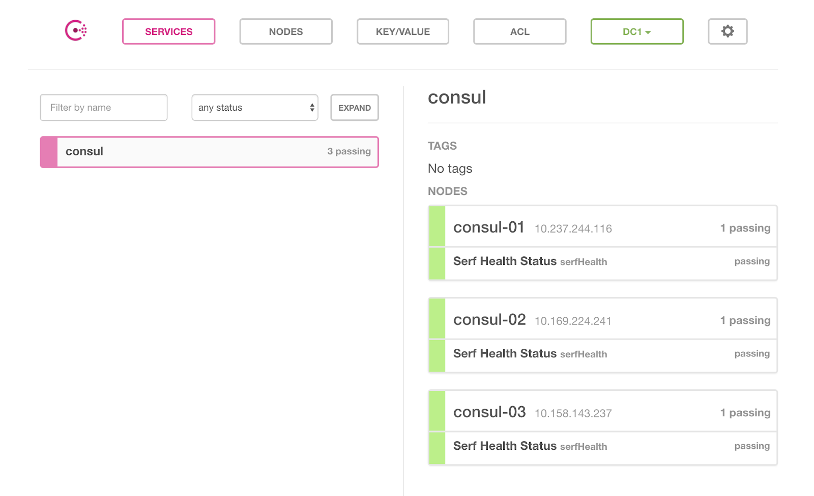
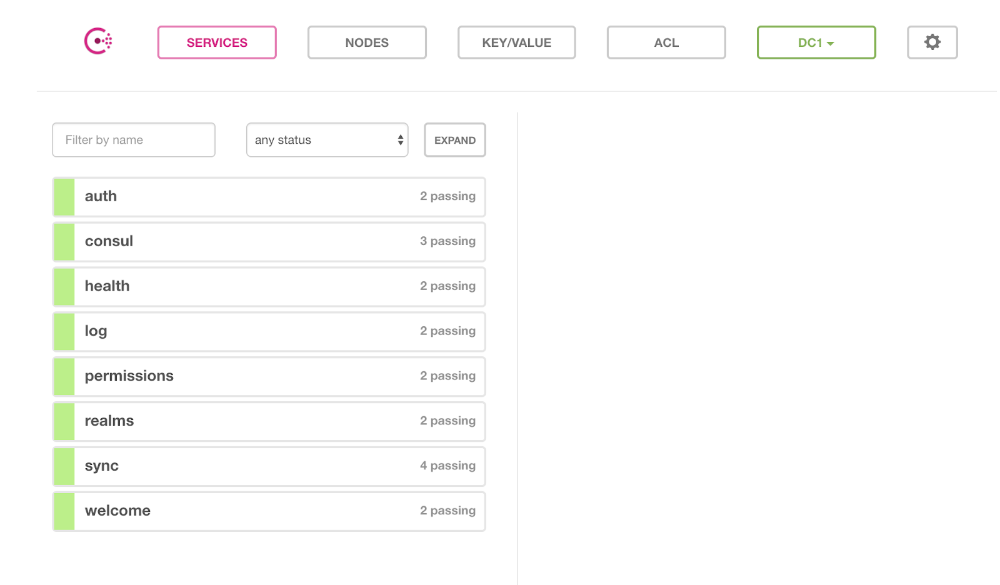

# Manual Deployment Instructions

## Background

This document will walk you through how to set-up a small Realm Enterprise Cluster spread out across 4 nodes. In this guide, we will be using Ubuntu 16.04 although RHEL/CentOS is also supported. We will deploy 3 nodes of the replicated sync-worker service, this is the stateful service that stores the realm data, serves the realm sync clients, and merges conflicts if necessary. It is stateful and can be scaled out horizontally. Clients will automatically be distributed across the available pool of sync-workers by the `Sync Proxy Service`. The proxy service will deployed on the 4th node along with a variety of other stateless services which combined form `Realm Core Services`. The core services can be scaled independently of each other based upon load and are directed traffic from realm mobile sync clients by an external facing load balancer, such as AWS ELB or a F5. The one exception to this is the `Realm Directory Service` where only one can exist in the cluster. Because core services pull their state from the backend sync workers they can be destroyed and brought up at will.


These commands and the installation of prerequisites are typically not done manually by an operator but instead is done with a configuration management tool like Chef, Puppet, Ansible, or Salt. These scripts are triggered on failure of a server which can be provided by a monitoring tool or for initial deployment which is usually manually started.

Additionally, it is recommended to use a process monitor like pm2 to ensure that the process stays up or is restarted in the event of error or reboot, see [here](http://pm2.keymetrics.io/) for instructions.




## Prerequisite: Consul Installation

The first thing to do when setting up Realm Enterprise Cluster is to get Consul up, running, and healthy. Consul servers as the distributed key-value store for the cluster, allowing for disparate services to discover each other by registering their network locations IP and ports. It also serves to facilitate failover should a master sync worker fail, it will use its consensus protocol to elect a new leader.

You will need 3 nodes for a typical production set-up.  

Perform these steps on each of the three nodes: 

```bash
ubuntu@ip-10-237-244-116:~$ sudo apt-get install unzip -y

#Get the latest:
ubuntu@ip-10-237-244-116:~$ wget https://releases.hashicorp.com/consul/1.0.5/consul_1.0.5_linux_amd64.zip

#Unzip -
ubuntu@ip-10-237-244-116:~$ unzip consul_1.0.5_linux_amd64.zip

#Move the binary
ubuntu@ip-10-237-244-116:~$ sudo mv consul /usr/local/bin

#Now we will create the unit file for systemd
ubuntu@ip-10-237-244-116:~$ sudo vi /etc/systemd/system/consul.service

```

Paste the following into your unit file: 



```text
[Unit]
Description=consul agent
Requires=network-online.target
After=network-online.target

[Service]
EnvironmentFile=-/etc/sysconfig/consul
Environment=GOMAXPROCS=2
Restart=on-failure
ExecStart=/usr/local/bin/consul agent -config-dir=/etc/consul.d
ExecReload=/bin/kill -HUP $MAINPID
KillSignal=SIGINT

[Install]
WantedBy=multi-user.target
```



Now we will create the Consul Configuration File: 

```bash
ubuntu@ip-10-237-244-116:~$ sudo mkdir -p /etc/consul.d
ubuntu@ip-10-237-244-116:~$ sudo vi /etc/consul.d/config.json
```

Paste in the following: 



```text
{
  "datacenter": "HUMAN READABLE NAME FOR CONSUL CLUSTER",
  "data_dir": "/var/lib/consul",
  "log_level": "INFO",
  "server": true,
  "bind_addr": "{{ GetInterfaceIP \"eth0\" }}",
  "client_addr": "0.0.0.0",
  "retry_join": [
    "IP ADDRESS OF HOST IN CLUSTER",
    "IP ADDRESS OF HOST IN CLUSTER",
    "IP ADDRESS OF HOST IN CLUSTER"
  ],
  "bootstrap_expect": NUMBER OF ITEMS IN retry_join,
  "ui": true
}
```



Then run: 

```bash
ubuntu@ip-10-237-244-116:~$ sudo mkdir /var/lib/consul
ubuntu@ip-10-237-244-116:~$ sudo systemctl daemon-reload
ubuntu@ip-10-237-244-116:~$ sudo systemctl enable consul
ubuntu@ip-10-237-244-116:~$ sudo systemctl start consul
```

### Validating your setup

Finally, once all the nodes are set up, run this on any node to validate the cluster:

```bash
ubuntu@ip-10-237-244-116:~$ consul members
```

Your output will look like this, though names and addresses will be different:  


```bash
Node       Address              Status  Type    Build  Protocol  DC   Segment
consul-01  10.247.245.117:8301  alive   server  1.0.5  2         dc1  <all>
consul-02  10.169.254.231:8301  alive   server  1.0.5  2         dc1  <all>
consul-03  10.157.13.237:8301  alive   server  1.0.5  2         dc1  <all>
```

You can also open the Consul Web UI at `http://ADDRESS_OF_NODE_IN_CLUSTER:8500` and see if all the nodes are accounted for. The consul service should show up green in the dashboard with all the nodes reporting healthy.



## Realm Object Server Enterprise Installation

This guide will assume that we are installing our sync workers on the same hosts as each consul node. While this is fine for smaller deployments, in larger production deployments the recommendation is to have a dedicated consul cluster where each consul node lives in a fault zone or Availability Zone in AWS parlance. You can read more on these topics here: 

* [Consul Architecture ](https://www.consul.io/docs/internals/architecture.html)
* [AWS Console Architecture Guide](https://aws.amazon.com/quickstart/architecture/consul/)


You will always want to start at least two sync workers \(master and slave\).  You may also start a third which will server as a spare.  


### Services: What are they? 

First,  we'll start with some background of the services in the Realm Cluster. The Realm Object Server \(ROS\) has a service architecture where there is an outer shell that is the Server which then coordinates X number of services. The Server does things like start all the services up, route networking to endpoints defined in a service, aggregate logs across services, etc.  


So when you start “Core Services” you start a Server with various core services within it: Permissions, Auth, SyncProxy, Realms \(Realm Directory\), Welcome, Health, etc.

The Server has its own port that it listens to because it has to route connections to endpoints defined in a service such as /auth in the Auth service to handle REST login requests.

#### Auth Service

The AuthService is for authentication users on a Realm mobile sync client and giving them an access token if the authentication is successful. Realm provides pre-built auth providers like username/password or JWT but the class can also be subclassed and your own authentication system injected.  


#### SyncProxyService

The SyncProxyService is for proxying or directing inbound connections to the appropriate backend sync worker that holds the realm the client has requested.

#### RealmDirectoryService

The RealmDirectoryService keeps track of the location of the realm files on the sync worker\(s\). You can only have 1 because you need to ensure a Realm file is recorded as being on 1 sync worker in the Enterprise Cluster because a realm is only ever served from one master sync-worker at a time \(in order to merge conflicts\) If there were two RealmDirectory services running in parallel, this could result in the same Realm file being recorded in two locations when clients initially connect. This is due to the nature of how synced Realms are eventually consistent and you need a consistent data store for Realm locations.

#### PermissionsService

The PermissionsService controls access to all Realms on the cluster. It keeps an entry of each realm, the default permissions for this realm, and which users have access to this realm via read, write, or admin permissions. A user is given an internal Realm access token with the permissions for the realm the user is trying to access.

#### LogService

The LogService collects logs from the Server process and outputs them to a specific stream or file location, more configuration parameters can be found [here](logging.md).

#### HeathService

The HealthService brings up /health endpoint used to check the health of the server. This is useful to query as part of a monitoring system which could then trigger a redeployment in the case of health failure. Health services should be deployed on each sync worker and if all health services go down on a sync worker group and not return a success code then the health service on the proxy will return failure. This is useful for trigger a DR failover. 

#### WelcomeService

The WelcomeService displays a webpage at the configured server port that directs the user to download Studio for their various platform. Studio is an electron app that allows for administrative capabilities of the Realm Enterprise Cluster. See [here](../../../realm-studio/) for more information:

#### GraphQLService

The GraphQLService allows for web integration into Realm Enterprise Cluster, allowing a REST query to retrieve or manipulate data using the GraphQL query language. It is pulled in by a separate NPM package and is deployed as part of the Core Services app. See [here](../../customize/web-integration.md) for more information.

#### ReplicatedSyncService

The ReplicatedSyncService is the workhorse of the Realm Enterprise Cluster and is colloquially known as a sync worker. This service stores the Realm data for sync clients, serves sync Websocket connection, and if data conflicts are detected; merges the changes. The ReplicatedSyncService must be deployed in groups of 2 to allow for failover and replication but the best practice is to deploy with 3 sync workers in a single group.

### Installing the Sync Workers 

Now let’s set-up your sync worker group, `ssh` to your first consul node. It is assumed that you have followed the instructions to install the Realm prerequisites [here](../../installation/#prerequisites)

However, we will proceed assuming that none of the Realm related packages are installed globally, instead they will be part of the local node packages. This is more analogous to Enterprise servers which may have global packages locked down and root access prohibited.

```bash
ubuntu@consul-01:~$ mkdir syncWorker1
ubuntu@consul-01:~$ cd syncWorker1/
ubuntu@consul-01:~/syncWorker1$ vi syncWorker.js
```

Now take the [SyncWorker JS App](https://gist.github.com/ianpward/4b1d51f0c6b5c8eca086172af9f69a0e) and paste in the code, fill in any variables specific to your environment, then save the changes.


`SYNC_ADDRESS` is used by the proxy and other workers to connect to the worker, so this cannot be `127.0.0.1` or `0.0.0.0`, use the real address at which the worker is to be found on the network.

`SYNC_LABEL` defines the sync worker group which serves as a single shard for load balancing. Should be `default` in the unbalanced case.

`SYNC_ID` uniquely identifies a sync worker among its worker group.


Now create a `package.json` file in the same folder and put in your dependencies, it should look like this:



```javascript
{ 
    "dependencies": 
    { 
        "realm-object-server-enterprise": "^3.0.2",
        "realm-object-server": "^3.1.0"
    } 
}
```



You’ll notice in the JS app code that we need a public-private key pair, this generates a token that is used across the cluster to authenticate the various Realm servers and services. The key pair must be the same across all nodes for the cluster to communicate effectively. We will use OpenSSL to generate a token on the first node but consult your security team for their best practices.

```javascript
ubuntu@consul-01: mkdir-p data/keys
ubuntu@consul-01: cd data/keys
# First generate the private key
ubuntu@consul-01:~/syncWorker1/data/keys$ openssl genpkey -algorithm RSA -out auth.key -pkeyopt rsa_keygen_bits:2048
# Then pull a public key out of it
ubuntu@consul-01:~/syncWorker1/data/keys$ openssl rsa -pubout -in auth.key -out auth.pub
# Now install the dependencies
ubuntu@consul-01:~/syncWorker1$ npm install
```

Now go to each other Consul node and repeat the same steps. You will need to copy the `auth.pub` and `auth.key` from the first sync worker to all other realm services - you can use rsync, scp, or a NFS/NAS to distribute the keys.

You can now start each sync worker with the command:

```bash
ubuntu@consul-01:~/syncWorker1$ node syncWorker.js
```

You should see a “Server Started” message and then you should go check the consul UI by going to the IP on port 8500 in a web browser. The sync service should show up green and healthy. This will bind the node process to the terminal window, to run the process in the background you could set up a Unit file or use a tool like [pm2](../../running-the-server.md#running-ros-in-the-background)

Now we will setup the final piece of our cluster: the CoreServices node. `SSH` to this new node and [install the Realm prerequisites](../../installation/#prerequisites) like you did with the sync workers.

```bash
ubuntu@coreServices-01:~$ mkdir coreServices
ubuntu@coreServices-01:~$ cd coreServices/
ubuntu@coreServices-01:~/coreServices$ vi coreServices.js
```

Now take the [CoreServices JS App](https://gist.github.com/mgeerling/6a1df6a00a1d6293d51fe2e9c094234a) and paste in the code, fill in any variables specific to your environment, then save the changes. 

You will need to fill in the `advertiseAddress` with IP or DNS address of the NATed address of CoreServices if you are behind a NAT. The consulHost should be an IP or DNS address of the cluster of Consul hosts. You can use a load balancer round-robin scheme or a DNS name with all three Consul hosts. If you only place one IP in there then you will not have failover if one Consul host fails.  


Now create a `package.json` file in the same folder and put in your dependencies, it should look like this:



```javascript
{ 
    "dependencies": 
    { 
        "realm-object-server-enterprise": "^3.0.2",
        "realm-object-server": "^3.1.0"
    } 
}
```



You will need to copy the auth.pub and auth.key from any of the sync worker to the core services.

```text
# Now install the dependencies
ubuntu@coreServices-01:~/coreServices$ npm install
# And start the process
ubuntu@coreServices-01:~/coreServices$ node coreServices.js
```

You should see in the logs something like:

```text
info: Realm Object Server has started and is listening on http://0.0.0.0:9080
Your server is started at 0.0.0.0:9080
```


Be sure to add your sync workers and core services to the server's startup boot process. It is recommended to use a process monitor like pm2 to restart the process should it ever go down. If using pm2 then the commands to add the process to startup would be:

`pm2 startup`

`pm2 save`


You can then check the Consul UI to see that all the services are showing as green:



### Login to validate your setup

The last and final test would be to connect using Studio to the IP and port of the Core Services node using the `adminToken` which can be found in the `data/keys/admin.json`

Not what you were looking for? [Leave Feedback](https://realm3.typeform.com/to/A4guM3) 

