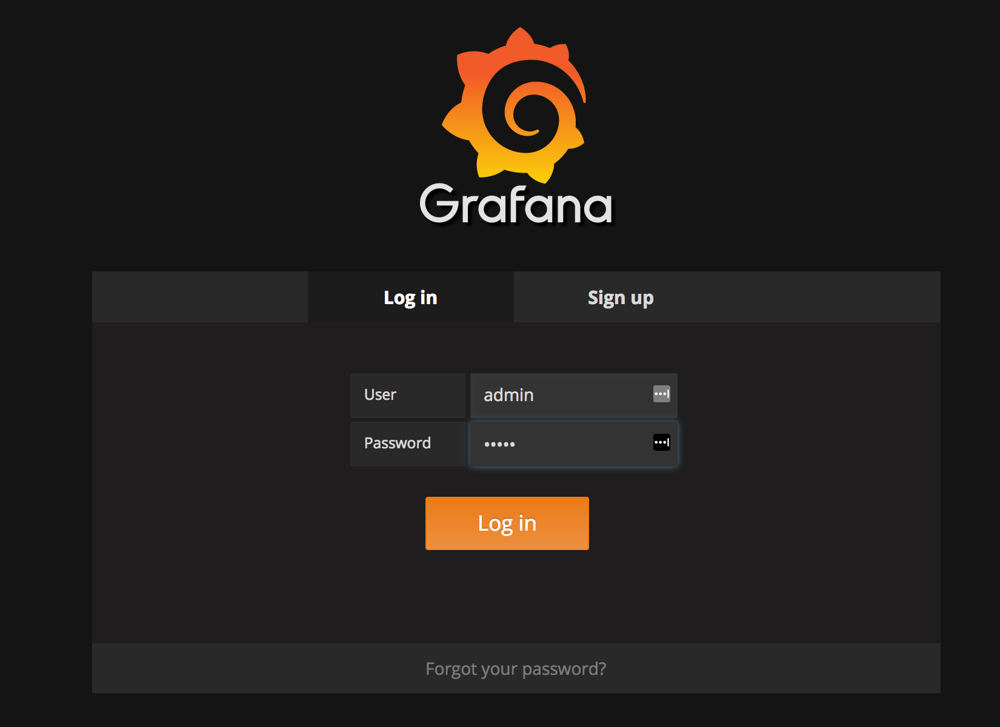
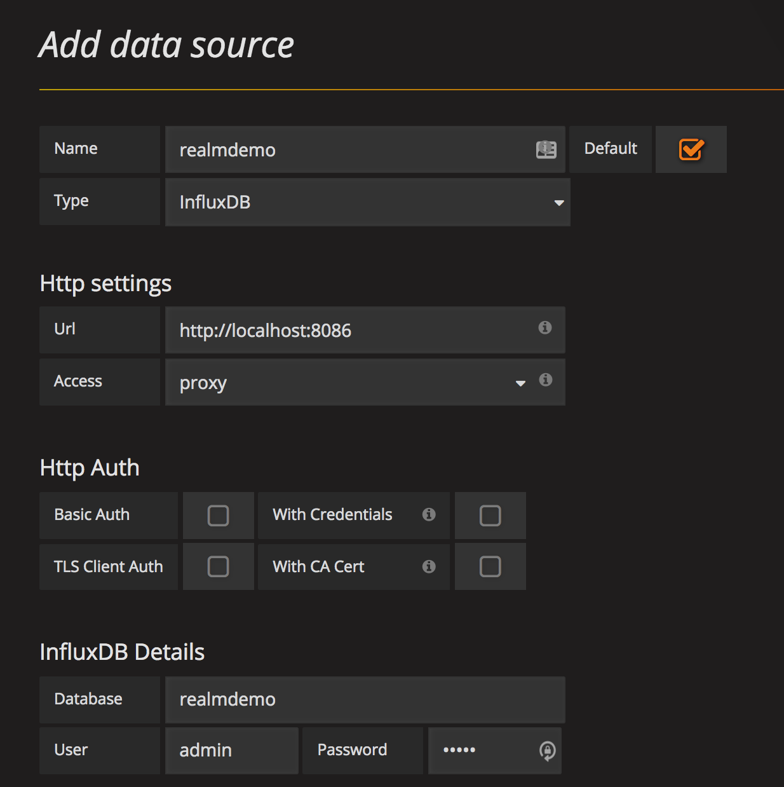
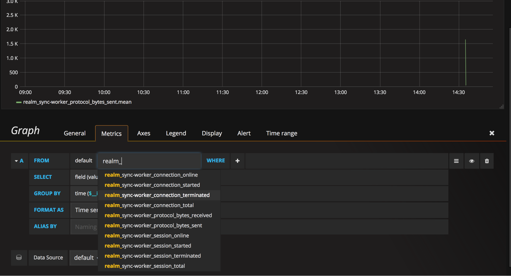

# Monitoring

## Background

Realm Object Server workers support sending metrics to **statsd**, which is assumed to be listening at `localhost:8125`. You can then forward these metrics to graphite or similar systems for monitoring.

All metrics keys start with a prefix of `realm.<hostname>`:

```text
realm.example.com.connection.online
realm.example.com.connection.failed
realm.example.com.realms.open
realm.example.com.protocol.violated
realm.example.com.protocol.bytes.received
realm.example.com.authentication.failed
```

### Available **Metrics**

| Name | Type | Description |
| --- | --- | --- |
| `<prefix>.client.unsyncable` | counter | Triggered every time a client fails to initiate synchronization of a realm because of messed up history. Such clients need their realm file deleted and then recovered from the server. This might happen if the server crashes and is recovered from a backup. |
|  |  |  |
| `<prefix>.session.started` | counter | Triggered every time a session is started. A session is considered started even before the authentication. |
| `<prefix>.session.online` | gauge | The total number of sessions currently being served. |
| `<prefix>.session.failed` | counter | Triggered every time there is a session-level error. |
| `<prefix>.session.terminated` | counter | Triggered every time a session terminates. |
|  |  |  |
| `<prefix>.connection.started` | counter | Triggered every time a client opens a connection. |
| `<prefix>.connection.online` | gauge | The total number of connections currently open. Multiple sessions may be served through a connection. |
| `<prefix>.connection.failed` | counter | Low-level errors on connections. Triggered every time a failure happens during `accept()`, `read()` or `write()`. |
| `<prefix>.connection.terminated` | counter | Triggered every time a connection terminates. This includes the failed ones. |
|  |  |  |
| `<prefix>.realms.open` | gauge | The number of currently open realms. |
|  |  |  |
| `<prefix>.authentication.failed` | counter | Triggered on authentication failures, e.g. token invalid or expired. Should not normally happen. |
| `<prefix>.permission.denied` | counter | Triggered on permission failures, e.g. trying to access a realm with a token for another realm or trying to upload with a download-only token. Should not normally happen. |
| `<prefix>.protocol.<version>.used` | counter | Triggered every time a connection over protocol version `<version>` is established. Use this to track how many connections of each protocol version are initiated, and choose a better time to update the server and app. |
| `<prefix>.protocol.violated` | counter | Triggered every time the sync protocol is violated. May mean that the application is too old or badly written. |
|  |  |  |
| `<prefix>.protocol.bytes.received` | counter | Triggered every time an upload message is received by the server. |
| `<prefix>.protocol.bytes.sent` | counter | Triggered every time a download message is sent by the server. |
|  |  |  |
| `<prefix>.protocol.bytes.received` | gauge | The number of bytes received since the start. |
| `<prefix>.protocol.bytes.sent` | gauge | The number of bytes sent since the start. |


In a production environment you would want to ship these metrics to a central repository so that you can programmatically trigger alerts or trigger deployment scripts. Realm provides a [walkthrough](https://realm.io/docs/tech-notes/rmp-walkthrough#adding-a-monitoring-system%20) on how to set-up Telegraf, InfluxDB, and Grafana for this but many others are available



## Example: Adding a Monitoring System

Now let’s dive into the day two operations bits. First, we’ll set up a monitoring system and integrate it with our Realm distributed system. Realm uses `statsd` endpoints for metrics. This guide will describe setting up a server with Grafana and InfluxDB, but you can use any `statsd` compliant system.

It’s considered best practice to have a dedicated server separate from your other infrastructure. Set up a new server and SSH to it, then enter the following steps \(as usual, `#` lines are comments\):

```bash
# Let's set-up the package sources
curl -sL https://repos.influxdata.com/influxdb.key | sudo apt-key add -
source /etc/lsb-release
echo "deb https://repos.influxdata.com/${DISTRIB_ID,,} ${DISTRIB_CODENAME} stable" | sudo tee /etc/apt/sources.list.d/influxdb.list

# Update the repo
sudo apt-get update

# Install InfluxDB
sudo apt-get install influxdb

# Start Influx
sudo systemctl start influxdb

# Use the influx command line to create a database
influx
> CREATE DATABASE realmdemo

# Use the SHOW DATABASES command to see output similar to the below
> SHOW DATABASES
name: databases
name
----
_internal
realmdemo

> exit
```

We need to setup Telegraf on the sync worker and gather the stats to export them to our monitoring server. So, now SSH to the server with the sync worker:

```bash
# Use the Influxdb repo to set up the package sources
curl -sL https://repos.influxdata.com/influxdb.key | sudo apt-key add -
source /etc/lsb-release
echo "deb https://repos.influxdata.com/${DISTRIB_ID,,} ${DISTRIB_CODENAME} stable" | sudo tee /etc/apt/sources.list.d/influxdb.list

# Update the repo
sudo apt-get update

# Install Telegraf
sudo apt-get install telegraf
```

Now, open `/etc/telegraf/telegraf.conf` in a text editor to add the InfluxDB server and database name in the `outputs.influxdb` section.  


```bash
[[outputs.influxdb]]
  urls = ["http://<IP_OF_MONITORING_SERVER>:8086"] # required
  database = "realmdemo" # required
```

We also need to add the inputs for `statsd` for the Realm Object Server in the same file in the `inputs.statsd` section:

```bash
[[inputs.statsd]]
  service_address = ":8125"
```

Now, enable and start Telegraf:

```bash
sudo systemctl enable telegraf
sudo systemctl start telegraf
```

Now that you have InfluxDB and Telegraf running, let’s set up Grafana to view the Realm data and metrics:

```bash
# Set up the Grafana repo
echo "deb https://packagecloud.io/grafana/stable/debian/ wheezy main" | sudo tee /etc/apt/sources.list.d/grafana.list
curl https://packagecloud.io/gpg.key | sudo apt-key add -

# Update the repo
sudo apt-get update

# Install Grafana
sudo apt-get install grafana

# Enable and start Grafana
sudo systemctl enable grafana-server
sudo systemctl start grafana-server
```

Now let’s browse to the Grafana server in a web browser by going to port 3000 of the monitoring server’s public IP. The default login is `admin/admin`.



Then, click **Add a Data Source** and fill in the information for InfluxDB:  




Now, you can select **New Dashboard** and start adding metrics to graphs. Realm-specific metrics will be prepended with `realm_`. Add Telegraf on each Realm host in your distributed system.



All available metrics can be found [above](monitoring.md#available-metrics).  

Not what you were looking for? [Leave Feedback](https://realm3.typeform.com/to/A4guM3) 

