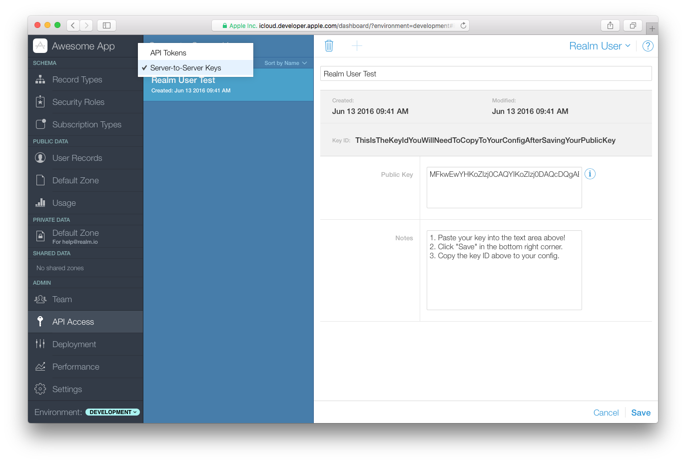

# CloudKit Authentication

You will need to create a public key for the Realm Object Server to access CloudKit. The steps are slightly different for Linux and macOS. 


Note that iCloud client support is only available on Apple platforms: iOS, macOS, tvOS, and watchOS.




1. Open a terminal and `cd` to the Realm Object Server directory.
2. Generate a private key: `openssl ecparam -name prime256v1 -genkey -noout -out cloudkit_eckey.pem` 
3. Generate a public key to be submitted to the CloudKit Dashboard: `openssl ec -in cloudkit_eckey.pem -pubout`



1. Generate a private key:`openssl ecparam -name prime256v1 -genkey -noout -out cloudkit_eckey.pem`
2. Generate a public key to be submitted to the CloudKit Dashboard:

   `openssl ec -in cloudkit_eckey.pem -pubout`





Log in to [Apple’s CloudKit Dashboard](https://icloud.developer.apple.com/dashboard) and select your application. In the left-hand side of the dashboard, select “API Access”, then select “Server-to-Server Keys”. Select “Add Server-to-Server Key”. Give the new key a name and paste in the public key generated above. Click “Save.” After a few seconds, a key will be generated and displayed in the “Key ID” section at the top of the page.

Security note: Create a new private key for each application you plan on using with Realm CloudKit authentication. Reusing private keys can compromise all Realms using the shared key if the private key itself becomes compromised or needs to be revoked.

To include or customize the CloudKit provider, create a ROS project via `ros init`:

```javascript
const RealmObjectServer = require('realm-object-server');
const path = require('path');

const server = new RealmObjectServer.BasicServer();

// Add the Key ID, private key path, container ID and environment information
const cloudKitProvider = new RealmObjectServer.auth.CloudkitAuthProvider({
    container: 'iCloud.io.realm.exampleApp.ios',
    // For production deployment on the App Store, you must specify 'production'
    environment: 'development',
    keyId: '0123456789abcdef0123456789abcdef0123456789abcdef0123456789abcdef',
    privateKeyPath:  'cloudkit_eckey.pem'
});

server.start({
    dataPath: path.join(__dirname, '../data'),
    authProviders: [ cloudKitProvider ],
}).catch((err) => {
    console.error("There was an error starting your custom ROS Server", err);
});
```

Please ensure the path to the `privateKeyPath` is correct. If you followed the steps above, on Linux the path will be `cloudkit_eckey.pem`.


Not what you were looking for? [Leave Feedback](https://www.getfeedback.com/r/uO1Zl0vE)

