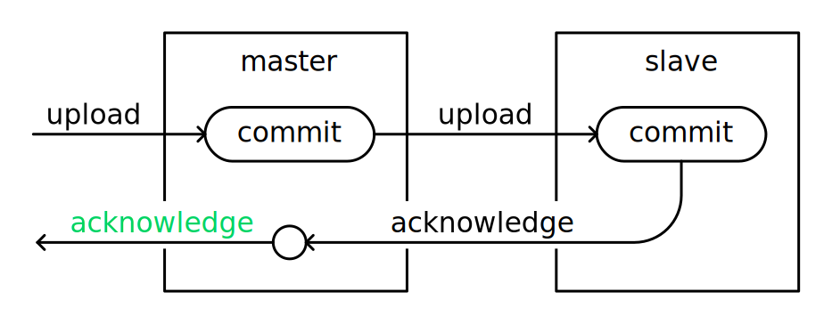

# High Availability

## Key Concepts

### Stateless Services

All internal services in Realm Object Server \(except the Sync service\) are stateless, in the sense that they don’t keep the state themselves, using the Sync service instead. 

This allows spawning multiple Auth or Proxy services. The only thing that has a state is the Sync service, and the next two ideas solve that problem.

### **Synchronous replication** 

The fact that the backup process is synchronous ensures that the committed data is replicated at any given point in time. 

Whenever a server fails, there is a full copy on another one.

### Service Discovery

Reliable service discovery is what allows Realm Object Server to notice and react to failures. 

After a server becomes unavailable, Realm Object Server chooses the new master replica carefully. It will not start an incomplete copy \(which would be a disaster for the data\).

All three at once make Realm Object Server highly available.

#### Consul

Realm Object Server depends on [Consul](https://consul.io) for service discovery.

The Auth and Proxy services ask Consul for the current Sync master. The Proxy service connects the clients to the master, and it drops all current connections in case a new master is elected.

The Sync services use Consul to elect a master and a slave and expose themselves to other services.

## Failover

In the event of failure for sync-worker master the slave will immediately take over the master role and turn the spare into a slave. The network monitoring tool should notice this outage and trigger a redeploy of the failed sync-worker and keep the `SYNC_LABEL` and `SYNC_ID` the same as the failed sync-worker - this will enable the rebuilt sync-worker to rejoin the same sync-worker group as a spare.  

In the event of failure of a ROS Core services node the network monitoring tool should send a trigger to immediately deploy a replacement ROS Core services node. Because the Core services is stateless multiple can be deployed in tandem and the load shared - spread out by the public load balancer. The network monitoring tool should also update the public load balancer with the DNS or IP of the new and healthy ROS core services module. Many software LBs such as nginx or HAproxy can be configured to do this themselves.  

In the event of consul failover the network monitoring tool should trigger a redeploy of the consul node to rejoin the cluster as specified in the consul documentation [here](https://www.consul.io/docs/guides/outage.html).  
****

## Disaster Recovery

In the event that an entire datacenter goes down and traffic must be served from a secondary datacenter the operator should make use of Realm’s backup functionality. This backup can be performed at regular intervals on each of the masters of the sync worker group. This backup is zipped and stored as a file in the secondary datacenter. This backup command can be run at regular intervals such as every day, every hour, or even faster by tools such as a cron job.

Once failure of a DC has been determined by the network monitoring tool - CM scripts can be used to redeploy the entire ROS cluster as if it were an initial deployment except this time the scripts will use the backup restore functionality and point to the latest backup file. Once this cluster is up the public load balancer can be adjusted to point to the new ROS proxy in the new datacenter.

If downtime must be kept to a minimum the ROS cluster can be kept in a “warm spare” mode where the nodes are ready but not serving traffic.The ROS sync-worker group can always be deployed with the most recent backup once one occurs. Once failure is detected the only thing needed to do is to adjust the forwarding address on the public load balancer.


Learn how to set up disaster recovery [here](disaster-recovery.md)! 


## Server Maintenance 

In a production environment you will at some point need to upgrade or patch the Realm components while the system is live and serving customers. To do this and not interrupt the service to your clients you should use the failover functionality built into the Realm system. For upgrading the realm sync-workers first upgrade the slave to the needed version, once the slave is up and healthy and has synchronous replication established - trigger a failover event by stopping the sync worker process on the master. You may then upgrade the old master process.  

To upgrade the Realm core services module it is recommended to have a secondary process deployed and part of the load balanced pool. This secondary process should be on the needed patched version, then you can configure your load balancer to start directing all new connections to the secondary Realm core services app. Once the primary Core services app is free from connections you may stop it and upgrade the app. This procedure is known as connection draining and is built into many proxies such as HAproxy.  

Not what you were looking for? [Leave Feedback](https://realm3.typeform.com/to/A4guM3) 

