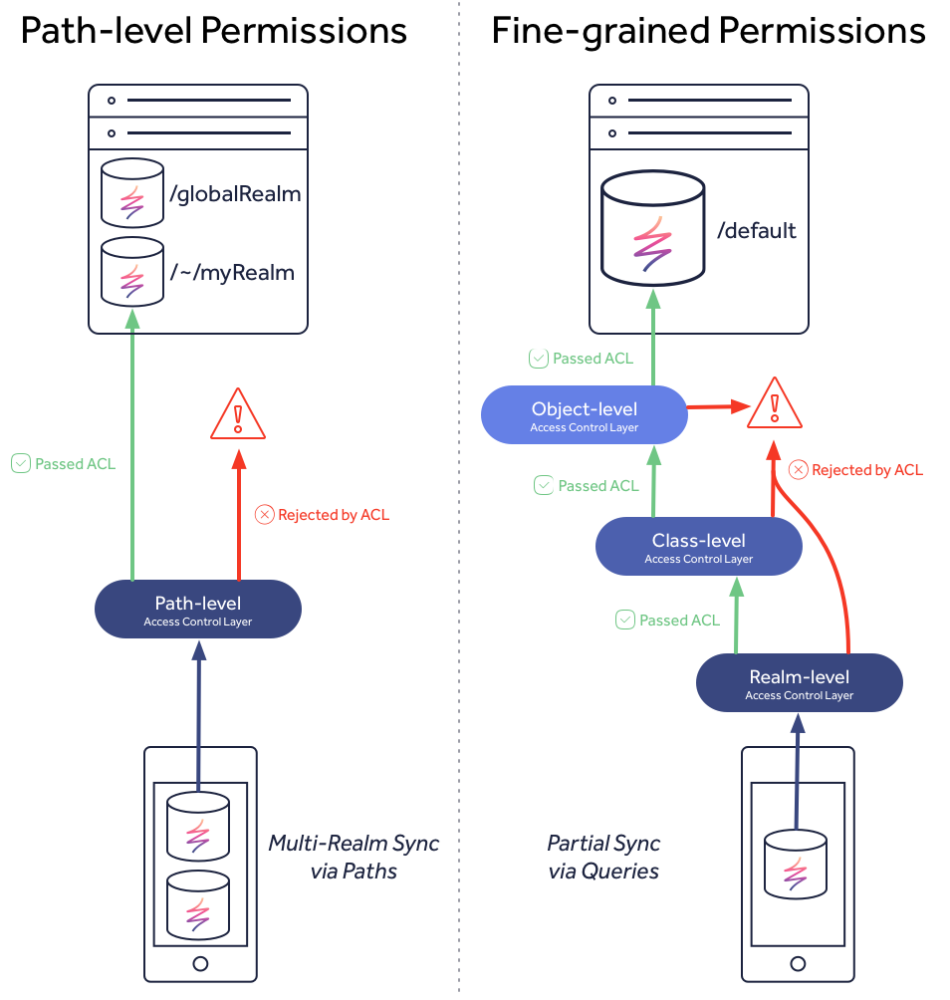

# Access Control

## Overview

As you progress in your app development, eventually you will want to consider the data security. Realm Platform offers a variety of mechanisms to securely control access to your synchronized data.

### Path-level Permissions

In versions &lt;3.x access control was limited to just [**path-level permissions**](path-level-permissions.md), or rather permissions that were based off the specific path assigned to the Realm, such as `/globalRealm` or `/~/myRealm`. This design meant that to control data access to specific users or groups, the application had to split its data up into different Realms, such as a global read-only Realm \(i.e. `/globalRealm`\) and user-specific data in individual Realms \(i.e. `/~/myRealm`\).

These permissions should only be used by applications that match the &lt;3.x data model requirements. For more details see the dedicated guide:



### Fine-Grained Permissions

Starting with version 3.x and the introduction of [Query-based synchronization](../syncing-data.md) and [the default synced Realm](../setting-up-your-realms.md#the-default-synced-realm), we also introduced a [fine-grained permission system](fine-grained-permissions.md) that works on more levels:

* [**Realm-level permissions**](fine-grained-permissions.md#realm-level) - permissions that apply to the entire Realm file \(this is similar to path-level permissions, but has a different API that aligns with class/object-level permissions\)
* \*\*\*\*[**Class-level permissions**](fine-grained-permissions.md#class-level) - permissions that apply only to a specific object class within a Realm file
* [**Object-level permissions**](fine-grained-permissions.md#object-level) - permissions that apply only to a specific object within a Realm file

With this fine-grained permission system you do not need to use the [**path-level permissions**](path-level-permissions.md) anymore. Instead, we recommend to start with the [default synced Realm](../setting-up-your-realms.md#the-default-synced-realm), which is designed for Query-based sync and fine-grained permissions.

### Comparison

To help clarify the differences between the various permissions, this visualization shows the difference between path-level and the fine-grained permissions, in addition, to how the fine-grained levels relate to each other.

Path-level permissions are designed to control access to multiple Realms based on the server URL path. When you open a Realm and supply the URL, the client SDK communicates with the server to obtain an access token. This token will be granted if the user has read or read/write permissions to the Realm. If the user does not have access, then no token is granted, an error will be passed to the client, and no sync session is established.

Fine-grained permissions work differently than path-permissions. When you open a query-based Realm, such as the default synced Realm, the client will initially contain no data. Once the client subscribes to a query, the access control system evaluates what objects to return through an ordered series of layers. Let's walk through an example of a client simply trying to `Read` data.

1. Realm-level permissions are evaluated first to check if the user has `Read` access. If no, then the client Realm will be empty. If yes, then the system continues to the next layer.
2. Class-level permissions are evaluated second to check if the user has `Read` access to the class used in the query. If no, then the client Realm will be empty since no objects can match the query that the user has access to. If yes, then the system continues to the next layer.
3. Object-level permissions are evaluated last to check which specific objects the user has `Read` access to that match the query. If the user has access to all or some objects, then these will be synced with the client Realm.

By default, when a Realm or class is created, all users are granted full access. Whereas when objects are created, they do not contain an ACL, because by default, objects lacking an ACL are accessible by everyone. Following the example above, by default, this means that clients subscribing to a query will pass through the hierarchy at the Realm and class-level since they have `Read` access and then all objects would be used to evaluate the query since no objects will contain an ACL initially.

Not what you were looking for? [Leave Feedback](https://realm3.typeform.com/to/A4guM3)

