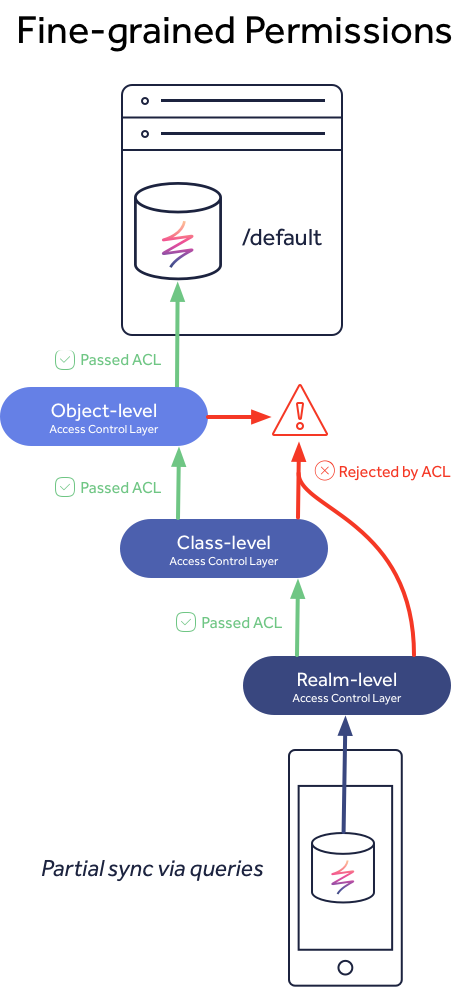

# Access Control

## Overview

As you progress in your app development, eventually you will want to consider the data security. Realm Platform offers a variety of mechanisms to securely control access to your synchronized data.

### Path-level Permissions

In versions &lt;3.x access control was limited to just [**path-level permissions**](path-level-permissions.md), or rather permissions that were based off the specific path assigned to the Realm, such as `/globalRealm` or `/~/myRealm`. This design meant that to control data access to specific users or groups, the application had to split its data up into different Realms, such as a global read-only Realm \(i.e. `/globalRealm`\) and user-specific data in individual Realms \(i.e. `/~/myRealm`\).

These permissions should only be used by applications that match the &lt;3.x data model requirements. For more details see the dedicated guide:



### Fine-Grained Permissions

Starting with version 3.x and the introduction of [Query-based synchronization](../syncing-data.md) and [the default synced Realm](../setting-up-your-realms.md#the-default-synced-realm), we also introduced a fine-grained permission system that works on more levels:

* [**Realm-level permissions**](./#realm-level) - permissions that apply to the entire Realm file \(this is similar to path-level permissions, but has a different API that aligns with class/object-level permissions\)
* [**Class-level permissions**](./#class-level) - permissions that apply only to a specific object class within a Realm file
* [**Object-level permissions**](./#object-level) - permissions that apply only to a specific object within a Realm file

With this fine-grained permission system you do not need to use the [**path-level permissions**](path-level-permissions.md) anymore. Instead, we recommend to start with the [default synced Realm](../setting-up-your-realms.md#the-default-synced-realm), which is designed for Query-based sync and fine-grained permissions.

### Comparison

To help clarify the differences between the various permissions, this visualization shows the difference between path-level and the fine-grained permissions, in addition, to how the fine-grained levels relate to each other.


Path-level permissions are designed to control access to multiple Realms based on the server URL path. When you open a Realm and supply the URL, the client SDK communicates with the server to obtain an access token. This token will be granted if the user has read or read/write permissions to the Realm. If the user does not have access, then no token is granted, an error will be passed to the client, and no sync session is established.

Fine-grained permissions work differently than path-permissions. When you open a partially synced Realm, such as the default synced Realm, the client will initially contain no data. Once the client subscribes to a query, the access control system evaluates what objects to return through an ordered series of layers. Let's walk through an example of a client simply trying to `Read` data.

1. Realm-level permissions are evaluated first to check if the user has `Read` access. If no, then the client Realm will be empty. If yes, then the system continues to the next layer.
2. Class-level permissions are evaluated second to check if the user has `Read` access to the class used in the query. If no, then the client Realm will be empty since no objects can match the query that the user has access to. If yes, then the system continues to the next layer.
3. Object-level permissions are evaluated last to check which specific objects the user has `Read` access to that match the query. If the user has access to all or some objects, then these will be synced with the client Realm.

By default, when a Realm or class is created, all users are granted full access. Whereas when objects are created, they do not contain an ACL, because by default, objects lacking an ACL are accessible by everyone. Following the example above, by default, this means that clients subscribing to a query will pass through the hierarchy at the Realm and class-level since they have `Read` access and then all objects would be used to evaluate the query since no objects will contain an ACL initially.

## Fine-Grained Permissions

In addition to path-level permissions, you can control user access to individual objects through fine-grained permissions. This feature is in effect whenever the user is connecting to a Realm file using Query-based synchronization.

When first starting, any user who can connect to a Realm file can make any change to the data. This is designed to allow you to get up and running quickly, syncing data, and iterating on your data models. Once you are ready to start implementing access control, an admin can then define access control lists inside the Realm file, either on individual objects or whole classes.

Access control is modeled using roles. A user can be a member of as many roles as needed. All users are automatically added to the special role called `everyone` by the server when they first connect.


In a new Realm file, the `everyone` role has full admin rights.


When you as a developer are ready to integrate permissions in your app, you would usually define a new `admin` which has yourself as a member, and then reduce the privileges of the `everyone` role.

Realm is an offline-first database, but permission checks are performed by the server. When a user makes a change to their local database, it will eventually be uploaded to the server, but if the server determines that the user tried to make changes that they were not allowed to make, the server will refuse to integrate it and instruct the client to revert the change. This all happens transparently from the perspective of the app.


A reversal of an illegal change looks like any other change coming from the server.


To minimize the risk of a user unintentionally making illegal changes while offline, the permission metadata is replicated to each client for offline access, and can be [queried in the app for UI purposes](./#user-privileges). No permission checks are done automatically by the client -- the app has to manually query the permission metadata.

The permission system recognizes three levels of permissions: Realm, Class, and Object-level. The hierarchy works like this: If a user does not have higher-level `Read` access, they cannot see anything on the lower levels. For example, if a user lacks `Read` access at the Realm-level, they cannot see any data in the Realm, even if they have `Read` at the class or object-level. However, just because they have higher-level `Read` access does not mean they can see _everything_ on the lower level -- just that they can see anything at all. In this way, the app developer can decide for themselves what granularity they want for permissions in their data model.



### Realm-level

The following permissions apply globally to the Realm file:

* `Read`_:_ This indicates that a user can see anything in the Realm at all \(though not necessarily everything\). If the user does not have this privilege, the Realm file will appear empty.
* `Update`_:_ This indicates that the user can make updates in the Realm \(though not necessarily to any object in the file\). If the user does not have this privilege, all changes they attempt to make in the Realm file will be rejected by the server.
* `ModifySchema`_:_ The user is allowed to add classes and properties in the Realm file.
* `SetPermissions`_:_ The user is allowed to change Realm-level permissions. Note that a user with the `SetPermissions` privilege can never give other users higher privileges than they themselves have.

These permissions are modeled using normal Realm Objects and can be edited the following way:



```swift
// Example creating a new role with only read access to the Realm
 
// Permissions must be modified inside a write transaction
try! realm.write {
    // Create the role
    let readOnlyRole = realm.create(PermissionRole.self, value: ["read-only"])
     
    // Add the user to the role
    let user = getUser()
    readOnlyRole.users.append(user)
     
    // Create a new permission object for the role and add it to the Realm
    // permissions
    let permission = realm.permissions.findOrCreate(forRole: readOnlyRole)
    permission.canRead = true
    permission.canQuery = true
}
```



```objectivec
// Example creating a new role with only read access to the Realm
 
// Permissions must be modified inside a write transaction
[realm transactionWithBlock:^{
    // Create the role
    RLMPermissionRole *readOnlyRole = [RLMPermissionRole createInRealm:realm withValue:@[@"read-only"]];

    // Add the user to the role
    RLMPermissionUser *user = getUser();
    [readOnlyRole.users addObject:user];

    // Create a new permission object for the role and add it to the Realm permissions
    RLMPermission *permission = [RLMPermission permissionForRoleNamed:readOnlyRole.name onRealm:realm];
    permission.canRead = YES;
    permission.canQuery = YES;
}];
```



```java
// Example creating a new role with only read access to the Realm

// Permissions must be modified inside a write transaction
realm.beginTransaction();
RealmPermissions realmPermissions = realm.getPermissions();

// Create the role
Role readOnlyRole = realm.createObject(Role.class, "read-only");

// Add the user to the role
SyncUser user = getUser();
readOnlyRole.addUser(user.getIdentity());

// Create a new permission object for the role and add it to the Realm
// permissions
Permission permission = new Permission.Builder(readOnlyRole)
  .canRead(true)
  .canQuery(true)
  .build();

realmPermissions.getPermissions().add(permission);
realm.commitTransaction();
```



```javascript
// Example creating a new role with only read access to the Realm

// Permissions must be modified inside a write transaction
realm.write(() => {
    // Create the role
    let readOnlyRole role = realm.createObject('__Role', { name: 'read-only' });

    // Add the user to the role
    let user = getUser();
    readOnlyRole.members.push(user);

    // Create a new permission object for the role and add it to the Realm
    // permissions
    let permission = realm.createObject('__Permission', { 'role': role, 'canRead': true, 'canQuery': true });
    let realmPermissions = realm.objects('__Realm');
    realmPermissions.permissions.push(permission);
};
```



```csharp
// Example creating a new role with only read access to the Realm
 
// Permissions must be modified inside a write transaction
realm.Write(() =>
{
    // Find or create the role
    var readOnlyRole = PermissionRole.Get(realm, "read-only");
     
    // Add the user to the role
    var user = User.Current;
    readOnlyRole.Users.Add(user);
     
    // Create a new permission object for the role and add it to the Realm
    // permissions
    var permission = Permission.Get(realm, readOnlyRole);
    permission.CanRead = true;
    permission.CanQuery = true;
});
```




Normal users can only grant other people access up to the level they themselves have, and only if they have the `SetPermissions` privilege. Admin users can see and edit everything.


### Class-level

The following permissions apply to classes:

* `Read`_:_ This indicates that a user can see objects of this class, though not necessarily all objects of this class. If the user does not have this privilege, they will not be able to see any objects of this class.
* `Update`_:_ This indicates that the user can make updates to objects of this class, though not necessarily all objects of this class.
* `Create`_:_ The user may create new objects of this class.
* `Query`_:_ This indicates that the user is allowed to make server-side global queries on objects of this class. Note that local \(client-side\) queries are always allowed.
* `SetPermissions`_:_ The user is allowed to change class-level permissions on this class.

Class permissions are set and modified the same way as Realm permissions:



```swift
// Example of only granting read only access to a class in the Realm
 
// Permissions must be modified inside a write transaction
try! realm.write {
    // Find an existing Role
    let readOnlyRole = realm.object(ofType: PermissionRole.self, forPrimaryKey: "read-only")!

    // Add the user to the role
    let user = getUser()
    readOnlyRole.users.append(user)

    // Create a new permission object for the role and add it to the class permissions
    let permissions = realm.permissions(forType: Person.self).findOrCreate(forRole: readOnlyRole)
    permissions.canRead = true
    permissions.canQuery = true
}
```



```objectivec
// Example of only granting read only access to a class in the Realm
 
// Permissions must be modified inside a write transaction
[realm transactionWithBlock:^{
    // Find an existing Role
    RLMPermissionRole *readOnlyRole = [RLMPermissionRole objectInRealm:realm forPrimaryKey:@"read-only"];

    // Add the user to the role
    RLMPermissionUser *user = getUser();
    [readOnlyRole.users addObject:user];

    // Create a new permission object for the role and add it to the class permissions
    RLMPermission *permission = [RLMPermission permissionForRoleNamed:readOnlyRole.name onClass:Person.class realm:realm];
    permission.canRead = YES;
    permission.canQuery = YES;
}];
```



```java
// Example of only granting read only access to a class in the Realm

// Permissions must be modified inside a write transaction
realm.beginTransaction();
ClassPermissions classPermissions = realm.getPermissions(Person.class);

// Find an existing Role
Role role = realm.where(Role.class).equalTo("name", "read-only").findFirst();

// Add the user to the role
SyncUser user = getUser();
role.addUser(user.getIdentity());

// Create a new permission object for the role
// and add it to the Realm permissions
Permission permission = new Permission.Builder(role)
  .canRead(true)
  .canQuery(true)
  .build();

classPermissions.getPermissions().add(permission);
realm.commitTransaction();
```



```javascript
// Example of only granting read only access to a class in the Realm

// Permissions must be modified inside a write transaction
realm.write(() => {

    // Find an existing Role
    let role = realm.objects('__Role').filtered(`name = 'read-only'`)[0];

    // Add the user to the role
    let user = getUser();
    role.members.push(user);

    // Create a new permission object for the role
    // and add it to the Realm permissions
    let permission = realm.createObject('__Permission', { 'role': role, 'canRead': true, 'canQuery': true });
    let realmPermissions = realm.objects('__Class');
    realmPermissions.permissions.push(permission);
};
```



```csharp
// Example of only granting read only access to a class in the Realm
 
// Permissions must be modified inside a write transaction
realm.Write(() =>
{
    // Find or create the role
    var readOnlyRole = PermissionRole.Get(realm, "read-only");

    // Add the user to the role
    var user = User.Current;
    readOnlyRole.Users.Add(user);

    // Create a new permission object for the role and add it to the class permissions
    var permission = Permission.Get<Person>(realm, readOnlyRole);
    permission.canRead = true;
    permission.canQuery = true;
});
```



### Object-level

In order to add permissions to your objects, you must add an ACL property. If your objects do not have the ACL property, the objects will be fully accessible by anyone \(provided that they are discoverable -- see the `Query` permission at the Class level\).

If there is an ACL property, but no permissions have been defined for any role, nobody will have access to the object.



```swift
// The ACL property is a `List<Permission>` field with a user-defined name
class Person: Object {
    @objc dynamic var name = ""
    let permissions = List<Permission>()
}
```



```objectivec
// The ACL property is a `RLMArray<RLMPermission *>` field with a user-defined name
@interface Person : RLMObject
@property NSString *name;
@property RLMArray<RLMPermission *><RLMPermission> *permissions;
@end
```



```java
// The ACL property is a `RealmList<Permission>` field with a user-defined name
public class Person extends RealmObject {
  public String name;
  public RealmList<Permission> permissions = new RealmList<>();
}
```



```javascript
// The ACL property is a list-of-permission property with a user-defined name
const PersonSchema = {
    name: 'Person',
    properties: {
        name: 'string',
        permissions: '__Permission[]'
    }
};
```



```csharp
// The ACL property is an `IList<Permission>` property with a user-defined name
public class Person : RealmObject
{
    // Other properties ...

    public IList<Permission> Permissions { get; }
}
```



The following permissions apply to objects:

* `Read`_:_ This indicates that the object is visible to the user. If the user does not have this privilege, the object will not appear in query results.
* `Update`_:_ This indicates that the object is writable by the user. The user may change any property of the object, except the ACL property if one exists.
* `Delete`_:_ The user may delete the object.
* `SetPermissions`_:_ The user is allowed to modify the ACL property of the object, if one exists.

Any object that is reachable through links or collections from an object to which a user has Read access will also be readable by that user, even if they explicitly do not have Read access to the reachable object. This is due to a current limitation in the way object graphs are represented in Realm.

Object-level permissions are set and modified the same way as Realm and class-level permissions:



```swift
// Example of restricting the object to the user creating it.
 
// Permissions must be modified inside a write transaction
try! realm.write {
    // Get the permission user for the sync user that is currently logged in.
    let user = realm.object(ofType: PermissionUser.self, forPrimaryKey: SyncUser.current!.identity!)!

    let person = getPerson()

    // Create a new permission object for the user's private role and
    // add it to the objects permissions
    let permissions = person.permissions.findOrCreate(forRole: user.role)
    permissions.canRead = true
    permissions.canUpdate = true
    permissions.canDelete = true
    permissions.canSetPermissions = true
}
```



```objectivec
// Example of restricting the object to the user creating it.
 
// Permissions must be modified inside a write transaction
[realm transactionWithBlock:^{
    // Get the permission user for the sync user that is currently logged in.
    RLMPermissionUser *user = [RLMPermissionUser userInRealm:realm withIdentity:RLMSyncUser.currentUser.identity];

    Person *person = getPerson();

    // Create a new permission object for the user's private role and
    // add it to the objects permissions
    RLMPermission *permission = [RLMPermission permissionForRoleNamed:readOnlyRole.name onObject:person realm:realm];
    permissions.canRead = YES;
    permissions.canUpdate = YES;
    permissions.canDelete = YES;
    permissions.canSetPermissions = YES;
}];
```



```java
// Example of restricting the object to the user creating it.
SyncUser user = SyncUser.currentUser();

// Permissions must be modified inside a write transaction
realm.beginTransaction();
Person person = getPerson();
ObjectPermissions objectPermissions = realm.getPermissions(person);

// Create role unique to the user
Role role = realm.create(Role.class, user.getIdentity());
role.addUser(user.getIdentity());

// Create a new permission object for the role
// and add it to the objects permissions
Permission permission = new Permission.Builder(role)
  .allPrivileges()
  .build();

objectPermissions.getPermissions().add(permission);
realm.commitTransaction();
```



```javascript
// Example of restricting the object to the user creating it.
let user = Realm.Sync.User.current;

// Permissions must be modified inside a write transaction
realm.write(() => {
    // Create role unique to user
    let role = realm.create('__Role', { name: user.identity });
    role.members.push(user);

    // Create a new permission object for the role
    // and add it to the objects permissions
    let permission = realm.create('__Permission', { role: role });
    ['canRead', 'canUpdate', 'canDelete', 'canSetPermissions', 'canQuery', 'canCreate', 'canModifySchema'].forEach((p) => permission[p] = true);

    let objectPermissions = realm.objects('__Class').filtered(`class_name = 'Person'`)[0];
    objectPermissions.permissions.push(permission);
};
```



```csharp
// Example of restricting the object to the user creating it.
 
// Permissions must be modified inside a write transaction
realm.Write(() =>
{
    // Get the permission user for the sync user that is currently logged in.
    var user = PermissionUser.Get(realm, User.Current.Identity);

    var person = realm.Find<Person>(someId);

    // Create a new permission object for the user's private role and
    // add it to the object's permissions
    var permission = Permission.Get(user.Role, person);
    permission.canRead = true;
    permission.canUpdate = true;
    permission.canDelete = true;
    permission.canSetPermissions = true;
});
```



## User Privileges

Because a `User` can be part of multiple roles with many different permissions, it is often useful to be able to determine exactly what the current user can do with an object \(or class, or the Realm file\).

This can be achieved in the following way:



```swift
// Realm privileges
let privileges = realm.getPrivileges()
 
// Class privileges for `Person`
let privileges = realm.getPrivileges(Person.self)
 
// Object privileges
let person = getPerson()
let privileges = realm.getPrivileges(person)
```



```objectivec
// Realm privileges
struct RLMRealmPrivileges privileges = [realm privilegesForRealm];
 
// Class privileges for `Person`
struct RLMClassPrivileges privileges = [realm privilegesForClass:Person.class];
 
// Object privileges
Person *person = getPerson();
struct RLMObjectPrivileges privileges = [realm privilegesForObject:person];
```



```java
// Realm privileges
RealmPrivileges privileges = realm.getPrivileges();

// Class privileges for `Person`
ClassPrivileges privileges = realm.getPrivileges(Person.class);

// Object privileges
Person person = getObject();
ObjectPrivileges privileges = realm.getPrivileges(person);
```



```javascript
// Realm privileges
let realmPrivileges = realm.privileges();

// Class privileges for Person
let classPrivileges = realm.privileges('Person');

// Object privileges
let person = getObject();
let objectPrivileges = realm.privileges(person);
```



```csharp
// Realm privileges
var privileges = realm.GetPrivileges();
 
// Class privileges for Person
var privileges = realm.GetPrivileges<Person>();

// Class privileges for Person using the string API
var privileges = realm.GetPrivileges("Person");
 
// Object privileges
var person = realm.Find<Person>(someId);
var privileges = realm.GetPrivileges(person);
```



This can e.g. be used to toggle an Edit button if a user only have read access to an object:



```swift
let person = getPerson()
let privileges = realm.getPrivileges(person)

if privileges.contains(.update) {
    showEditButton()
}
else {
    hideEditButton()
}
```



```objectivec
Person *person = getPerson();
struct RLMObjectPrivileges privileges = [realm privilegesForObject:person];

if (privileges.update) {
    showEditButton()
}
else {
    hideEditButton()
}
```



```java
Person person = getObject();
ObjectPrivileges privileges = realm.getPrivileges(person);

if (privileges.canModify()) {
  showEditButton();
} else {
  hideEditButton();
}
```



```javascript
let person = getObject();
let privileges = realm.privileges(person);

if (privileges.canModify) {
    showEditButton();
} else {
    hideEditButton();
}
```



```csharp
var person = realm.Find<Person>(someId)
var privileges = realm.GetPrivileges(person);

if (privileges.HasFlag(ObjectPrivileges.Update))
{
    ShowEditButton();
}
else
{
    HideEditButton();
}
```



Not what you were looking for? [Leave Feedback](https://realm3.typeform.com/to/A4guM3)

