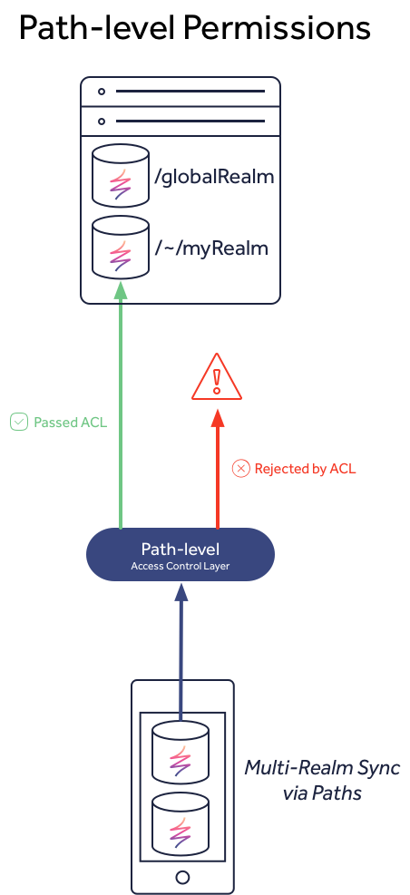

# Path-level permissions

## Overview

In versions &lt;3.x access control was limited to just path-level permissions, or rather permissions that were based off the specific path assigned to the Realm, such as `/globalRealm` or `/~/myRealm`. This design meant that to control data access to specific users or groups, the application had to split its data up into different Realms, such as a global read-only Realm \(i.e. `/globalRealm`\) and user-specific data in individual Realms \(i.e. `/~/myRealm`\).



## Paths

By default, a user can only create Realms within their own scoped path: `/<userId>/`. To simplify creating URLs, the tilde character, `~`, can be used in place of the `userId`. For example, if a user with `userId=1234` creates a Realm called `myRealm`, this would live at the path `/1234/myRealm` and is also addressable as `/~/myRealm` when called from the logged in user.


The only users that can create Realm files at other paths, such as the base path `/`, are admin users.


## Access Levels

Access levels can be granted to users for specific synchronized Realms, using the client permissions APIs. There are three levels:

* `Read` the ability to connect and sync the Realm
* `Write` the ability to make changes to the data in the Realm
* `Manage` - the ability to change permissions on the Realm

Note that each access level guarantees all allowed actions provided by less permissive access levels. Specifically, users with `Write` access to a Realm can always `Read` from that Realm.


Admin users can always read or write from the Realm.


Permissions for a Realm can be set on a _default_ basis and a _per-user_ basis. When a user attempts to sync a Realm, first the server checks to see if there are per-user permissions set for that user on that Realm. If there are no per-user permissions set for that user, the default permissions for the Realm are used. For example, a Realm might have `mayRead` set true by default, with individual users being granted `mayWrite` permissions.

By default, a Realm is exclusive to its owner: the owner has all permissions on it, and no other user has _any _permissions for it. Other users must be explicitly granted access.

## Reading Permissions



To get all the Realms a user has access to, along with the level of access for each Realm, use the `SyncUser.retrievePermissions(...)` method.

```swift
SyncUser.current?.retrievePermissions { permissions, error in
    if let error = error {
        // handle error
        return
    }
    // success! access permissions
}
```



To get all the Realms a user has access to, along with the level of access for each Realm, use the `-[RLMSyncUser retrievePermissionsWithCallback:]` method.

```objectivec
[[RLMSyncUser currentUser] retrievePermissionsWithCallback:^(RLMResults<RLMSyncPermission *> *permissions, NSError *error) {
    if (error) {
        // handle error
        return;
    }
    // success! access permissions
}];
```







```javascript
let user = Realm.Sync.User.current;
user.getGrantedPermissions().then(permissions => {
  // permissions is a collection of permission objects
})
.catch(error => {
  // an error occurred
});
```







## Modifying Permissions

Modifying the access control settings for a Realm file is performed through one of two means: _applying/revoking permission values_ and _offer/response objects._

### Granting permissions



```swift
let permission = SyncPermission(realmPath: realmPath,  // The remote Realm path on which to apply the changes
                                identity: anotherUserID, // The user ID for which these permission changes should be applied
                                accessLevel: .write)   // The access level to be granted
user.apply(permission) { error in
    if let error = error {
        // handle error
        return
    }
    // permission was successfully applied
}
```

To apply the permission changes for all Realms managed by the user, specify a `realmPath` value of `*`. To apply the permission changes for all users authorized with the Object Server, specify a `userID` value of `*`.

In addition to granting permissions based on the Realm Object Server identity of the user, it is also possible to grant permissions based on their Realm Object Server username:

```swift
let permission = SyncPermission(realmPath: realmPath,
                                username: "alice@realm.example.org",
                                accessLevel: .write)
user.apply(permission) { error in
    // ...
}

```



```objectivec
RLMSyncPermission *permission = [[RLMSyncPermission alloc] initWithRealmPath:realmPath                 // The remote Realm path on which to apply the changes
                                                                    identity:anotherUserID             // The user ID for which these permission changes should be applied
                                                                 accessLevel:RLMSyncAccessLevelWrite]; // The access level to be granted
[user applyPermission:permission callback:^(NSError *error) {
    if (error) {
        // handle error
        return;
    }
    // permission was successfully applied
}];
```

To apply the permission changes for all Realms managed by the user, specify a `realmPath` value of `*`. To apply the permission changes for all users authorized with the Object Server, specify a `userID` value of `*`.

In addition to granting permissions based on the Realm Object Server identity of the user, it is also possible to grant permissions based on their Realm Object Server username:

```objectivec
RLMSyncPermission *permission = [[RLMSyncPermission alloc] initWithRealmPath:realmPath
                                                                    username:@"alice@realm.example.org"
                                                                 accessLevel:RLMSyncAccessLevelWrite];
[user applyPermission:permission callback:^(NSError *error) {
    // ...
}];
```







```javascript
let user = Realm.Sync.User.current;
user.applyPermissions(userId, realmPath, 'write').then(permissionChange => {
  // an object with the applied changes and its metadata
})
.catch(error => {
  // ...
});
```

To apply the permission changes for all Realms managed by the user, specify a `realmPath` value of `*`. 







### Revoking Permissions



Revoking permissions can either be done by granting a permission value with an access level of `.none` or by passing a permission value with _any_ level to `SyncUser.revokePermission(...)`.



Revoking permissions can either be done by granting a permission value with an access level of `RLMSyncAccessLevelNone` or by passing a permission value with _any_ level to `-[RLMSyncUser revokePermission:callback:]`.







Revoking permissions can either be done by granting a permission value with an access level of `'none'`.








### Offering Permissions


This API is deprecated in v3.x




Permission offers can be used to share Realms between users. You need not write any server code; permission offers are created and accepted entirely through the client APIs.

If you want to share access to a Realm that you own or manage, create a permission offer. To do so, call the `SyncUser.createOfferForRealm(at:, accessLevel:, expiration:, callback:)` method. This method will asynchronously make a permission offer; the callback will be called with a string token representing the permission offer once the operation completes successfully.

Permission offers specify the URL of the Realm to offer access to, what level of access to grant to the recipient, and optionally a date after which the permission offer expires and can no longer be redeemed. \(Users who have already accepted the offer do not lose access to the Realm.\) If this date is unspecified or set to nil, the offer will never expire.

```swift
let realmURL = URL(string: "realm://realm.example.org/~/recipes")!

// Offer read-write access to `offeringUser`'s personal instance of the `recipes` Realm.
offeringUser.createOfferForRealm(at: realmURL, accessLevel: .write, expiration: nil) { (token, error) in
    guard let token = token else {
        print("Not able to create a permission offer! Error was: \(error!)")
        return
    }
    // (`token` can now be passed out of the closure and given to another user.)
}
```

This string token can then be passed to a different user via any appropriate channel \(such as e-mail\) and accepted using the `SyncUser.acceptOffer(forToken:, callback:)` method. This method also runs asynchronously; the callback will be called with the URL of the Realm which was represented by the offer. This URL can then be used to open Realms as the recipient.

```swift
let token = getOfferToken()

receivingUser.acceptOffer(forToken: token) { (realmURL, error) in
    guard let realmURL = realmURL else {
        print("Not able to accept a permission offer! Error was: \(error!)")
        return
    }
    // We can now use `realmURL` to open the Realm.
    // (Remember that if we only have .read permissions, we must use the `asyncOpen` API.)
    let config = Realm.Configuration(syncConfiguration: SyncConfiguration(user: receivingUser, realmURL: realmURL))
    let realm = try! Realm(configuration: config)
    // ...
}
```

Note that a user’s device must be able to communicate with a Realm Object Server in order to create and accept permission offers.

Permissions granted by permission offers are additive: if a user has write access to a certain Realm and is offered \(and accepts\) read access to that same Realm, they do not lose their existing write access.



Permission offers can be used to share Realms between users. You need not write any server code; permission offers are created and accepted entirely through the client APIs.

If you want to share access to a Realm that you own or manage, create a permission offer. To do so, call the `-[RLMSyncUser createOfferForRealmAtURL:accessLevel:expiration:callback:]` method. This method will asynchronously make a permission offer; the callback will be called with a string token representing the permission offer once the operation completes successfully.

Permission offers specify the URL of the Realm to offer access to, what level of access to grant to the recipient, and a date after which the permission offer expires and can no longer be redeemed. \(Users who have already accepted the offer do not lose access to the Realm.\) If this date is specified as nil, the offer will never expire.

```objectivec
NSURL *realmURL = [NSURL URLWithString:@"realm://realm.example.org/~/recipes"];

// Offer read-write access to `offeringUser`'s personal instance of the `recipes` Realm.
[offeringUser createOfferForRealmAtURL:realmURL
                           accessLevel:RLMSyncAccessLevelWrite
                            expiration:nil
                              callback:^(NSString *token, NSError *error) {
    if (error) {
        NSLog(@"Not able to create a permission offer! Error was: %@", error);
        return;
    }
    // (`token` can now be passed out of the block and given to another user...)
}];
```

This string token can then be passed to a different user via any appropriate channel \(such as e-mail\) and accepted using the `-[RLMSyncUser acceptOfferForToken:callback:]` method. This method also runs asynchronously; the callback will be called with the URL of the Realm which was represented by the offer. This URL can then be used to open Realms as the recipient.

```objectivec
NSString *token;
// (get token...)

[receivingUser acceptOfferForToken:token callback:^(NSURL *realmURL, NSError *error) {
    if (error) {
        NSLog(@"Not able to accept a permission offer! Error was: %@", error);
        return;    
    }
    // We can now use `realmURL` to open the Realm.
    // (Remember that if we only have read permissions, we must use the `asyncOpen` API.)
    RLMSyncConfiguration *syncConfig = [[RLMSyncConfiguration alloc] initWithUser:receivingUser realmURL:realmURL];
    RLMRealmConfiguration *config = [RLMRealmConfiguration defaultConfiguration];
    config.syncConfiguration = syncConfig;
    RLMRealm *realm = [RLMRealm realmWithConfiguration:config error:&error];
    // ...
}];
```

Note that a user’s device must be able to communicate with a Realm Object Server in order to create and accept permission offers.

Permissions granted by permission offers are additive: if a user has write access to a certain Realm and is offered \(and accepts\) read access to that same Realm, they do not lose their existing write access.















