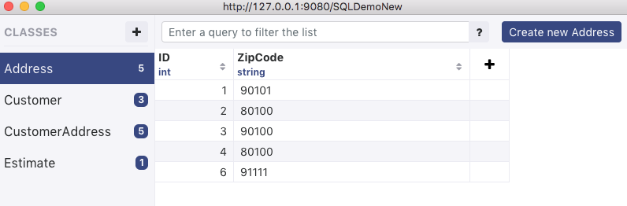

# MSSQL Data Connector

This guide walks you through how to use Realm’s data adapter to sync data from the Realm Object Server to a Microsoft SQL Server and vice versa. This guide shows the installation of the data adapter on an Ubuntu Server and assumes communication with an MSSQL Server in Amazon RDS, but any MSSQL Server will work as long as you are able to enable change tracking and snapshot isolation.

## Requirements {#postgres}

* Realm Object Server 2.x \(or higher\) or Realm Cloud
* MSSQL Server 2014 or newer 
* The ability to enable Change Tracking and Snapshot Isolation on your MSSQL Server
* A SQL User with admin privileges \(to run the adapter\)

## Example: Setting up Microsoft SQL Server {#postgres}

If you are running through this tutorial, we assume that you have a running MSSQL Server. If you do not, it is simple enough to create one using [Amazon RDS](https://aws.amazon.com/rds/sqlserver/).

### Loading in Test Data:

To get you up and running, we will provide some test data to show how the data synchronization works. You can run these SQL statements from any SQL client like SSMS or SQLPro for MSSQL.

#### Create the Database

```text
IF (SELECT db_id('SQLSyncDemo')) IS NULL CREATE DATABASE SQLSyncDemo;
```

#### Enable Change Tracking on the Database

```text
ALTER DATABASE SQLSyncDemo  
SET CHANGE_TRACKING = ON  
(CHANGE_RETENTION = 2 DAYS, AUTO_CLEANUP = ON)  

ALTER DATABASE SQLSyncDemo
SET ALLOW_SNAPSHOT_ISOLATION ON
GO

USE SQLSyncDemo  
GO
```

#### Create Tables

```text
CREATE TABLE dbo.Address (
    ID int NOT NULL,
    ZipCode varchar(10) NOT NULL
);

ALTER TABLE dbo.Address ADD CONSTRAINT PK_Address PRIMARY KEY (ID);

CREATE TABLE dbo.Customer (
    ID int NOT NULL,
    Company varchar(100) NULL
);

ALTER TABLE dbo.Customer ADD CONSTRAINT PK_Customer PRIMARY KEY (ID);

/* JOIN table */
CREATE TABLE dbo.CustomerAddress (
    CustomerID int NOT NULL,
    AddressID int NOT NULL,
    IsBilling bit NOT NULL
);

ALTER TABLE dbo.CustomerAddress ADD CONSTRAINT PK_Customer_Address PRIMARY KEY (CustomerID, AddressID); /* Compound PK */

CREATE TABLE dbo.Estimate (
    ID int NOT NULL,
    customerid int NOT NULL,
    something varchar(50) NULL
);

ALTER TABLE dbo.Estimate ADD CONSTRAINT PK__Estimate PRIMARY KEY (ID);

/* INSERT DATA */

INSERT INTO Address (ID, ZipCode) VALUES 
(1,'90101'),
(2,'80100'),
(3,'90100'),
(4,'80100'),
(6,'91111');

INSERT INTO Customer (ID, Company) VALUES 
(1,'C2'),
(2,'C2'),
(3,'C3');

INSERT INTO CustomerAddress (CustomerID, AddressID, IsBilling) VALUES 
(1,1,0),
(1,2,0),
(1,4,0),
(2,3,0),
(3,6,1);

INSERT INTO Estimate (ID, customerid, something) VALUES 
(13,1,'Some estimate');
```

#### Enable Change Tracking on each Table

```text
ALTER TABLE Address ENABLE CHANGE_TRACKING WITH (TRACK_COLUMNS_UPDATED = ON);
ALTER TABLE Customer ENABLE CHANGE_TRACKING WITH (TRACK_COLUMNS_UPDATED = ON);
ALTER TABLE CustomerAddress ENABLE CHANGE_TRACKING WITH (TRACK_COLUMNS_UPDATED = ON);
ALTER TABLE Estimate ENABLE CHANGE_TRACKING WITH (TRACK_COLUMNS_UPDATED = ON);
```

## Example: Setting up The Data Adapter

The data adapter relies on a number of components for two way data synchronization.

* Data Adapter Package: This contains the core codebase of the adapter
* Adapter.js: This runs as a process to facilitate synchronization 
* realmmodels.js: This defines the schema to be synchronized 
* config.js: this defines a number of variables which are used during adapter configuration 
* loader.js: You may choose to perform a one time bulk import of data into the Realm Object Server before running the adapter 

### Setup the Data Adapter Package


You'll need to contact [info@realm.io](mailto:sales@realm.io) to receive the MSSQL Data Adapter Package file.


Find a desirable location on your server and run the following commands from your terminal:

```bash
mkdir mssql-test
cd mssql-test
#press enter through all the prompts that are returned to create a project
npm init
npm install realm
#replace the path below with your local path to your adapter package -- you will want to cahnge the version accordingly 
npm install ~/Downloads/realm-mssql-adapters-1.1.1.tgz
```

### Prepare your Config File

Create the file by running the following command:

```text
touch config.js
```

Using your preferred text editor, paste the following into your config file:



```javascript
module.exports = {
    // Database name
    database_name: 'SQLSyncDemo',

    database_schema: 'dbo',

    // Realm Object Server URL
    //self-hosted: realm://10.0.0.7:9080
    //cloud: realms://small-plastic-handle.us1a.cloud.realm.io/
    //note: port only required for self-hosted
    realm_object_server_url: "realm://<IP_OR_DNS_OF_ROS>",

    //self-hosted:http://10.0.0.7:9080
    //cloud: https://small-plastic-handle.us1a.cloud.realm.io/
    auth_server_url: "http://<IP_OR_DNS_OF_ROS>",

    //enter as necessary
    admin_username: 'realm-admin',
    admin_password: '',

    // The synced Realm path for the data
    target_realm_path: '/SQLDemoNew',

    // MSSQL config used for all connections - replace with your data
    sqlserver_config: {
        user:       'realm',
        password:   'my-sql-password',
        server:     'mydbinstanceAddress.us-east-1.rds.amazonaws.com',
        port:        1433
        connectionTimeout: 300000,
        requestTimeout:    300000,
        pool: {
           idleTimeoutMillis: 300000
       },
      options: {
          //only if needed for server 
          encrypt: true
      }    
  },
}
```



You'll need to change a number of the various variables to match your own environment like the SQL Server information, admin user token, and the ROS address.

### Prepare your Models File

Create the file by running the following command:

```text
touch realmmodels.js
```

Using your preferred text editor, paste the following into your models file:



```javascript
const Customer = {
    name: 'Customer',
    primaryKey: 'ID',
    properties: {
        ID: 'int',
        Company: 'string',
        addresses: { type: 'list', objectType: 'CustomerAddress', watch_table: true },
        Estimates: { type: 'list', objectType: 'Estimate', watch_table: true }, 
    }
}

const CustomerAddress = {
    name: 'CustomerAddress',
    primaryKey: 'pk',
    properties: {
        pk: 'string',
        customerid: { type: 'linkingObjects', objectType: 'Customer', property: 'addresses' },
        addressid: 'Address',
        IsBilling: 'bool',
    }
}

const Address = {
    name: 'Address',
    primaryKey: 'ID',
    properties: {
        ID: 'int',
        ZipCode: 'string',
    },
}

const Estimate = {
    name: 'Estimate',
    primaryKey: 'ID',
    properties: {
        ID: 'int',
        customerid: { type: 'linkingObjects', objectType: 'Customer', property: 'Estimates' },
        Something: 'string',
    }
}


module.exports = [
    Customer, 
    CustomerAddress, 
    Address, 
    Estimate
];
```




This models file is built specifically to work with the SQL data which we loaded into our SQL Server. You will edit this schema to match your own data that you wish to synchronize.


### Load the existing SQL Data into ROS

Create your loader file by running the following command:

```text
touch loader.js
```

Using your preferred text editor, paste the following into your loader file:



```javascript
const Realm = require('realm');
const fs = require('fs');
const path = require('path');
const SQLServerRealmLoader = require('realm-mssql-adapters').SQLServerRealmLoader;
const Config = require('./config');

const Models = require('./realmmodels');

if (process.env.NODE_ENV !== 'production') {
    require('source-map-support').install();
}

// Print out uncaught exceptions
process.on('uncaughtException', (err) => console.log(err));

async function main() {
    //login as an admin user 
    var admin_user = await Realm.Sync.User.login(Config.auth_server_url, Config.admin_username, Config.admin_password)

    const conf = {
        // Realm configuration parameters for connecting to ROS
        realmConfig: {
            server: Config.realm_object_server_url, // or specify your realm-object-server location
            user:   admin_user,
        },
        dbName: Config.database_name,
        dbSchema: Config.database_schema,
        // SQL Server configuration and database name
        sqlserverConfig: Config.sqlserver_config,
        resetPostgresReplicationSlot: true,


        // Set to true to create the SQL Server DB if not already created
        createSQLServerDB: false,
        initializeRealmFromSQLServer: false,
        // Enable and set this function if you'd like to speed up your loader 
        //loaderSQLBatchSize: 1000,

        // Set to true to indicate SQL Server tables should be created and
        // properties added to these tables based on schema additions
        // made in Realm. If set to false any desired changes to the
        // SQL Server schema will need to be made external to the adapter.
        applyRealmSchemaChangesToSQLServer: false,

        // Only match a single Realm called 'testRealm'
        //realmRegex: `/*`+Config.database_name,
        realmRegex: Config.target_realm_path,

        // Specify the Realm name all SQL Server changes should be applied to
        mapSQLServerChangeToRealmPath: Config.target_realm_path,

        // Specify the Realm objects we want to replicate in SQL Server.
        // Any types or properties not specified here will not be replicated
        schema: Models,

        printCommandsToConsole: true,

        compoundPrimaryKeys: {
            'CustomerAddress': [
                { property: 'customerid', dbColumn: 'CustomerID', type: 'int' },
                { property: 'addressid', dbColumn: 'AddressID', type: 'int' },
            ]
        }
    }
    var loader = new SQLServerRealmLoader(conf);
        loader.init().catch(console.error)
}

main();
```



Now you should be able to run the loader to import your SQL data into the Realm Object Server. Simply run:

```text
node loader.js
```


**Note:** At this point, you might check to see if the data is available in Realm Studio. If you see the Realm files created but no resulting data, this is due to the loader / adapter design. After completion, the loader will attempt to upload all local data to your Realm Object Server instance. If it does not complete within the `loaderUploadMaxWaitTime` \(default 60 seconds\), it will simply persist the data locally until it is ultimately uploaded when the adapter process is run.


#### Improving the Performance of your Loader

Importing a large amount of data can sometimes take a fair amount of time.  Here's a few tips to increase the performance of your loader

* Increase the batch size from the default size of 1000 by using the `loaderSQLBatchSize`parameter in your loader file. 
* When using JOIN tables, seed the RealmID field with a uuid on the SQL side before running the loader script.

You should now be able to use Realm Studio to see that the data was synchronized to your Realm Object Server.

  




### Run the Adapter for Bidirectional Sync

Finally, we need to create and configure the adapter file which will facilitate bidirectional synchronization. Create the file by running the following command:

```text
touch adapter.js
```

Using your preferred text editor, paste the following into your adapter file:



```javascript
const fs = require('fs');
const path = require('path');
const process = require('process');
const SQLServerAdapter = require('realm-mssql-adapters').SQLServerAdapter;
const Config = require('./config');
const Models = require('./realmmodels');

// Print out uncaught exceptions
process.on('uncaughtException', (err) => console.log(err));

async function main() {
    //login as an admin user 
    var admin_user = await Realm.Sync.User.login(Config.auth_server_url, Config.admin_username, Config.admin_password)
    const conf = {
        // Realm configuration parameters for connecting to ROS
        realmConfig: {
            server: Config.realm_object_server_url, // or specify your realm-object-server location
            user:   admin_user,
        },
        dbName: Config.database_name,
        dbSchema: Config.database_schema,
        // SQL Server configuration and database name
        sqlserverConfig: Config.sqlserver_config,

        // Set to true to create the SQL Server DB if not already created
        createSQLServerDB: false,
        initializeRealmFromSQLServer: false,

        // Set to true to indicate SQL Server tables should be created and
        // properties added to these tables based on schema additions
        // made in Realm. If set to false any desired changes to the
        // SQL Server schema will need to be made external to the adapter.
        applyRealmSchemaChangesToSQLServer: false,

        // Only match a single Realm called 'testRealm'
        //realmRegex: `/*`+Config.database_name,
        realmRegex: Config.target_realm_path,

        // Specify the Realm name all SQL Server changes should be applied to
        mapSQLServerChangeToRealmPath: Config.target_realm_path,

        // Specify the Realm objects we want to replicate in SQL Server.
        // Any types or properties not specified here will not be replicated
        schema: Models,

        printCommandsToConsole: false,

        compoundPrimaryKeys: {
            'CustomerAddress': [
                { property: 'customerid', dbColumn: 'CustomerID', type: 'int' },
                { property: 'addressid', dbColumn: 'AddressID', type: 'int' },
            ]
        }
    }

    var adapter = new SQLServerAdapter(conf);
}

main();
```



Finally, run the adapter file:

```text
node adapter.js
```


In a production environment, make sure to run the adapter in the background using a process manager like PM2.


You can now make changes on either the MSSQL or ROS side and see the changes synchronized between the two databases.

Not what you were looking for? [Leave Feedback](https://realm3.typeform.com/to/A4guM3)

## Relationships

One of the first things you will need to add to support the Realm Adapter for MSSQL is a RealmId string field to each object you want to support in Realm. This will be used as the PrimaryKey for your Realm models on the Realm side. You will also need to add a RealmId column as a nvarchar\(128\) to each table that matches your classes in Realm. This will be auto-generated and loaded into SQL when the Realm loader is run - to improve performance generate these GUID values on the SQL side first. This is necessary to enable the linking of models and List relationships from Realm primary keys to SQL primary keys. Additionally, this will allow an offline mobile client to create objects without getting a primary key from the SQL Server. The adapter will then create a mapping of Realm object to a SQL row by creating a mapping of the primary keys. In the Realm models the actual primary key of the SQL server will be made optional in Realm \(even though it is required in SQL\) but designated in the Realm model with sqlserverPrimaryKey key. This is why it is important to designate an IDENTITY column which will automatically insert a Primary Key into a new row when the Realm adapter inserts a new object into SQL.  


When designing your schema for the Realm adapter to match the schema of your MSSQL database you must consider how your relationships should be structured in the Realm Object model compared to relations between tables on SQL Server.

### **1 to 1 Relationship**

This is the most straightforward relationship. In your SQL schema you have one table that has a foreign key column to another table thus forming a relationship. In the Realm data model relationships are defined by declaring a name of a Realm object as a property of a parent object as shown [here](mssql-data-connector.md#https-realm-io-docs-javascript-latest-to-one-relationships):

Let’s say your SQL schema looked like this:

```sql
CREATE TABLE dbo.Passport
(
PassportId INT NOT NULL IDENTITY(1,1),
RealmId VARCHAR(255),
Country     VARCHAR(255),
CONSTRAINT PK_Passport PRIMARY KEY (PassportId)
);

CREATE TABLE dbo.Person
(
PersonId INT NOT NULL IDENTITY(1,1),
Name VARCHAR(255),
RealmId VARCHAR(255),
PassportId INT FOREIGN KEY REFERENCES Passport(PassportId),
CONSTRAINT PK_Person PRIMARY KEY (PersonId)
);
```

Notice how we added an optional RealmId column to each table.  


With this schema we can see that there is a Person table and there is a column for PassportId which means every Person must have a Passport or foreign key to the ID column of the Passport table. Now we go to create this schema with a Realm model, notice how the PassportId field for Person now just have the relation or link to the Passport class.

```javascript
const Person = {
   name: 'Person',
   primaryKey: 'RealmId',
   sqlserverPrimaryKey: 'PersonId',
   properties: {
       RealmId: 'string',
       PassportId: 'Passport',
       PersonId: { type: 'int', optional: true },
       Name: 'string',
   }
}

const Passport = {
       name: 'Passport',
       primaryKey: 'RealmId',
       sqlserverPrimaryKey: 'PassportId',
       properties: {
           Country: 'string',
           RealmId: 'string',
           PassportId: { type: 'int', optional: true },
       }
   }
```

Now lets insert some data into SQL Server by executing the commands below

```sql
SET IDENTITY_INSERT Passport ON

INSERT INTO dbo.Passport (PassportId, Country) VALUES
(1, 'USA'),
(2, 'Canada');

SET IDENTITY_INSERT Passport OFF

SET IDENTITY_INSERT Person ON

INSERT INTO dbo.Person (PersonId, Name, PassportId) VALUES
(1, 'Curly', 1),
(2, 'Larry', 1),
(3, 'Moe', 2);

SET IDENTITY_INSERT Person OFF
```

Now run the loader and it should then finish without errors and then run the adapter. If you take a look in Realm Studio you should see the Person objects populated with links to a Passport objects.

```javascript
const Money = {
    name: 'Money',
    primaryKey: 'RealmId',
    sqlserverPrimaryKey: 'MoneyId',
    properties: {
        RealmId: 'string',
        MoneyId: { type: 'int', optional: true },
        change: 'string',
    }
}
```


If you now run the adapter you can insert into Realm or SQL and watch as the data is replicated to the opposite side. If you are inserting from the Realm side - do not worry about inserting the SQL primary key - the database should take care of that for you. Conversely, if you are inserting from the SQL side the Realm object will automatically have a RealmId generated for it from the adapter. 

### 1 to Many Relationships

Now the next question becomes how to represent one to many relationships where a single parent object can have many child objects. In SQL these are represented with Foreign Keys from the child object back to its particular parent. In Realm we represent these as a list or array of Child objects as a property of the Parent object as shown [here](https://realm.io/docs/javascript/latest/#to-one-relationships)

Let’s say your SQL Schema looks like so:

```sql
CREATE TABLE dbo.Author
(
AuthorId INT NOT NULL IDENTITY(1,1),
FullName     VARCHAR(255),
RealmId VARCHAR(255),
CONSTRAINT PK_Author PRIMARY KEY (AuthorId)
);

CREATE TABLE dbo.Book
(
BookId INT NOT NULL IDENTITY(1,1),
Name VARCHAR(255),
RealmId VARCHAR(255),
Author   INT FOREIGN KEY REFERENCES Author(AuthorId),
CONSTRAINT PK_Book PRIMARY KEY (BookId)
);
```

Your corresponding Realm schema would look like this:

```javascript
const Author = {
   name: 'Author',
   primaryKey: 'RealmId',
   sqlserverPrimaryKey: 'AuthorId',
   properties: {
       RealmId: 'string',
       AuthorId: { type: 'int', optional: true },
       FullName: 'string',
       books: { type: 'linkingObjects', objectType: 'Book', property: 'Author' },
   }
}
const Book = {
   name: 'Book',
   primaryKey: 'RealmId',
   sqlserverPrimaryKey: 'BookId',
   properties: {
       Author: 'Author',
       BookId: { type: 'int', optional: true },
       RealmId: 'string',
       Name: 'string',
   }
}
```

We use a linking object in Author to return an array of all Book objects that are linked to that Author. While it will not show up in Studio - you will be able to access these Author.Book objects in your Swift/Kotlin models.

Now lets insert some data:

```sql
SET IDENTITY_INSERT Author ON

INSERT INTO dbo.Author (AuthorId, FullName) VALUES
(1, 'Ernest Hemingway'),
(2, 'Kurt Vonnegut'),
(3, 'Mikhail Bulgakov');

SET IDENTITY_INSERT Author OFF

SET IDENTITY_INSERT Book ON

INSERT INTO dbo.Book (BookId, Name, Author) VALUES
(1, 'For Whom the Bell Tolls', 1),
(2, 'The Sun Also Rises', 1),
(3, 'A Farewell to Arms', 1),
(4, 'Slaughterhouse-Five', 2),
(5, 'Cats Cradle', 2),
(6, 'The Master and Margarita', 3);

SET IDENTITY_INSERT Book OFF
```

Now if you run the loader and adapter you should see the Foreign Key column mapping to the appropriate relationship back to Author.


### 1 to Many Relationships with Order

One of the things about Relational Databases is that they do not have an inherent order in their tables - rows are ordered by when they are inserted. In Realm, and with all object-oriented programming Lists with order give the developer one less thing to worry about. The MSSQL-Realm adapter is no exception.  


Let’s say your SQL Schema looks like so:

```sql
CREATE TABLE dbo.BusLine
(
BusLineId INT NOT NULL IDENTITY(1,1),
Name     VARCHAR(255),
RealmId VARCHAR(255),
CONSTRAINT PK_BusLine PRIMARY KEY (BusLineId)
);

CREATE TABLE dbo.Stop
(
StopId INT NOT NULL IDENTITY(1,1),
Name VARCHAR(255),
RealmId VARCHAR(255),
BusLineId INT FOREIGN KEY REFERENCES BusLine(BusLineId),
CONSTRAINT PK_Stop PRIMARY KEY (StopId)
);
```

The corresponding Realm schema would look like so:

```javascript
const Stop = {
   name: 'Stop',
   primaryKey: 'RealmId',
   sqlserverPrimaryKey: 'StopId',
   properties: {
       RealmId: 'string',
       BusLineId: { type: 'linkingObjects', objectType: 'BusLine', property: 'Stops' },
       StopId: { type: 'int', optional: true },
       Name: 'string',
   }
}

const BusLine = {
   name: 'BusLine',
   primaryKey: 'RealmId',
   sqlserverPrimaryKey: 'BusLineId',
   properties: {
       RealmId: 'string',
       BusLineId: { type: 'int', optional: true },
       Name: 'string',
       Stops: { type: 'list', objectType: 'Stop', watch_table: true },
   }
}
```


Notice the special `watch_table: true` designation in its List definition. This instructs the adapter that order matters here and will continue to make sure that order is maintained each time inserts or modifications occur in the RealmList.


Now let’s insert some data:

```sql
SET IDENTITY_INSERT BusLine ON

INSERT INTO dbo.BusLine (BusLineId, Name) VALUES
(1, 'Marina'),
(2, 'SOMA'),
(3, 'Mission');

SET IDENTITY_INSERT BusLine OFF

SET IDENTITY_INSERT Stop ON

INSERT INTO dbo.Stop (StopId, Name, BusLineId) VALUES
(1, 'Market', 1),
(2, 'Gough', 1),
(3, 'Union', 1),
(4, 'Townsend', 2),
(5, 'Mission', 3),
(6, 'Van Ness', 3);

SET IDENTITY_INSERT Stop OFF
```

Now if you rerun the loader and the adapter you will see a List of Stops associated with each BusLine.


On the SQL side you will see a special table created called \_\_BusLine\_\_Stops - this is an internal table for the Realm Adapter to maintain order.


### Many to Many Relationships

In SQL Many-Many relationships are represented through JOIN tables that often use a compound primary key between two Foreign Keys. Such concepts are not needed in Realm because it is an object database that uses links to other classes to form relationships with backlinks as shown [here](https://realm.io/docs/javascript/latest#to-many-relationships)

However, in order to integrate with relational database constructs the adapter provides support for JOIN tables and compound primary keys.

Let’s say your SQL schema looked like this:

```sql
CREATE TABLE dbo.Route (
    RouteKey int NOT NULL IDENTITY(1,1),
	RouteName nvarchar(32),
    RealmID nvarchar(128),
	CONSTRAINT PK_Route PRIMARY KEY (RouteKey),
)
CREATE TABLE dbo.Employee (
    EmployeeKey int NOT NULL IDENTITY(1,1),
    EmployeeName nvarchar(64),
    RealmID nvarchar(128),
    CONSTRAINT PK_Employee PRIMARY KEY (EmployeeKey)
)
CREATE TABLE dbo.EmployeeRoute (
    EmployeeKey int FOREIGN KEY REFERENCES Route(RouteKey) NOT NULL,
    RouteKey int FOREIGN KEY REFERENCES Employee(EmployeeKey)NOT NULL
)
ALTER TABLE dbo.EmployeeRoute ADD CONSTRAINT PK_EMPLOYEE_ROUTE PRIMARY KEY (EmployeeKey, RouteKey); /* Compound PK */
```

Then your corresponding Realm schema would look like this:

```javascript
const Route = {
   name: 'Route',
   primaryKey: 'RealmID',
   sqlserverPrimaryKey: 'RouteKey',
   properties: {
       RealmID: 'string',
       RouteKey: { type: 'int', optional: true },
       RouteName: 'string',
       Employees: { type: 'linkingObjects', objectType: 'EmployeeRoute', property: 'RouteKey' }
   }
}

const EmployeeRoute = {
   name: 'EmployeeRoute',
   primaryKey: 'PK',
   properties: {
       PK: 'string',
       EmployeeKey: 'Employee',
       RouteKey: 'Route'
   }
}

const Employee = {
   name: 'Employee',
   primaryKey: 'RealmID',
   sqlserverPrimaryKey: 'EmployeeKey',
   properties: {
       RealmID: 'string',
       EmployeeKey: { type: 'int', optional: true },
       EmployeeName: { type: 'string', optional: true },
       Routes: { type: 'linkingObjects', objectType: 'EmployeeRoute', property: 'EmployeeKey' }
   }
}
```

Where every Employee has Routes and every Route has Employees. Notice the new field PK on the EmployeeRoute object. This is an internal Realm Adapter construct which will represent the JOIN table compound key as a concatenation of the two foreign keys. 

Now let’s insert some data into SQL:

```sql
SET IDENTITY_INSERT Employee ON

INSERT INTO dbo.Employee (EmployeeKey, EmployeeName) VALUES
(1, 'Tom'),
(2, 'David'),
(3, 'Nathan');

SET IDENTITY_INSERT Employee OFF

SET IDENTITY_INSERT Route ON

INSERT INTO dbo.Route (RouteKey, RouteName) VALUES
(1, 'East'),
(2, 'West'),
(3, 'North');

SET IDENTITY_INSERT Route OFF

INSERT INTO dbo.EmployeeRoute  (EmployeeKey, RouteKey) VALUES
(1, 1),
(2, 1),
(3, 1),
(2, 3);
```

You will also need to configure the compound primary keys in the adapter and the loader like this:

```javascript
   compoundPrimaryKeys: {
       'EmployeeRoute': [
           { property: 'EmployeeKey', dbColumn: 'EmployeeKey', type: 'int' },
           { property: 'RouteKey', dbColumn: 'RouteKey', type: 'int' },
       ]

   }
```


In order to insert or delete directly to/from EmployeeRoute \(or any JOIN object\), a few rules must be obeyed.

The EmployeeRoute.PK \(on the Realm side\) must be made up of two parts. For example ‘2-3’, where the first number\(2\) is the SQL ID \(Employee.EmployeeKey\), and the second number \(3\) is also the SQL ID Route.RouteKey. Also, the EmployeeRoute.EmployeeKey and EmployeeRoute.RouteKey columns have to store references \(Realm IDs\) to the corresponding entities as defined in the PK.

Updating an EmployeeRoute \(or a JOIN object\) is not possible because the PK is made up of two parts which reference the linked objects. If you update the other columns \(the referenced objects\), you would need to update the PK as well, but updating PKs is neither possible nor advisable. Instead it is recommend to delete the JOIN object and then re-insert with the new object relational mapping. 

Deleting an Employee or a Route while any EmployeeRoute referencing them still exists causes an error. If you wish to do this please delete the JOIN object first and then delete the corresponding related object. MSSQL will through a FK constraint violation if you attempt to do this.

## Mapping and Renaming 

When integrating with your existing MSSQL database, it is not uncommon to want to rename some of your SQL tables or columns.  For example, you may have a SQL column whose name is a reserved keyword within your client SDK \(like "description" is in Swift\).  

### Mapping a SQL table name to a Realm class name

This is achieved by using the `mapSQLServerTableName`and the `mapRealmClassName` functions.  These functions can be considered sibling functions.  They are typically defined within your configuration or constants files and then called from your `loader` and `adapter` scripts.  `mapSQLServerTableName` is required in both your loader and adapter.  `mapRealmClassName` is only required within your adapter since the loader does not perform bidirectional sync.

For example, let's imagine we have a SQL table called `UserData`  that we would like to rename `RealmUserData`

You can do this with the follow functions: 

```javascript
   //from SQL to Realm 
   mapSQLServerTableName?: (name: string) => {
      if (name === 'UserData') {
         out_name = 'RealmUserData';
         }
      return out_name;
   }
   //from Realm to SQL
   mapRealmClassName?: (class_name) => {
   if (class_name === 'RealmUserData') {
         out_name = 'UserData';
         }
      return out_name;
   }
```

### Mapping a SQL column name to a Realm property name 

This is achieved by using the `mapSQLServerColumnName`and the `mapRealmPropertyName` functions.  These functions can be considered sibling functions.  They are typically defined within your configuration or constants files and then called from your `loader` and `adapter` scripts.  `mapSqlServerColumnName` is required in both your loader and adapter.  `mapRealmPropertyName` is only required within your adapter since the loader does not perform bidirectional sync.    

For example, if your SQL schema looks like: 

```sql
CREATE TABLE MapTest.dbo.MapTable 
(
  id INT NOT NULL IDENTITY(1,1),
  RealmId VARCHAR(255),
  name VARCHAR(255),
  age INT,
  CONSTRAINT PK_id PRIMARY KEY (id)
)
```

If you wanted to rename the `name` column in SQL to be called `firstname` in realm.  You can do this with the following: 

```javascript
        //table_name denotes the name of the table in SQL and is optional
        //column_name denotes the column to be renamed.  
        //simply, return the value of the new name in Realm 
        mapSQLServerColumnName: (table_name, column_name) => {
            let out_name = column_name;
            if (table_name === 'MapTable') {
                if (column_name === 'name') {
                    out_name = 'firstname';
                }
            }
            return out_name;
        },
        
        //class_name denotes the name of the class/model in Realm and is optional
        //property_name denotes the name of the Realm property 
        //simply, return the value of the new name in Realm 
        mapRealmPropertyName: (class_name, property_name) => {
            let out_name = property_name;
            if (class_name === 'MapTable') {
                if (property_name === 'firstname') {
                    out_name = 'name';
                }
            }
            return out_name;
        },
```

### Converting a SQL Value Type to a different Realm Value Type

While integrating with your SQL server you may want to remap one of your existing SQL types to a new type for easier use in your mobile applications.  You can do this with the a pair of convert sibling functions.  

For example, if your SQL schema looks like:

```sql
CREATE TABLE dbo.Money  
(  
MoneyId INT NOT NULL IDENTITY(1,1),
RealmId VARCHAR(255),
Change decimal(5,2),
CONSTRAINT PK_Money PRIMARY KEY (MoneyId)
);
```

If you wanted to convert the `change` column in SQL from a `decimal` to a `string` in Realm.  You'll start by declaring your corresponding desired realm schema: 

```javascript
const Money = {
    name: 'Money',
    primaryKey: 'RealmId',
    sqlserverPrimaryKey: 'MoneyId',
    properties: {
        RealmId: 'string',
        MoneyId: { type: 'int', optional: true },
        change: 'string',
    }
}
```

Then you'll implement these conversion functions in your loader and adapter scripts.  

```javascript
    convertSQLServerValueToRealm: (table_name, column_name, value) => {
        //handle some base cases 
        if (value === null) {
            return value;
        }
        if (value === undefined) {
            return value;
        }
        //performn the value conversion 
        if (table_name === 'Money') {
            if (column_name === 'change') {
                console.log('BEFORE ' + 'TABLENAME: ' + table_name + 'COLUMNNAME: ' + column_name + 'VALUE: ' + value);
                newVal = value.toString();
                console.log('AFTER ' + newVal);
                return newVal;
            }
        }
        return value;
    },
    convertRealmValueToSQLServer: (class_name, property_name, value) => {
        //handle some base cases
        if (value === null) {
            return value;
        }
        if (value === undefined) {
            return value;
        }
        //performn the value conversion
        if (class_name === 'Money') {
            if (property_name === 'change') {
                console.log('BEFORE ' + 'TABLENAME: ' + table_name + 'COLUMNNAME: ' + column_name + 'VALUE: ' + value);
                newVal = parseFloat(value);
                console.log('AFTER ' + newVal);
                return newVal;
            }
        }
        return value;
    },
```

