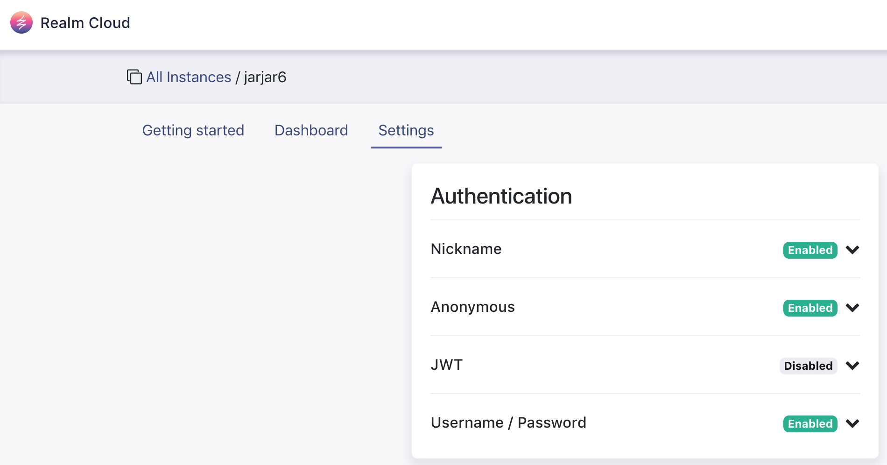
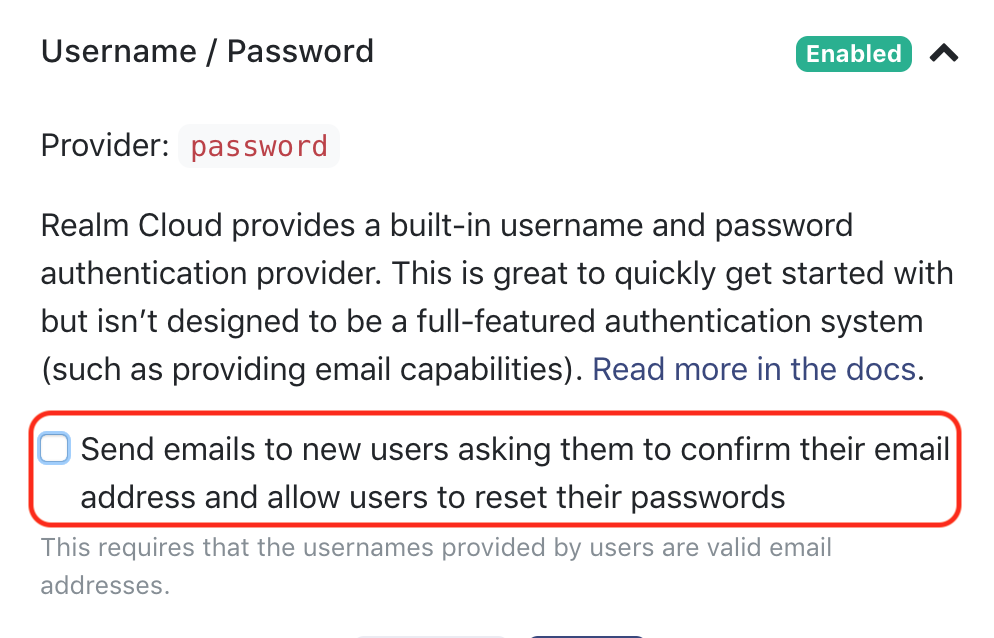
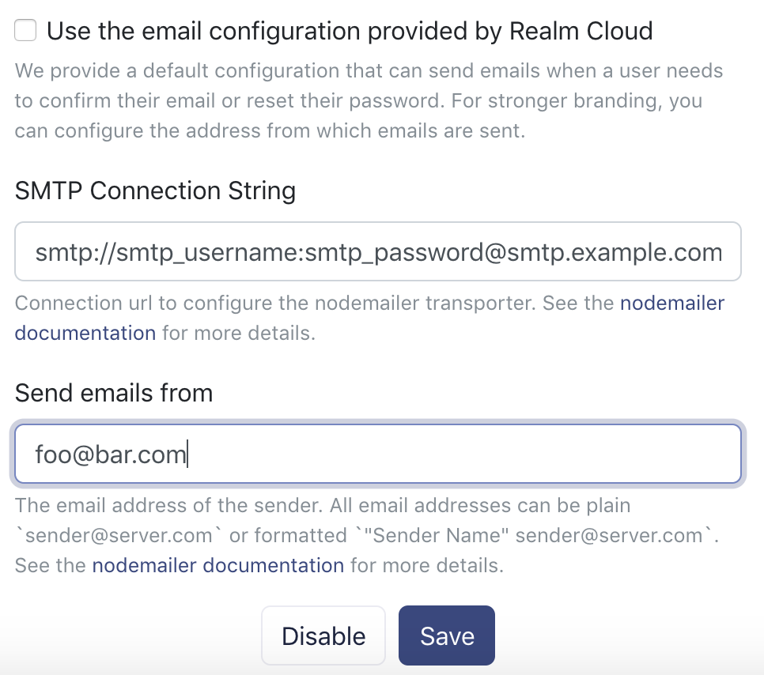

# Username/password provider

## Overview

Realm Platform provides a built-in username and password authentication provider. This allows client applications to register users with unique usernames and offers customizable password handling.

### Configuration



Realm Cloud is configured to send emails in order to allow users to complete a password reset or email confirmation flow. This is enabled by default, however, if you want to override this configuration \(example for strong branding\) you can specify a custom SMTP and email sender. 

* Navigate to your instance settings



* Select the Username / Password provider, then check "send emails" to activate the option.



You can now keep using the default configuration to send emails, or continue for further customization.  

* Uncheck the default configuration, to override it 









## Register Users



```swift
let usernameCredentials = SyncCredentials.usernamePassword(username: "username", password: "password", register: true)
```

Note that the factory method takes a `register` boolean argument that indicates whether a new user should be registered or an existing user should be logged in. An error will be thrown if your application tries to register a new user with the username of an existing user, or tries to log in a user that does not exist.



```objectivec
RLMSyncCredentials *usernameCredentials = [RLMSyncCredentials credentialsWithUsername:@"username"
                                                                             password:@"password"
                                                                             register:YES];
```

Note that the factory method takes a `register` boolean argument that indicates whether a new user should be registered or an existing user should be logged in. An error will be thrown if your application tries to register a new user with the username of an existing user, or tries to log in a user that does not exist.



```java
SyncCredentials myCredentials = SyncCredentials.usernamePassword(username, password, true);
```

The third parameter of `usernamePassword` is a boolean indicating whether the user should be created. Set it to `true` when registering new users; set it to `false` when logging in users.  



```javascript
Realm.Sync.User.register('http://my.realm-auth-server.com:9080', 'username', 'p@s$w0rd', (error, user) => { /* ... */ });
```



```csharp
var credentials = Credentials.UsernamePassword(username, password, createUser: true);
```

The third parameter of [UsernamePassword\(\)](https://realm.io/docs/dotnet/latest/api/reference/Realms.Sync.Credentials.html#Realms_Sync_Credentials_UsernamePassword_System_String_System_String_System_Boolean_) is the `createUser` flag which should only be `true` the first time, as it indicates that the user should be created. Once the user is created, the parameter must be set to `false`.



## Login Users



```swift
let auth_url = URL(string: "https://myinstance.realm.io")!
let creds    = SyncCredentials.usernamePassword(username: "username", password: "password", register: true)

SyncUser.logIn(with: creds, server: auth_url, onCompletion: { [weak self](user, err) in
    if let _ = user {
        // User is logged in
    } else if let error = err {
        fatalError(error.localizedDescription)
    }
})
```



```objectivec
RLMSyncCredentials *usernameCredentials = [RLMSyncCredentials credentialsWithUsername:@"username"
                                                                             password:@"password"
                                                                             register:NO];
```



```java
SyncCredentials myCredentials = SyncCredentials.usernamePassword(username, password, false);
```



```javascript
Realm.Sync.User.login('http://my.realm-auth-server.com:9080', 'username', 'p@s$w0rd').then(user => {
  // user is logged in
  // do stuff ...
}).catch(error => {
  // an auth error has occurred
});
```



```csharp
var credentials = Credentials.UsernamePassword(username, password, createUser: false);
```



## Change Password



### Change Current User's Password {#change-current-user's-password}

Users who authenticate using the built-in Realm Object Server username/password credential type may change their own passwords by calling the `SyncUser.changePassword(_:, completion:)` API.

This API makes an asynchronous call to the server. The completion block will be called once a response is received, and will be passed in an error if the operation failed, or nil if the operation succeeded.

```swift
let newPassword = "swordfish"
user.changePassword(newPassword) { (error) in
    if let error = error {
        // Something went wrong
    }
    // Otherwise, the password was successfully changed.
}
```

### Change Another User's Password {#change-another-user's-password}

Administrators may change the password of any user by calling the `SyncUser.changePassword(_:, forUserID:, completion:)` API. Pass in the user identity of the user whose password should be changed.

```swift
let newPassword = "swordfish"
adminUser.changePassword(newPassword, forUserID: "12345...") { (error) in
    if let error = error {
        // Something went wrong
    }
    // Otherwise, the password was successfully changed.
}
```



### Change Current User's Password

Users who authenticate using the built-in Realm Object Server username/password credential type may change their own passwords by calling the `-[RLMSyncUser changePassword:completion:]` API.

This API makes an asynchronous call to the server. The completion block will be called once a response is received, and will be passed in an error if the operation failed, or nil if the operation succeeded.

```objectivec
NSString *newPassword = @"swordfish";
[user changePassword:newPassword
          completion:^(NSError *error) {
    if (error) {
        // Something went wrong
    }
    // Otherwise, the password was successfully changed.
}];
```

### Change Another User's Password {#change-another-user's-password}

Administrators may change the password of any user by calling the `-[RLMSyncUser changePassword:forUserID:completion:]` API. Pass in the user identity of the user whose password should be changed.

```objectivec
NSString *newPassword = @"swordfish";
[adminUser changePassword:newPassword
                forUserId:@"12345..."
               completion:^(NSError *error) {
    if (error) {
        // Something went wrong
    }
    // Otherwise, the password was successfully changed.
}];
```



Users who authenticate using the built-in Realm Object Server username/password credential type may change their own passwords by calling the either the `SyncUser.changePassword()` or `SyncUser.changePasswordAsync()`API.

This API makes a call to the server. Once the method returns, the user will have updated their password. If any error happens, either an exception is thrown or it is delivered in the callback.

```java
SyncUser user = SyncUser.currentUser();

// Change password on a background thread
try {
  user.changePassword("new-password);
  // Password was successfully changed
} catch (ObjectServerError error) {
  // Something went wrong
}

// Change password from the UI thread
user.changePasswordAsync("new-password", new SyncUser.Callback<SyncUser>() {
  @Override
  public void onSuccess(SyncUser user) {
    // Password for 'user' was succesfully changed.
  }
  
  @Override
  public void onError(ObjectServerError error) {
    // Something went wrong
  }
});
```




_API Coming Soon!_




To change a user’s password, you can use [User.ChangePasswordAsync](https://realm.io/docs/dotnet/latest/api/reference/Realms.Sync.User.html#Realms_Sync_User_ChangePasswordAsync_System_String_):

```csharp
var currentUser = User.Current;
await currentUser.ChangePasswordAsync("new-secure-password");

// The user's password has been changed, they'll no longer be able to use their old password.
```

Admin users may change other users’ passwords \(e.g. as part of a server-side app that automates password retrieval\) by passing in a user’s Id:

```csharp
var adminUser = await User.LoginAsync(...);
await adminUser.ChangePasswordAsync("some-user-id", "new-secure-password");

// The password of the user with Id some-user-id has been changed to new-secure-password.
```



## Reset Password

Users who authenticate using the built-in Realm Object Server username/password credential type may initiate a password reset if they used a valid email as their username, this is done in two steps:

1. Request a password reset: 



```swift
let serverURL = URL(string: "https://foo.us1.realm.cloud.io")
let email = "user@email.com"
SyncUser.requestPasswordReset(forAuthServer: serverURL, userEmail: email) { error in
    if error {
        // something went wrong
    }
}
```



```objectivec
NSURL *serverURL = [NSURL URLWithString:@"https://foo.us1.realm.cloud.io"];
NSString *email = @"user@email.com";
[RLMSyncUser requestPasswordResetForAuthServer:serverURL userEmail:email completion:^(NSError *error) {
    if (error) {
        // Something went wrong
    }
}];
```



```java
SyncUser.requestPasswordResetAsync("user@email.com", "https://foo.us1.realm.cloud.io", new SyncUser.Callback<Void>() {
    @Override
    public void onSuccess(Void result) {        
    }

    @Override
    public void onError(ObjectServerError error) {
    }
});
```



```typescript
Realm.Sync.User.requestPasswordReset('https://foo.us1.realm.cloud.io', 'user@email.com').then(() => {
    // query sent successfully. 
}).catch((error) => {
    // an error has occurred
});
```



```csharp
var serverUri = new Uri("https://foo.us1.realm.cloud.io");
await User.RequestPasswordResetAsync(serverUri, "user@email.com");
```



   2. Complete the password reset using the token sent by email, this can be completed by clicking on the link inside the email or via the API if we manage to extract the token from the email \(using [deep linking](https://en.wikipedia.org/wiki/Mobile_deep_linking) for instance\):



```swift
let serverURL = URL(string: "https://foo.us1.realm.cloud.io")
let token = "resetToken"
let newPassword = "newPassword"
SyncUser.completePasswordReset(forAuthServer: serverURL, token: token, password: newPassword) { error in
    if error {
        // something went wrong
    }
}
```



```objectivec
NSURL *serverURL = [NSURL URLWithString:@"https://foo.us1.realm.cloud.io"];
NSString *token = @"reset_token";
NSString *newPassword = @"newPassword";
[RLMSyncUser completePasswordResetForAuthServer:serverURL token:token password:newPassword completion:^(NSError *error) {
    if (error) {
        // Something went wrong
    }
}];
```



```java
SyncUser.completePasswordResetAsync("reset_token", "newPassword", "https://foo.us1.realm.cloud.io", new SyncUser.Callback<Void>() {
    @Override
    public void onSuccess(Void result) {
    }

    @Override
    public void onError(ObjectServerError error) {
    }
});
```



```typescript
Realm.Sync.User.completePasswordReset('https://foo.us1.realm.cloud.io', 'reset_token', 'new_password').then(() => {
    // query sent successfully. 
}).catch((error) => {
    // an error has occurred
});
```



```csharp
var serverUri = new Uri("https://foo.us1.realm.cloud.io");
await User.CompletePasswordResetAsync(serverUri, "reset_token", "newPassword");
```



## Confirming email 

After registering a new user, we can perform email confirmation if the username used is a valid email, this is done in two steps:

1. Request email confirmation



```swift
let serverURL = URL(string: "https://foo.us1.realm.cloud.io")
let email = "user@email.com"
SyncUser.requestEmailConfirmation(forAuthServer: serverURL, userEmail: email) { error in
    if error {
        // something went wrong
    }
}
```



```objectivec
NSURL *serverURL = [NSURL URLWithString:@"https://foo.us1.realm.cloud.io"];
NSString *email = @"user@email.com";
[RLMSyncUser requestEmailConfirmationForAuthServer:serverURL userEmail:email completion:^(NSError *error) {
    if (error) {
        // Something went wrong
    }
}];
```



```java
SyncUser.requestEmailConfirmationAsync("user@email.com", "https://foo.us1.realm.cloud.io", new SyncUser.Callback<Void>() {
    @Override
    public void onSuccess(Void result) {
    }

    @Override
    public void onError(ObjectServerError error) {
    }
});
```



```typescript
Realm.Sync.User.requestEmailConfirmation('https://foo.us1.realm.cloud.io', 'user@email.com').then(() => {
    // query sent successfully. 
}).catch((error) => {
    // an error has occurred
});
```



```csharp
var serverUri = new Uri("https://foo.us1.realm.cloud.io");
await User.RequestEmailConfirmationAsync(serverUri, "user@email.com");
```



   2. Complete the email confirmation using the token sent by email,  this can be completed by clicking on the link inside the email or via the API if we manage to extract the token from the email \(using [deep linking](https://en.wikipedia.org/wiki/Mobile_deep_linking) for instance\):



```swift
let serverURL = URL(string: "https://foo.us1.realm.cloud.io")
let token = "resetToken"
SyncUser.confirmEmail(forAuthServer: serverURL, token: token) { error in
    if error {
        // something went wrong
    }
}
```



```objectivec
NSURL *serverURL = [NSURL URLWithString:@"https://foo.us1.realm.cloud.io"];
NSString *token = @"confirmation_token";
[RLMSyncUser confirmEmailForAuthServer:serverURL token:token completion:^(NSError *error) {
    if (error) {
        // Something went wrong
    }
}];
```



```java
SyncUser.confirmEmailAsync("confirmation_token", "https://foo.us1.realm.cloud.io", new SyncUser.Callback<Void>() {
    @Override
    public void onSuccess(Void result) {
    }

    @Override
    public void onError(ObjectServerError error) {
    }
});
```



```typescript
Realm.Sync.User.confirmEmail('https://foo.us1.realm.cloud.io', 'confirmation_token').then(() => {
    // query sent successfully. 
}).catch((error) => {
    // an error has occurred
});
```



```csharp
var serverUri = new Uri("https://foo.us1.realm.cloud.io");
await User.ConfirmEmailAsync(serverUri, "confirmation_token");
```



Not what you were looking for? [Leave Feedback](https://realm3.typeform.com/to/A4guM3) 

