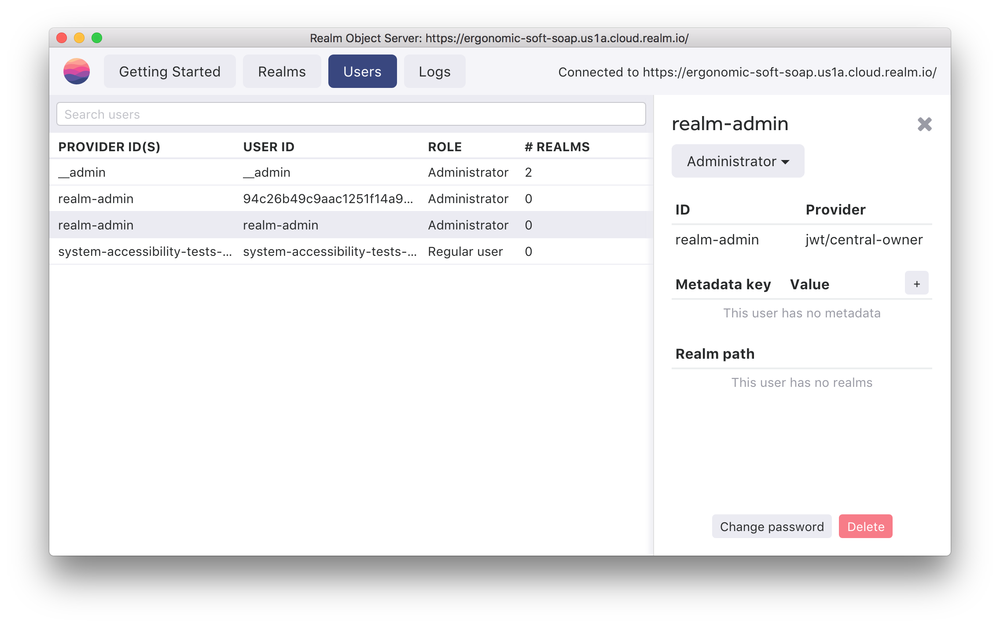

# Admin users

## Overview

Realm Object Server's authentication system has the concept of an admin user. This is a special user which contains admin privileges to:

* Access any synchronized Realm in the server
* Login to Realm Studio

## Creating an Admin User

The easiest way to create a new admin user is through Realm Studio. In the Users tab you can select a user then adjust in the dropdown on the side panel if this is an admin user:



You can also define a user as an admin through specific providers:

### JWT

With the JWT provider you can include a key in the payload of the token which defines that the user is an admin. By default, this is a boolean value for key `isAdmin`:

```javascript
const jwt = require('jsonwebtoken');
const fs = require('fs');
const key = fs.readFileSync('private.pem');

const payload = {
  userId: '123',
  isAdmin: true // optional
  // other properties (ignored by Realm Object Server)
};

const token = jwt.sign(payload, { key:  key, passphrase: 'your-passphrase' }, { algorithm: 'RS256'});
// Send token to your client app
```



You can configure the JWT provider in your instance settings. Adjust the _Field Name_ and _Value_ inputs to control what determines that a token is an administrator:





You can customize the JWT provider through parameters in its constructor within your server start script:

```javascript
const RealmObjectServer = require('realm-object-server');
const path = require('path');

const server = new RealmObjectServer.BasicServer();

// Add your public key from "Generating RS256 key" section
let jwtProvider = new JWTAuthProvider(
  {
    publicKey: '-----BEGIN PUBLIC KEY-----\nMIICIjANBgkqhki...\n-----END PUBLIC KEY-----',
    isAdminFieldName: "isAdmin", // Default is `isAdmin`
    isAdminValue: true // Default is `true`
  }
)

server.start({
    dataPath: path.join(__dirname, '../data'),
    authProviders: [ jwtProvider ],
}).catch((err) => {
    console.error("There was an error starting your custom Realm Object Server", err);
});
```



### Nickname

The Nickname provider is designed to quickly create users when you are first getting started with Realm Platform. In addition, you can indicate that the user is an admin. This is to simplify setting up a synchronized Realm and exploring functionality.


The Nickname provider should not be used in production.


For more information see the [documentation on the Nickname provider](authentication-providers.md#nickname).

## Admin Tokens


This feature is not available in Realm Cloud.


Admin access is also available via an admin token. This is a self-contained token, similar to a JWT, containing full admin access claims and is signed by the server's private key. The server uses the admin token internally to open up system Realms because it is self-contained and verifiable through the public key, eliminating the need to contact the authentication APIs.

_**Given that the token is self-contained it should be closely guarded and only used in trusted environments.**_


For most use-cases, we do not recommend using the admin token since it cannot be easily rotated and instead recommend creating admin users as [described above](admin-users.md#overview).


The token is generated in the `/keys` folder in the server's data path, such as `/data/keys/admin.json`. To retrieve the token in Javascript within the start script of the server:

```javascript
const adminTokenUser = require(path.resolve(server.config.dataPath, 'keys/admin.json')).ADMIN_TOKEN
```

This can be used to synchronously construct a`Realm.Sync.User`object which can be passed into the`Realm`constructor to open a connection to any Realm on the server side.

```javascript
// Open a Realm using the admin user
const adminTokenUser = require(path.resolve(server.config.dataPath, 'keys/admin.json')).ADMIN_TOKEN
var adminUser = Realm.Sync.User.adminUser(adminTokenUser, SERVER_URL);
var realm = new Realm({
  sync: {
    user: adminUser,
    url: 'realm://object-server-url:9080/my-realm',
  },
  schema: [{...}
  }]
});
```

Note that when used with an admin token user, the Realm URL does _**not**_ include the `~`character that resolves into the user ID for non-admin authentication; an admin token user does not have a user ID.

